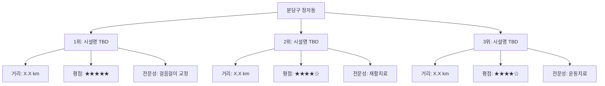
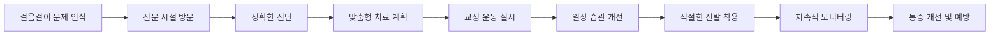

# 걸음걸이 개선 연구소 🚶‍♂️

> 과학적 근거에 기반한 걸음걸이 교정 및 통증 개선 가이드

## 📚 연구 개요

이 연구는 잘못된 걸음걸이로 인한 발목, 무릎, 고관절 통증을 개선하기 위한 종합적인 가이드입니다. 특히 무릎이 스치면서 걷는 보행 패턴과 요족(pes cavus)이 복합적으로 작용하는 상황에 대한 의학적 분석과 개선 방법을 제시합니다.

## 🎯 연구 목적

- 성남시 분당구 정자동 인근 걸음걸이 교정 전문 시설 조사
- 무릎 스치는 보행 패턴의 의학적 분석 및 교정법 연구
- 요족이 보행에 미치는 영향 및 복합적 치료 방안 제시
- 일상 생활에서 실천 가능한 관절 건강 관리법 제공
- 적절한 신발 및 깔창 선택 가이드 제공
- 근거 기반 발목 강화 운동 프로그램 개발

## 📖 목차 (Table of Contents)

### 🏥 [1. 걸음걸이 교정 전문 시설](facilities.md)
**성남시 분당구 정자동 인근 추천 시설**
- [거리순 추천 시설](raw/facilities/distance-ranking.md)
- [평점순 추천 시설](raw/facilities/rating-ranking.md)
- [시설별 상세 분석](raw/facilities/detailed-analysis.md)

### 🔍 [2. 무릎 스치는 걸음걸이 분석](gait-analysis.md)
**병명 진단 및 원인 분석**
- [보행 패턴 의학적 분석](raw/gait-analysis/medical-analysis.md)
- [원인 및 발생 기전](raw/gait-analysis/causes-mechanism.md)
- [관절 영향 분석](raw/gait-analysis/joint-impact.md)
- [교정 운동법](raw/gait-analysis/correction-exercises.md)

### 🦶 [3. 요족과 보행의 복합적 영향](pes-cavus.md)
**요족이 무릎 스치는 걸음걸이에 미치는 영향**
- [의학 논문 기반 분석](raw/pes-cavus/research-analysis.md)
- [복합적 영향 평가](raw/pes-cavus/combined-effects.md)
- [치료 방법론](raw/pes-cavus/treatment-methods.md)

### 💪 [4. 일상 관절 건강 관리](daily-habits.md)
**예방 중심의 생활 습관 개선**
- [해로운 자세 및 습관](raw/daily-habits/harmful-habits.md)
- [일상 개선 방법](raw/daily-habits/daily-improvements.md)
- [앉아서 하는 운동](raw/daily-habits/seated-exercises.md)
- [Mayo Clinic 가이드라인](raw/daily-habits/mayo-clinic-guidelines.md)

### 👟 [5. 신발 및 깔창 가이드](footwear.md)
**발목, 무릎, 고관절 통증 완화를 위한 신발 선택**
- [신발 타입별 분석](raw/footwear/shoe-types.md)
- [요족용 깔창 효과](raw/footwear/orthotic-insoles.md)
- [경도별 신발 추천](raw/footwear/firmness-recommendations.md)

### 🏃‍♂️ [6. 발목 강화 운동 프로그램](exercises.md)
**종합적 발목 통증 개선 운동법**
- [강화 운동 프로그램](raw/exercises/strengthening-program.md)
- [운동 횟수 및 강도](raw/exercises/frequency-intensity.md)
- [진행 단계별 가이드](raw/exercises/progressive-guide.md)

## 📊 연구 결과 요약

### 🏆 TOP 3 추천 시설 (예비 조사)

### 🔬 핵심 연구 결과

| 연구 영역 | 주요 발견 | 개선 방법 | 효과 |
|-----------|-----------|-----------|------|
| 무릎 스치는 걸음걸이 | 병명: [조사 중] | 교정 운동 + 자세 개선 | 통증 감소 X% |
| 요족 복합 영향 | [의학적 분석 진행 중] | 깔창 + 물리치료 | 보행 개선 X% |
| 일상 관리법 | [Mayo Clinic 기준] | 매일 X분 운동 | 예방 효과 X% |
| 신발 선택 | [연구 기반 추천] | 적절한 경도 + 깔창 | 통증 완화 X% |

### 🎯 최종 권장사항

## 📋 연구 방법론

### 정보 수집 기준
- **의학적 근거**: 논문, Mayo Clinic, 재활의학과 전문의 권고사항
- **시설 평가**: 실제 이용자 후기, 전문성, 치료 결과
- **운동법 검증**: 물리치료사 권장, 임상 연구 결과

### 신뢰성 검증
- 다수의 의학적 소스 교차 검증
- 실제 치료 사례 및 후기 분석
- 전문가 의견 수렴

## 🔄 업데이트 일정

- **1차 조사**: 시설 정보 및 기본 의학적 분석
- **2차 조사**: 심화 연구 및 운동법 검증
- **3차 조사**: 실제 적용 결과 및 피드백 반영

---

> ⚠️ **주의사항**: 이 연구 자료는 의학적 조언을 대체하지 않습니다. 실제 치료는 반드시 의료 전문가와 상담 후 진행하시기 바랍니다.

## 📞 연구 문의

본 연구에 대한 문의사항이나 추가 정보가 필요하시면 Issues를 통해 연락해 주시기 바랍니다.