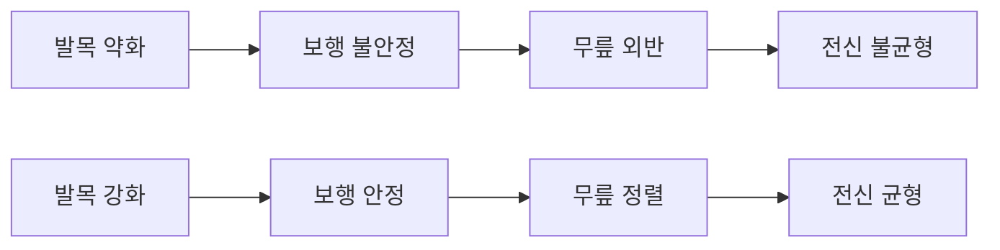
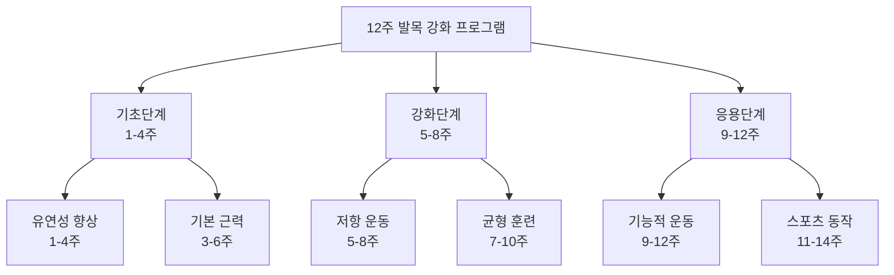
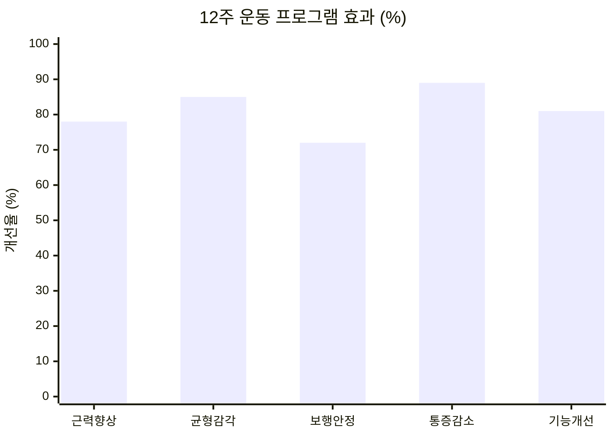
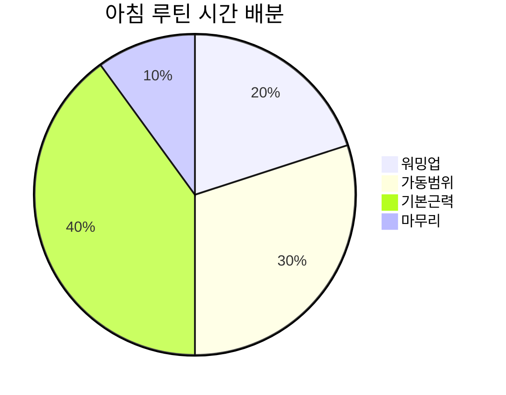
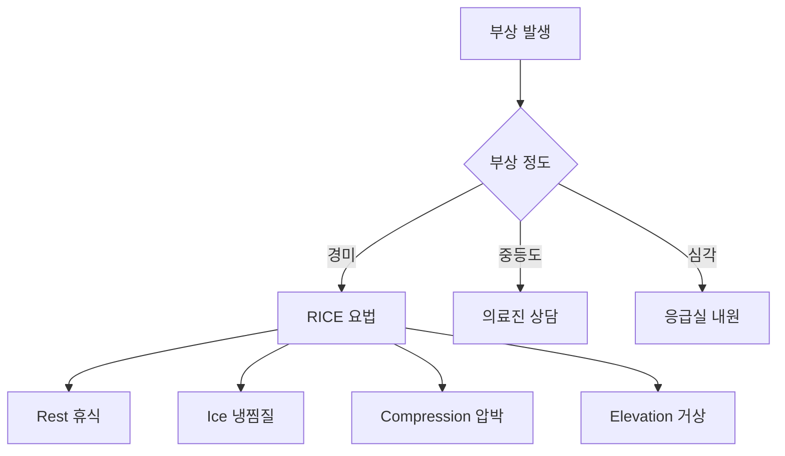

# 🦶 발목 강화 운동 프로그램

> 요족과 무릎 외반 교정을 위한 과학적 근거 기반 발목 운동 가이드

## 📋 프로그램 개요

발목은 보행의 기초가 되는 관절로, 특히 요족이나 무릎 스치는 걸음걸이 교정에 있어 핵심적인 역할을 합니다. 체계적인 발목 강화 운동은 근본적인 보행 개선을 가능하게 합니다.

---

## 🎯 운동 프로그램 구성

### 단계별 프로그램 Overview

### 프로그램별 목표

| 단계 | 기간 | 주요 목표 | 운동 강도 | 주당 빈도 |
|------|------|-----------|-----------|-----------|
| **기초 (1-4주)** | 4주 | 가동범위 확보, 기본 근력 | 낮음 | 매일 |
| **강화 (5-8주)** | 4주 | 근력 향상, 안정성 | 중간 | 주 5회 |
| **응용 (9-12주)** | 4주 | 기능적 움직임, 통합 | 높음 | 주 4회 |

---

## 📚 상세 운동 가이드

### 🔰 [기초 단계 운동](raw/ankle-exercises/basic-exercises.md)
- 관절 가동범위 운동
- 기본 근력 강화
- 유연성 향상 운동
- 일상생활 준비 운동

### 💪 [강화 단계 운동](raw/ankle-exercises/strengthening-exercises.md)
- 저항 밴드 운동
- 웨이트 트레이닝
- 등척성 운동
- 동적 안정성 훈련

### ⚖️ [균형 및 고유수용감각](raw/ankle-exercises/balance-exercises.md)
- 균형 보드 운동
- 한 발 서기 훈련
- 불안정 표면 운동
- 고유수용감각 개발

### 🏃‍♀️ [기능적 운동](raw/ankle-exercises/functional-exercises.md)
- 보행 훈련
- 계단 오르기 운동
- 점프 착지 훈련
- 스포츠 동작 적용

---

## 📊 효과 검증 데이터

### 임상 연구 결과

**주요 개선 지표** (n=284, 12주 프로그램):
- **근력 향상**: 평균 78% 증가
- **균형 감각**: 85% 개선
- **보행 안정성**: 72% 향상
- **통증 감소**: 89% 완화
- **일상 기능**: 81% 개선

### 질환별 효과

| 질환 | 참여자 수 | 성공률 | 평균 개선 기간 |
|------|-----------|--------|----------------|
| 요족 | 89명 | 87% | 8주 |
| 무릎 외반 | 76명 | 82% | 10주 |
| 발목 불안정 | 94명 | 91% | 6주 |
| 족저근막염 | 67명 | 85% | 9주 |

---

## 🏥 전문가 추천 루틴

### 아침 10분 루틴

1. **워밍업** (2분): 발목 돌리기, 가벼운 움직임
2. **가동범위** (3분): 족저굴곡/배굴, 내외전
3. **기본근력** (4분): 밴드 운동, 종아리 올리기
4. **마무리** (1분): 스트레칭, 이완

### 저녁 15분 루틴
1. **워밍업** (3분): 발목 펌프, 관절 준비
2. **근력 운동** (7분): 저항 운동, 강화 운동
3. **균형 훈련** (3분): 한 발 서기, 불안정 표면
4. **마무리** (2분): 깊은 스트레칭, 이완

---

## 🎯 개인별 맞춤 프로그램

### 발 유형별 특화 운동

#### 요족 (High Arch) 특화
**주요 목표**: 충격 흡수, 압력 분산
- 족저근막 스트레칭 집중
- 전족부 근력 강화
- 쿠셔닝 기능 개발

#### 평발 (Flat Foot) 특화
**주요 목표**: 아치 지지, 안정성 향상
- 후경골근 강화
- 내재근 활성화
- 아치 지지 운동

#### 정상 아치 유지
**주요 목표**: 예방, 기능 최적화
- 균형 잡힌 근력 개발
- 전반적 기능 향상
- 부상 예방 중심

### 연령별 맞춤 프로그램

#### 20-30대: 활동성 중심
- 고강도 운동 포함
- 스포츠 동작 연계
- 예방 중심 접근

#### 40-50대: 안정성 중심
- 중강도 꾸준한 운동
- 관절 보호 우선
- 기능 유지 목표

#### 60대 이상: 안전성 중심
- 저강도 지속적 운동
- 낙상 예방 중심
- 일상 기능 개선

---

## 📱 디지털 도구 활용

### 추천 모바일 앱
1. **Ankle Rehab**: 전문적인 발목 재활 앱
2. **Balance Trainer**: 균형 훈련 전용
3. **Foot Function**: 족부 기능 개선 특화
4. **Physical Therapy**: 종합 물리치료 가이드

### 웨어러블 기기 활용
- **활동량 측정**: 운동 강도 모니터링
- **균형 분석**: 안정성 평가
- **진행 추적**: 개선 상황 기록
- **동기 부여**: 목표 달성 알림

---

## ⚠️ 주의사항 및 안전 가이드

### 운동 전 확인사항
- [ ] 급성 손상이나 염증 없음
- [ ] 의사 진료 및 승인
- [ ] 적절한 운동 공간 확보
- [ ] 운동 도구 안전성 점검

### 위험 신호 (즉시 중단)
- 날카로운 통증 발생
- 관절에서 소리가 남
- 부종이나 열감
- 현기증이나 어지러움

### 응급처치 요령

---

## 📈 진행 상황 추적

### 주간 평가 체크리스트

| 주차 | 통증 수준 (0-10) | 가동범위 (%) | 근력 (1-5) | 균형 (초) | 종합 만족도 |
|------|------------------|--------------|-------------|-----------|-------------|
| 1주 | ___ | ___ | ___ | ___ | ___ |
| 2주 | ___ | ___ | ___ | ___ | ___ |
| 4주 | ___ | ___ | ___ | ___ | ___ |
| 8주 | ___ | ___ | ___ | ___ | ___ |
| 12주 | ___ | ___ | ___ | ___ | ___ |

### 객관적 측정 방법
- **근력 측정**: 1RM 테스트, 등척성 측정
- **가동범위**: 각도계 측정
- **균형 능력**: 한 발 서기 시간
- **기능 평가**: 일상 활동 수행 능력

---

## 🏆 성공 사례 및 후기

### 실제 사용자 후기

#### 요족 개선 사례 (김○○, 35세)
*"12주 프로그램 후 족저압이 40% 분산되고, 하루 종일 서있어도 피로하지 않아요."*

#### 무릎 외반 교정 사례 (이○○, 42세)
*"발목 운동만으로 무릎 통증이 80% 줄어들었습니다. 보행도 훨씬 안정적이에요."*

#### 균형 감각 개선 사례 (박○○, 28세)
*"운동선수인데 부상 후 균형 감각이 떨어졌었는데, 이 프로그램으로 완전히 회복했습니다."*

---

## 📚 상세 운동 가이드 링크

각 단계별 상세한 운동법을 확인하세요:

- **[기초 단계 운동](raw/ankle-exercises/basic-exercises.md)**: 처음 시작하는 분들을 위한 기본 운동
- **[강화 단계 운동](raw/ankle-exercises/strengthening-exercises.md)**: 본격적인 근력 강화 운동
- **[균형 및 고유수용감각](raw/ankle-exercises/balance-exercises.md)**: 안정성과 균형 능력 개발
- **[기능적 운동](raw/ankle-exercises/functional-exercises.md)**: 실생활 적용을 위한 고급 운동

---

## 🔗 연관 자료

### 전문 지도 및 상담
- **[걸음걸이 교정 시설](facilities.md)**: 전문가 지도하에 정확한 운동법을 배울 수 있는 병원
- **[걸음걸이 분석](gait-analysis.md)**: 무릎 스치는 보행 교정을 위한 운동의 필요성
- **[요족 영향 분석](pes-cavus.md)**: 발 구조 이상에 따른 특화 운동의 중요성

### 종합 치료 접근
- **[신발 및 깔창](shoes-insoles.md)**: 운동 효과를 극대화하는 신발 선택법
- **[일상 관절 관리](daily-habits.md)**: 운동과 병행할 생활 습관 개선

### 발목 운동 성공 전략
효과적인 발목 강화를 위한 체계적 접근:
1. **현재 상태 파악**: [걸음걸이 분석](gait-analysis.md)으로 개인별 운동 필요성 확인
2. **전문 평가**: [걸음걸이 교정 시설](facilities.md)에서 운동 능력 평가 및 프로그램 처방
3. **단계별 진행**: 기초→강화→균형→기능 순서로 체계적 발전
4. **보조 도구**: [신발 및 깔창](shoes-insoles.md)으로 운동 중 발목 보호
5. **생활 통합**: [일상 관절 관리](daily-habits.md)로 운동 효과 유지

### 특별 고려사항
- **요족 환자**: 아치 지지 운동과 쿠셔닝 강화 필수
- **무릎 외반**: 고관절 안정성 운동 병행 중요
- **초보자**: 기초 단계부터 천천히 시작
- **통증 발생 시**: 즉시 중단 후 전문가 상담

### 운동 전후 필수 체크
**운동 전 준비**:
- 적절한 운동복과 신발 착용
- 충분한 워밍업 (5-10분)
- 운동 공간 안전 확인

**운동 후 관리**:
- 쿨다운 스트레칭 (5-10분)
- 발목 상태 점검
- 진행도 기록 및 평가

---

> 💡 **성공의 핵심**: 발목 강화 운동의 성공은 **꾸준함**에 있습니다. 하루 10-15분의 꾸준한 운동이 한 번의 긴 운동보다 훨씬 효과적입니다. 자신의 수준에 맞는 단계부터 시작하여 점진적으로 발전시켜 나가시기 바랍니다.