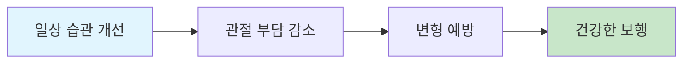

# 💪 일상 관절 건강 관리

> 예방 중심의 생활 습관 개선으로 보행 이상 근본 해결

## 📋 개요

일상 생활에서의 올바른 자세와 습관 개선을 통해 무릎 스치는 걸음걸이와 요족 문제를 예방하고 완화하는 포괄적 가이드입니다. Mayo Clinic의 검증된 가이드라인을 기반으로 실생활에 적용 가능한 실용적 솔루션을 제공합니다.

### 🎯 목표
- **예방 우선**: 문제 발생 전 예방적 관리
- **일상 통합**: 바쁜 현대인도 실천 가능한 간단한 방법
- **과학적 근거**: Mayo Clinic 등 의학적 근거 기반
- **점진적 개선**: 단계별 습관 개선을 통한 지속 가능한 변화

---

## 📚 상세 자료 구성

### ⚠️ [해로운 자세 및 습관](raw/daily-habits/harmful-habits.md)
**일상에서 피해야 할 자세와 습관들**
- 장시간 앉아있기의 악영향
- 잘못된 수면 자세
- 부적절한 신발 착용 습관
- 다리 꼬는 습관의 위험성

### ✅ [일상 개선 방법](raw/daily-habits/daily-improvements.md)
**바로 실천 가능한 생활 개선법**
- 올바른 앉는 자세 가이드
- 서있을 때 체중 분산법
- 걷기 자세 교정 요령
- 일상 중 스트레칭 타이밍

### 🪑 [앉아서 하는 운동](raw/daily-habits/seated-exercises.md)
**사무실이나 집에서 간단히 할 수 있는 운동**
- 의자에서 하는 발목 운동
- 앉은 자세에서 가능한 스트레칭
- 업무 중 틈틈이 하는 관절 운동
- TV 시청 중 할 수 있는 동작들

### 🏥 [Mayo Clinic 가이드라인](raw/daily-habits/mayo-clinic-guidelines.md)
**세계적 의료기관의 검증된 지침**
- Mayo Clinic 공식 권장사항
- 관절 건강을 위한 의학적 조언
- 예방적 관리의 중요성
- 전문의 권고 사항들

---

## 🎯 핵심 원칙

### 1. 예방이 치료보다 효과적

### 2. 작은 변화의 큰 효과
- **10분 규칙**: 매시간 10분씩 자세 변경
- **20-20-20 원칙**: 20분마다 20초간 20피트 거리 보기
- **계단 활용**: 엘리베이터 대신 계단 이용

### 3. 지속 가능한 실천
- 완벽함보다는 꾸준함
- 한 번에 하나씩 습관 개선
- 생활 리듬에 맞는 조정

---

## 📊 일일 체크리스트

### 아침 (기상 후)
- [ ] 침대에서 발목 돌리기 10회
- [ ] 올바른 자세로 일어나기
- [ ] 적절한 신발 선택

### 낮 (활동 시간)
- [ ] 매시간 자세 점검
- [ ] 앉은 자세에서 발목 운동
- [ ] 다리 꼬지 않기

### 저녁 (귀가 후)
- [ ] 하루 보행 패턴 점검
- [ ] 간단한 스트레칭
- [ ] 올바른 수면 자세 준비

---

## 🔗 연관 자료

### 운동 프로그램
- **[발목 강화 운동](ankle-exercises.md)**: 전문적인 운동 프로그램
- **[보행 분석](gait-analysis.md)**: 걸음걸이 패턴 이해

### 전문 도구 활용
- **[신발 및 깔창](shoes-insoles.md)**: 올바른 신발 선택법
- **[전문 시설](facilities.md)**: 전문가 상담이 필요한 경우

---

## ⚠️ 주의사항

### 전문의 상담이 필요한 경우
- 통증이 지속되거나 악화되는 경우
- 보행 이상이 심해지는 경우
- 일상생활에 지장을 주는 경우

### 점진적 개선 원칙
- 급작스러운 변화보다는 점진적 개선
- 개인의 체력과 상황에 맞게 조절
- 무리하지 않는 선에서 실천

---

> 💡 **핵심 메시지**: 올바른 생활 습관은 가장 효과적이고 경제적인 관절 건강 관리법입니다. 작은 변화부터 시작하여 꾸준히 실천하면 건강한 보행과 관절을 유지할 수 있습니다.

> 📅 **업데이트**: 2025년 1월 27일 기준 최신 Mayo Clinic 가이드라인 반영