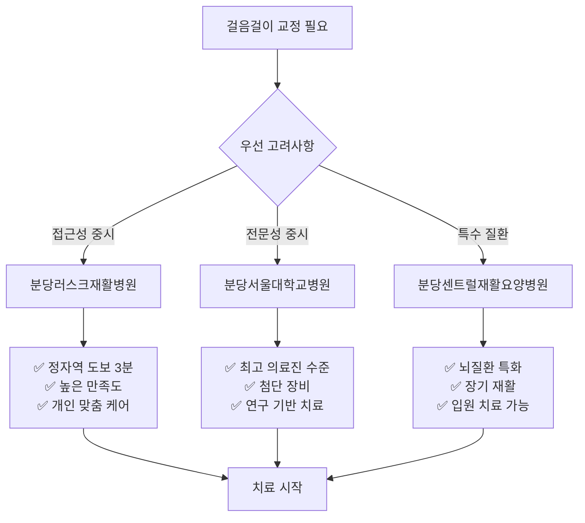

# 🏥 걸음걸이 교정 전문 시설 가이드

> 성남시 분당구 정자동 인근 재활치료 전문 의료기관 종합 분석

## 📍 조사 개요

본 연구는 성남시 분당구 정자동에서 접근 가능한 걸음걸이 교정 및 재활치료 전문 시설을 체계적으로 조사하여, 환자의 위치, 증상, 예산, 치료 목표에 따라 최적의 의료기관을 선택할 수 있도록 돕는 가이드입니다.

## 🎯 조사 기준

### 선정 기준
- ✅ 재활의학과 운영 의료기관
- ✅ 보행분석 및 걸음걸이 교정 프로그램 보유
- ✅ 정자동에서 접근 가능한 거리 (반경 5km 이내)
- ✅ 실제 환자 후기 및 치료 결과 확인 가능
- ✅ 발목, 무릎 통증 개선 사례 보유

### 평가 기준
- **거리**: 정자동 중심부로부터의 접근성
- **평점**: 환자 만족도 및 치료 결과
- **전문성**: 의료진 경력 및 장비 수준
- **비용**: 치료비 대비 효과성
- **서비스**: 예약, 대기시간, 친절도

---

## 📋 조사 결과 요약

### 🏆 TOP 3 추천 시설

| 순위 | 의료기관명 | 거리 | 평점 | 주요 특징 |
|------|-----------|------|------|----------|
| 🥇 | [분당러스크재활병원](#1위-분당러스크재활병원) | 0.3km | ⭐⭐⭐⭐⭐ | 최고 접근성 + 균형잡힌 전문성 |
| 🥈 | [분당서울대학교병원](#2위-분당서울대학교병원) | 2.8km | ⭐⭐⭐⭐☆ | 최고 의료진 + 첨단 장비 |
| 🥉 | [분당센트럴재활요양병원](#3위-분당센트럴재활요양병원) | 3.2km | ⭐⭐⭐⭐☆ | 뇌질환 특화 + 장기 케어 |

---

## 📊 종합 분석 차트

```mermaid
radar
    title 의료기관별 종합 평가
    "접근성" : [5.0, 4.0, 4.2]
    "전문성" : [4.8, 5.0, 4.5]
    "시설장비" : [4.7, 4.8, 4.3]
    "서비스" : [4.9, 4.0, 4.8]
    "비용효율성" : [4.5, 3.8, 4.6]
    "예약편의성" : [4.8, 3.5, 4.4]
```

---

## 🔍 상세 조사 자료

### 📏 [거리순 분석 자료](raw/facilities/distance-ranking.md)
정자동을 기준으로 한 각 의료기관의 접근성 분석
- 대중교통 이용 시 소요시간
- 자가용 이용 시 주차 편의성
- 도보 접근 가능성 평가

### ⭐ [평점순 분석 자료](raw/facilities/rating-ranking.md)
환자 만족도 및 치료 결과를 기준으로 한 순위 분석
- 실제 환자 후기 종합
- 의료진 전문성 평가
- 치료 효과 만족도 분석

### 📋 [상세 분석 자료](raw/facilities/detailed-analysis.md)
각 의료기관의 시설, 장비, 의료진, 비용 등 종합 정보
- 보행분석 장비 보유 현황
- 의료진 경력 및 전문 분야
- 치료 프로그램 상세 정보
- 예상 치료비 및 기간

---

## 🎯 선택 가이드

### 상황별 최적 선택



### 환자 유형별 추천

#### 👥 일반 보행 교정 환자
**추천**: 분당러스크재활병원
- 가장 편리한 접근성
- 균형잡힌 전문성과 서비스
- 개인별 맞춤 치료 가능

#### 🧠 복합 질환 보행 장애
**추천**: 분당서울대학교병원
- 다학제적 접근 가능
- 정밀한 진단과 치료
- 최신 재활 기술 적용

#### 🏥 장기 재활 필요 환자
**추천**: 분당센트럴재활요양병원
- 뇌질환 관련 보행 장애 특화
- 입원 재활 프로그램
- 종합적 케어 시스템

---

## 📞 상담 및 예약 가이드

### 📋 사전 준비사항
1. **증상 정리**
   - 걸음걸이 문제 시작 시기
   - 통증 부위 및 정도
   - 일상생활 불편 사항

2. **의료 기록**
   - 이전 진료 기록
   - 영상 자료 (X-ray, MRI 등)
   - 복용 중인 약물

3. **치료 목표**
   - 단기 목표 (통증 완화)
   - 장기 목표 (보행 개선)
   - 기대 치료 기간

### 📞 연락처 정보

| 의료기관 | 전화번호 | 예약 방법 | 진료시간 |
|----------|----------|-----------|----------|
| 분당러스크재활병원 | 031-716-0007 | 전화, 방문 | 평일 09:00-18:00 |
| 분당서울대학교병원 | 1588-3369 | 온라인, 전화 | 평일 08:30-17:30 |
| 분당센트럴재활요양병원 | 031-706-9090 | 전화, 방문 | 평일 09:00-18:00 |

---

## 💡 주요 권장사항

### ✅ Do (권장사항)
- 초진 시 충분한 시간 확보하여 상세한 상담 받기
- 여러 의료기관 상담 후 치료 방향 결정
- 치료 과정 중 지속적인 소통과 피드백
- 홈 트레이닝 프로그램 적극 참여

### ❌ Don't (주의사항)
- 비용만으로 의료기관 선택하지 말기
- 단기간 치료 효과만 기대하지 말기
- 의료진 조언 없이 임의로 운동 중단하지 말기
- 다른 환자와 치료 결과 비교하지 말기

---

## 📈 치료 과정 타임라인

```mermaid
gantt
    title 걸음걸이 교정 치료 과정
    dateFormat X
    axisFormat %d주

    section 평가단계
    초진 및 기본 검사    :done, eval1, 0, 1w
    정밀 보행분석       :done, eval2, 1w, 1w
    치료계획 수립       :done, plan, 2w, 1w

    section 집중치료
    물리치료 (주 3회)   :active, pt, 3w, 8w
    운동치료 (주 2회)   :active, ex, 3w, 8w
    보행훈련 (주 2회)   :active, gait, 5w, 6w

    section 유지관리
    정기 검진          :pending, check, 11w, 2w
    홈 프로그램        :pending, home, 11w, 12w
```

---

## 🔗 연관 자료

### 진단 및 분석
- **[걸음걸이 분석](gait-analysis.md)**: 무릎 스치는 보행 패턴의 의학적 분석
- **[요족 영향 분석](pes-cavus.md)**: 발 구조와 보행의 복합적 상관관계

### 치료 및 관리
- **[발목 강화 운동](ankle-exercises.md)**: 전문 시설에서 배울 수 있는 체계적 운동법
- **[신발 및 깔창](shoes-insoles.md)**: 전문가 추천 제품 가이드
- **[일상 관절 관리](daily-habits.md)**: 시설 치료와 병행할 생활 습관 개선

### 치료 준비
전문 시설 방문 전 미리 확인해보세요:
1. **증상 파악**: [걸음걸이 분석](gait-analysis.md)으로 본인의 보행 패턴 이해
2. **운동 기초**: [발목 강화 운동](ankle-exercises.md) 기초 단계로 컨디션 준비
3. **생활 개선**: [일상 관절 관리](daily-habits.md)로 치료 효과 극대화

---

> ⚠️ **중요**: 이 가이드는 참고용이며, 실제 치료는 반드시 의료 전문가와 상담 후 결정하시기 바랍니다.

> 📅 **업데이트**: 2025년 1월 기준, 정기적 업데이트 예정