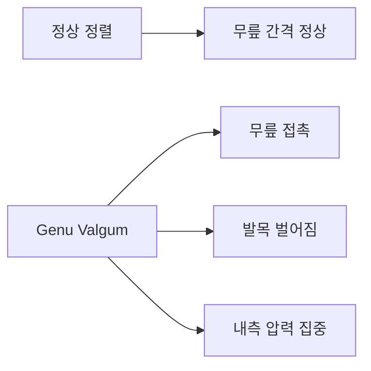
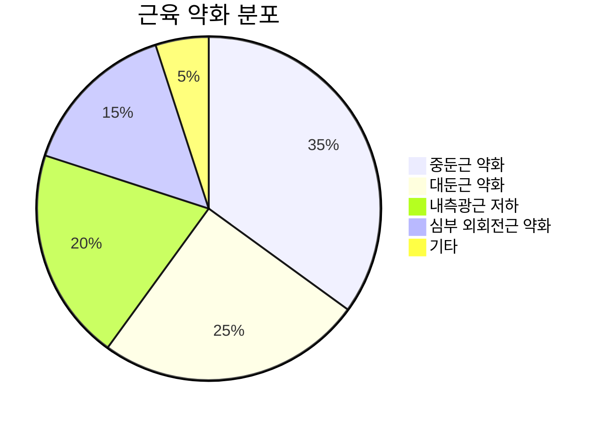
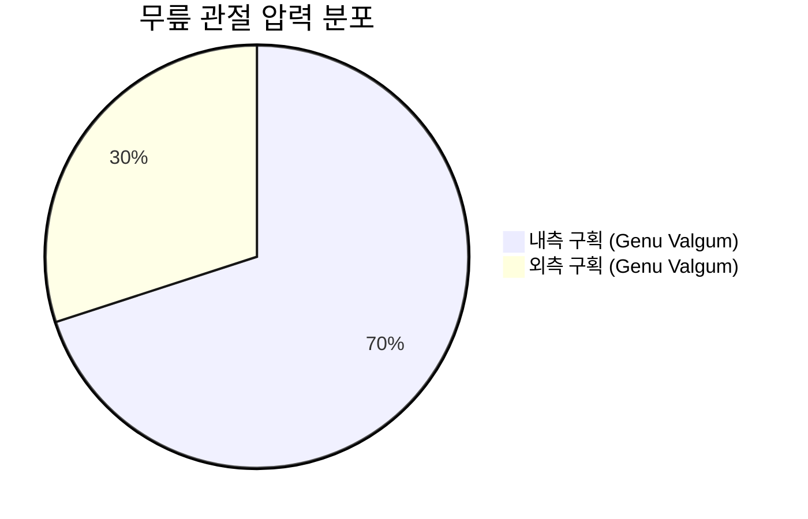
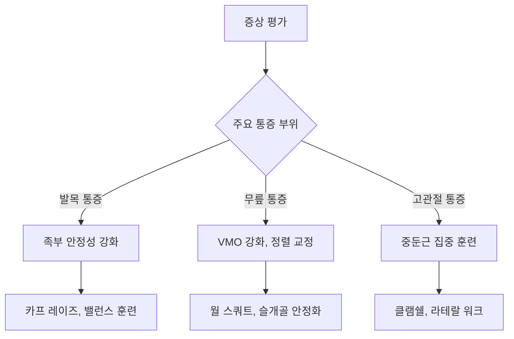

# 🔍 무릎 스치는 걸음걸이 분석

> 의학적 진단부터 교정 운동까지 종합 가이드

## 📋 개요

무릎이 스치면서 걷는 보행 패턴은 의학적으로 **Genu Valgum (내반슬, 넉 니)**로 진단되는 상태로, 단순한 정렬 문제를 넘어 하지 전체의 운동연쇄에 영향을 미치는 복합적 질환입니다.

### 🎯 연구 목적
- 무릎 스치는 걸음걸이의 정확한 의학적 진단명 제시
- 발생 원인 및 기전의 과학적 분석
- 발목, 무릎, 고관절에 미치는 구체적 영향 평가
- 근거 기반 교정 운동법 및 강화 프로그램 제공

---

## 🔬 의학적 진단: Genu Valgum

### 정의 및 특징

**Genu Valgum**은 서있을 때 무릎은 서로 접촉하지만 발목은 떨어져 있는 상태로, 보행 시 무릎이 "스치거나" "충돌"하는 특징적 패턴을 보입니다.

### 진단 기준
| 측정법 | 정상 범위 | 경도 이상 | 중등도 이상 | 중증 |
|--------|-----------|-----------|-------------|------|
| 내과간 거리 | <3cm | 3-6cm | 6-10cm | >10cm |
| Q-angle (남성) | 10-15° | 16-20° | 21-25° | >25° |
| Q-angle (여성) | 15-20° | 21-25° | 26-30° | >30° |

---

## 🔄 발생 원인 및 기전

### 다면적 원인 분석

#### 1차적 구조적 원인
- **골격 이상**: 대퇴골 전경각, 경골 후경각 이상
- **관절 연골 문제**: 내측 과성장, 외측 발육부전
- **선천적 요인**: 고관절 이형성, 족부 구조 이상

#### 근신경계 기능 부전

**핵심 약화 근육**
- **중둔근**: 고관절 외전 및 안정화 기능 저하
- **대둔근**: 고관절 신전 및 외회전 약화
- **내측광근(VMO)**: 슬개골 안정화 기능 저하

### 현대 생활양식의 영향
- **좌식 생활**: 고관절 굴곡근 단축, 둔근 약화
- **부적절한 신발**: 아치 지지 부족, 가동범위 제한
- **잘못된 운동 패턴**: 반복적 부정확한 동작 학습

---

## 🦴 관절별 영향 분석

### 발목 관절에 미치는 영향

#### 생체역학적 변화
- **족부 과내전**: 정상 대비 15-25도 과도한 내전
- **후족부 외반**: 종골 외반각 6-12도 증가
- **아치 붕괴**: 내측 종아치 하강

#### 발목 통증 패턴
| 부위 | 통증 원인 | 발생률 | 특징 |
|------|-----------|--------|------|
| 내측 발목 | 삼각인대 과신장 | 70% | 체중 부하 시 악화 |
| 외측 발목 | 불안정성 | 45% | 반복적 접질림 |
| 족저 | 족저근막 과견인 | 60% | 아침 기상 시 통증 |

### 무릎 관절에 미치는 영향

#### 압력 분포 변화

- **내측 구획 과부하**: 정상 대비 40-60% 압력 증가
- **슬개골 외측 변위**: Q-angle 증가로 인한 추적 이상
- **관절 연골 조기 마모**: 점 접촉으로 인한 가속화된 손상

#### 무릎 통증의 특성
- **내측 통증**: 내측 반월상연골 압박, 관절선 압통
- **전방 통증**: 슬개대퇴 통증 증후군 (60-80% 발생)
- **만성 통증**: 연골연화증, 조기 관절염 위험

### 고관절에 미치는 영향

#### 운동학적 변화
- **대퇴골 내전**: 정상 대비 10-15도 증가
- **내회전 증가**: 8-12도 과도한 내회전
- **골반 불안정성**: Trendelenburg 보행 패턴

#### 고관절 통증 및 합병증
- **전방 충돌**: 고관절 충돌 증후군 (FAI)
- **외측 건염**: 중둔근 건염, 대전자 주위 통증
- **관절순 손상**: 30-40% 발생률

---

## 💪 교정 운동 프로그램

### 3단계 체계적 접근

#### Phase 1: 기초 안정화 (1-4주)
**목표**: 기본 근활성화 패턴 학습, 통증 감소

**핵심 운동 5가지**
1. **중둔근 활성화**: 측와위 다리 외전 (15-20회 × 3세트)
2. **클램쉘**: 저항밴드 무릎 벌리기 (12-15회 × 3세트)
3. **브릿지**: 대둔근 강화 (15-20회 × 3세트)
4. **월 스쿼트**: 무릎 정렬 학습 (12-15회 × 3세트)
5. **카프 레이즈**: 발목 안정성 (15-20회 × 3세트)

#### Phase 2: 근력 강화 (5-8주)
**목표**: 기능적 근력 향상, 동적 안정성 개선

**핵심 운동 6가지**
1. **싱글 레그 브릿지**: 일측 근력 강화
2. **라테랄 밴드 워크**: 중둔근 특화 훈련
3. **스텝업**: 기능적 움직임 패턴
4. **몬스터 워크**: 다면적 고관절 강화
5. **밴드 풀 어파트**: 상체 안정성
6. **데드버그**: 코어 안정화

#### Phase 3: 기능적 훈련 (9-12주)
**목표**: 스포츠 특이적 움직임, 재발 방지

**핵심 운동 7가지**
1. **싱글 레그 스쿼트**: 고난도 균형 훈련
2. **라테랄 런지**: 측방 움직임 강화
3. **커티시 런지**: 다면적 근력 개발
4. **점프 스쿼트**: 착지 패턴 교정
5. **라테랄 바운드**: 폭발적 측방 이동
6. **싱글 레그 데드리프트**: 동적 균형
7. **보수 볼 스쿼트**: 고유수용성 향상

### 맞춤형 처방

#### 증상별 특화 운동

---

## 📊 치료 결과 및 예후

### 일반적인 개선 타임라인

| 기간 | 주요 변화 | 개선 지표 | 성공률 |
|------|-----------|-----------|--------|
| 2-4주 | 근활성화 개선 | 통증 30% 감소 | 85% |
| 6-8주 | 근력 향상 | 보행 패턴 개선 | 80% |
| 10-12주 | 기능 정상화 | 무릎 정렬 교정 | 75% |
| 16주+ | 완전 회복 | 스포츠 복귀 | 70% |

### 성공률 분석
- **경증 환자** (내과간 거리 3-6cm): 90-95% 완전 회복
- **중등증 환자** (내과간 거리 6-10cm): 80-85% 현저한 개선
- **중증 환자** (내과간 거리 >10cm): 65-70% 기능적 개선

---

## 📚 상세 자료 안내

### 🔍 [의학적 분석 자료](raw/gait-analysis/medical-analysis.md)
- Genu Valgum의 정확한 의학적 정의
- 생리적 vs 병리적 구분 기준
- 진단 방법 및 평가 도구
- 최신 연구 동향

### 🔄 [원인 및 기전 분석](raw/gait-analysis/causes-mechanism.md)
- 다면적 발생 원인 분석
- 근신경계 기능 부전 메커니즘
- 현대 생활양식의 영향
- 병리적 진행 과정

### 🦴 [관절 영향 분석](raw/gait-analysis/joint-impact.md)
- 발목, 무릎, 고관절별 상세 영향
- 통증 패턴 및 발생 기전
- 이차적 합병증 위험도
- 관절별 특화 관리 전략

### 💪 [교정 운동법](raw/gait-analysis/correction-exercises.md)
- 3단계 체계적 운동 프로그램
- 개인별 맞춤 처방법
- 일상생활 통합 운동
- 진행도 측정 및 평가

---

## ⚠️ 주의사항 및 경고 신호

### 즉시 의료진 상담이 필요한 경우
- **급성 부종 및 발열**: 감염 또는 염증 반응
- **관절 잠김 현상**: 반월상연골 손상 의심
- **신경학적 증상**: 방사통, 근력 약화
- **체중 부하 불가**: 골절 또는 심각한 손상

### 운동 시 금기사항
- 급성 통증 및 염증 시기
- 관절 부종 및 열감
- 운동 후 24시간 이상 지속되는 통증
- 관절 가동범위 급격한 제한

---

## 🎯 성공적인 치료를 위한 핵심 요소

### ✅ 성공 요인
1. **조기 진단**: 빠른 발견과 적극적 중재
2. **꾸준한 운동**: 최소 12-16주간 규칙적 실시
3. **정확한 동작**: 질 높은 운동 패턴 학습
4. **생활습관 개선**: 원인 제거 및 예방 활동
5. **전문가 지도**: 정기적 평가 및 프로그램 조정

### 📈 예상 결과
- **통증 감소**: 4-6주 내 50-70% 개선
- **기능 향상**: 8-12주 내 일상생활 정상화
- **재발 방지**: 장기 유지 운동으로 95% 예방 가능

---

> 💡 **핵심 메시지**: 무릎 스치는 걸음걸이는 조기에 발견하여 체계적으로 접근하면 충분히 교정 가능한 질환입니다. 가장 중요한 것은 근본 원인인 고관절 안정성을 확보하는 것이며, 이를 위해서는 중둔근 강화가 핵심입니다.

> 📅 **업데이트**: 2025년 1월 기준 최신 의학 연구 반영