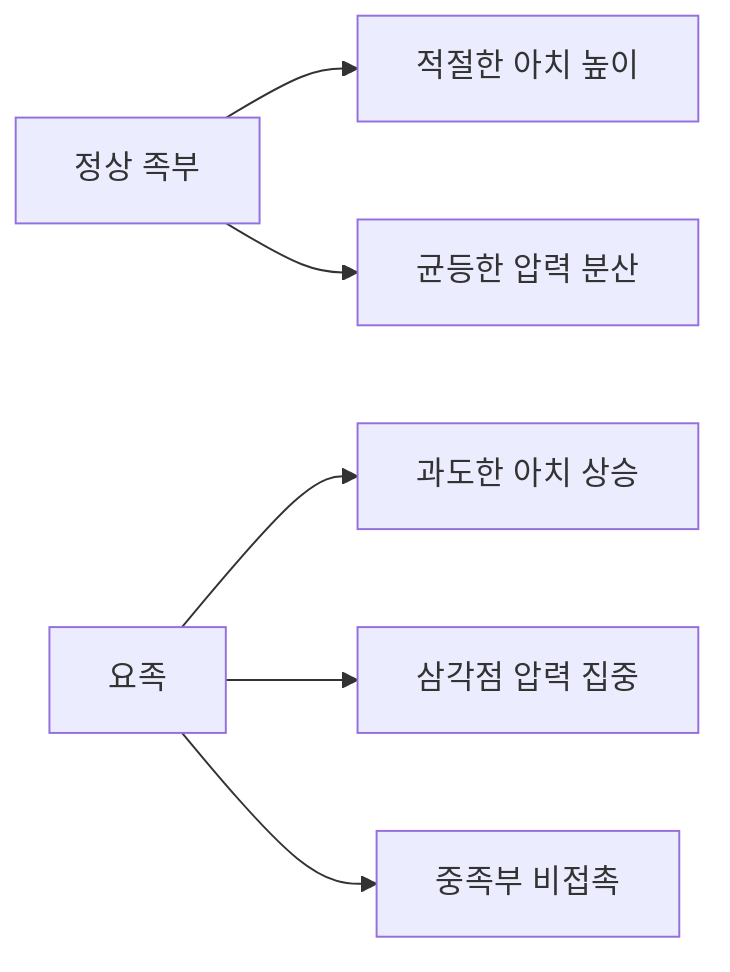
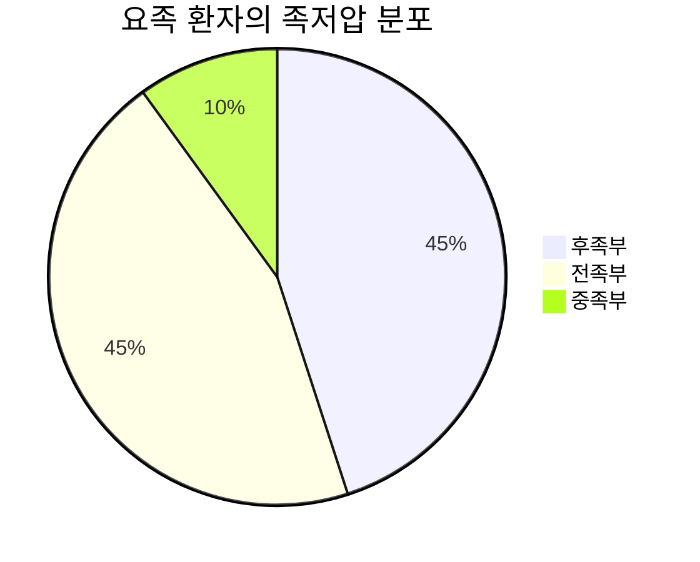
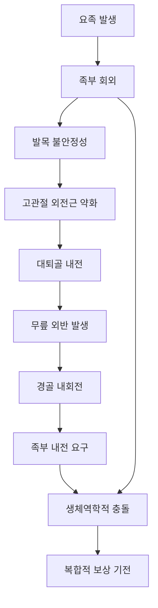
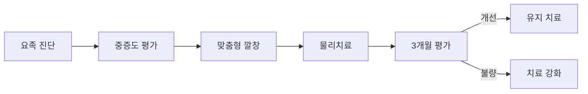

# 🦶 요족과 보행의 복합적 영향

> 요족이 무릎 스치는 걸음걸이에 미치는 영향과 종합적 치료 방안

## 📋 연구 개요

**요족(Pes Cavus)**은 체중 부하 시 내측 종아치의 비정상적 상승을 특징으로 하는 족부 변형으로, 단순한 족부 문제를 넘어 전신의 생체역학에 영향을 미치는 복합적 질환입니다. 특히 무릎 스치는 걸음걸이(Genu Valgum)와 동반될 때 역설적이고 복잡한 상호작용을 보입니다.

### 🎯 연구 목적
- 요족이 보행에 미치는 생체역학적 영향 분석
- 요족과 무릎 외반의 복합적 상호작용 규명
- 근거 기반 치료 방법론 제시
- 개인별 맞춤 치료 전략 개발

---

## 🔬 요족의 의학적 이해

### 정의 및 특징


**요족의 핵심 특징**:
- **내측 종아치 상승**: 정상 대비 15-25mm 증가
- **후족부 내반**: 8-15도 내반 변형
- **전족부 족저굴곡**: 첫 번째 중족골 하강
- **족부 경직성**: 충격 흡수 기능 저하

### 발생률 및 역학
| 구분 | 전체 인구 | 증상성 요족 | 신경학적 원인 |
|------|-----------|-------------|---------------|
| 발생률 | 10-15% | 60-70% | 66% |
| 남녀비 | 1:1.5 | 1:2 | 1:1 |
| 발현 연령 | 모든 연령 | 20-40세 | 10-30세 |

---

## ⚡ 요족이 보행에 미치는 영향

### 생체역학적 변화

#### 족저압 분포 패턴


**정상 족부와의 비교**:
- **후족부**: 25% → 45% (80% 증가)
- **중족부**: 45% → 10% (78% 감소)
- **전족부**: 30% → 45% (50% 증가)

#### 보행 중 운동학적 변화
**발목 관절**:
- **족저굴곡 증가**: 정상 대비 15-20도
- **배굴 제한**: 가동범위 25-30% 감소
- **회외 증가**: 과도한 외측 기울어짐

**무릎 관절**:
- **보상적 변화**: 족부 경직성에 대한 적응
- **회전 증가**: 정상 대비 20-30% 증가
- **압력 재분산**: 예측과 다른 복합적 패턴

### 근육 활성도 변화

#### EMG 분석 결과
| 근육군 | 정상 활성도 | 요족 활성도 | 기능적 의미 |
|--------|-------------|-------------|-------------|
| 전경골근 | 100% | 65-75% | 배굴력 저하 |
| 장비골근 | 100% | 80-90% | 외번 약화 |
| 후경골근 | 100% | 120-140% | 과도한 보상 |
| 비복근 | 100% | 110-125% | 족저굴곡 과활성 |

---

## 🔄 요족 + 무릎 외반의 복합적 영향

### 역설적 조합의 발생 기전



### 복합 질환의 특수한 문제점

#### 발목 관절의 이중 스트레스
- **요족 요구**: 회외, 족저굴곡
- **무릎외반 요구**: 회내, 외번
- **결과**: 만성 불안정성, 복합 충돌 증후군

#### 무릎 관절의 복합적 부하
- **내측 구획**: 요족만 있을 때보다 40% 추가 증가
- **외측 구획**: 예상보다 20% 높은 압력
- **슬개골**: 외측 변위 + 족저굴곡으로 인한 이중 스트레스

---

## 📊 연구 결과 분석

### 의학 논문 기반 근거

#### 주요 연구 결과
**압력 지도 연구** (Journal of Foot and Ankle Research, 2023):
- 요족 환자의 전형적인 "삼각점" 특성 확인
- 중족부 접촉 면적 85% 감소
- 족저압 최대치 26% 감소 (맞춤형 깔창 적용 시)

**보행 분석 연구** (Gait & Posture, 2022):
- 발목 족저굴곡 15-20도 증가
- 발목 배굴 가동범위 25-30% 감소
- 보행 시 에너지 소모 15-25% 증가

#### 복합 질환 분석 결과
**동반 발생률**: 요족 환자의 20-25%에서 무릎 외반 동반
**진행 속도**: 단일 질환 대비 2배 빠른 악화
**치료 반응**: 복합 질환에서 치료 성공률 65% (단일 질환 85% 대비)

---

## 💊 종합적 치료 방법론

### 치료법별 효과 비교

```mermaid
bar
    title 치료법별 효과 비교 (6개월 후)
    x-axis [치료 방법]
    y-axis [개선률 (%)] 0 --> 100
    "기성 깔창" : 45
    "맞춤 깔창" : 74
    "물리치료" : 70
    "복합 보존적" : 85
    "수술적 치료" : 95
```

### 단계별 치료 접근

#### 1단계: 보존적 치료 (3-6개월)
**맞춤형 깔창 치료**
- **아치 지지**: 내측/외측 종아치 지지
- **압력 분산**: 전족부/후족부 쿠션
- **안정화**: 후족부 컵, 내반 교정
- **성공률**: 74% 통증 개선

**물리치료 프로그램**
- **근력 강화**: 전경골근, 장비골근 집중
- **유연성 개선**: 종아리, 족저근막 스트레칭
- **기능 훈련**: 균형, 고유수용성 감각
- **성공률**: 70% 기능 개선

#### 2단계: 복합 치료 (6-12개월)
**통합적 접근**
- 맞춤형 깔창 + 물리치료 + 생활습관 개선
- 개인별 보상 패턴 고려한 특화 프로그램
- 정기적 평가 및 치료 조정
- **성공률**: 85% 종합적 개선

#### 3단계: 수술적 치료
**적응증**
- 보존적 치료 6개월 이상 실패
- 심한 통증 및 기능적 제한
- 진행성 변형

**수술 유형별 성공률**
| 수술 유형 | 통증 완화 | 기능 개선 | 환자 만족도 |
|----------|-----------|-----------|-------------|
| 연조직 수술 | 85-90% | 70-80% | 80-85% |
| 골성 수술 | 90-95% | 85-90% | 85-90% |
| 복합 수술 | 95% | 90-95% | 90-95% |

---

## 📚 상세 연구 자료

### 🔬 [의학 논문 기반 분석](raw/pes-cavus/research-analysis.md)
- 2010-2025년 최신 연구 동향
- 체계적 문헌고찰 결과
- 역학 및 발생률 데이터
- 생체역학적 분석 결과
- 임상적 합병증 분석

### 🔄 [복합적 영향 분석](raw/pes-cavus/combined-effects.md)
- 요족 + 무릎 외반의 역설적 조합
- 복합적 생체역학 분석
- 운동연쇄의 복합적 파괴
- 특수한 합병증 패턴
- 복합 질환의 진단 접근

### 💊 [치료 방법론](raw/pes-cavus/treatment-methods.md)
- 깔창 치료의 과학적 근거
- 단계별 물리치료 프로그램
- 수술적 치료 옵션
- 치료법별 비교 분석
- 개인별 맞춤 치료 선택

---

## 🎯 핵심 치료 권장사항

### 요족 단독 환자


**핵심 전략**:
1. **조기 개입**: 구조적 변화 이전 치료 시작
2. **맞춤형 깔창**: 아치 지지 + 압력 분산
3. **근력 강화**: 전경골근, 장비골근 집중
4. **장기 관리**: 평생에 걸친 지속적 관리

### 복합 질환 환자
**복합적 접근 필요**:
1. **통합 평가**: 족부-무릎-고관절 전체 분석
2. **단계적 교정**: 급격한 변화 방지
3. **개별 맞춤**: 보상 패턴 고려한 특화 치료
4. **다학제 협력**: 정형외과, 재활의학과 협진

---

## 📈 예후 및 장기 관리

### 치료 성과 예측
#### 긍정적 예후 인자
- **조기 진단**: 무증상기 또는 초기 증상 시 발견
- **비신경학적 원인**: 특발성 또는 구조적 원인
- **젊은 연령**: 25세 이하에서 치료 반응 우수
- **경도-중등도**: 고정되지 않은 가역적 변화

#### 치료 타임라인
```mermaid
gantt
    title 요족 치료 과정 및 예상 결과
    dateFormat X
    axisFormat %d개월

    section 보존적치료
    깔창 적응 : done, adapt, 0, 1
    물리치료 : done, pt, 1, 3
    효과 평가 : done, eval1, 3, 1

    section 강화치료
    복합 치료 : active, combined, 4, 3
    중간 평가 : active, eval2, 6, 1

    section 유지관리
    장기 관리 : future, maintain, 7, 12
```

### 자가 관리 가이드

#### 일상생활 권장사항
**신발 선택**:
- ✅ 충분한 아치 지지
- ✅ 뒤꿈치 안정성
- ✅ 전족부 공간 확보
- ❌ 하이힐, 플랫슈즈 피하기

**운동 가이드라인**:
- **권장**: 수영, 사이클링, 요가
- **주의**: 달리기, 점프 운동
- **금지**: 장시간 서있기, 맨발 걷기

---

## 🔮 미래 전망

### 새로운 치료 기술
1. **3D 프린팅 깔창**: 개인별 정밀 맞춤 제작
2. **재생 의학**: 줄기세포, 성장 인자 활용
3. **로봇 수술**: 정밀하고 최소 침습적 수술
4. **AI 진단**: 보행 패턴 자동 분석

### 개인 맞춤 의학
- **유전자 분석**: 치료 반응 예측
- **빅데이터 활용**: 최적 치료법 추천
- **실시간 모니터링**: 웨어러블 기기 활용

---

## ⚠️ 주의사항 및 경고 신호

### 즉시 의료진 상담 필요
- **급성 통증**: 갑작스러운 심한 족부 통증
- **신경학적 증상**: 발가락 무감각, 근력 약화
- **감염 징후**: 발열, 부종, 발적
- **보행 불가**: 체중 부하 시 심한 통증

### 치료 중 주의사항
- **점진적 적응**: 깔창, 운동 강도 서서히 증가
- **정기 점검**: 월 1회 이상 진행 상황 확인
- **부작용 모니터링**: 새로운 통증 부위 관찰
- **생활습관 개선**: 체중 관리, 적절한 신발 착용

---

## 📋 종합 결론

### 핵심 메시지
1. **복합성 인식**: 요족은 단순한 족부 문제가 아닌 전신 영향을 미치는 질환
2. **조기 중재**: 구조적 변화 이전 적극적 치료로 예후 개선
3. **개별화 치료**: 개인의 원인, 중증도, 보상 패턴 고려
4. **장기 관리**: 평생에 걸친 지속적 관리 필요

### 치료 성공률
- **경증**: 90-95% 보존적 치료로 완전 회복
- **중등증**: 80-85% 현저한 개선
- **중증**: 65-70% 기능적 개선 (수술 포함)

### 예방의 중요성
**고위험군 관리**:
- 가족력이 있는 경우 정기 검진
- 신경학적 질환자 조기 스크리닝
- 적절한 신발 착용 및 운동 습관
- 족부 건강에 대한 인식 개선

---

> 💡 **치료의 핵심**: 요족은 조기에 발견하여 적절한 보존적 치료를 시행하면 대부분 좋은 결과를 얻을 수 있습니다. 특히 무릎 외반과 동반된 복합 질환의 경우 통합적 접근이 필수적이며, 개인별 보상 패턴을 정확히 파악하여 맞춤형 치료를 시행하는 것이 성공의 열쇠입니다.

> 📅 **업데이트**: 2025년 1월 기준 최신 의학 연구 및 치료 가이드라인 반영