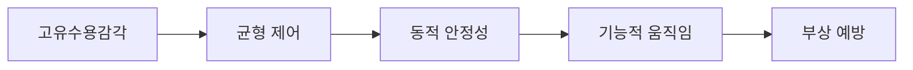
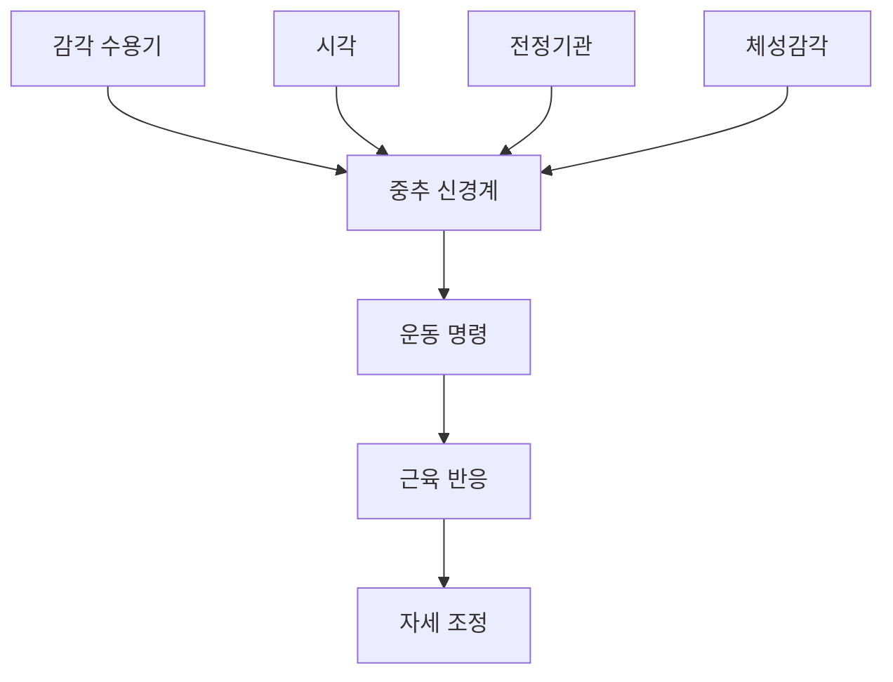
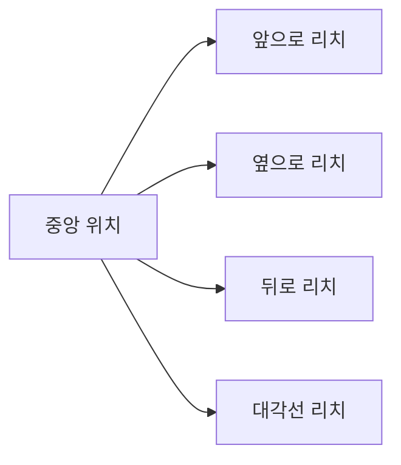
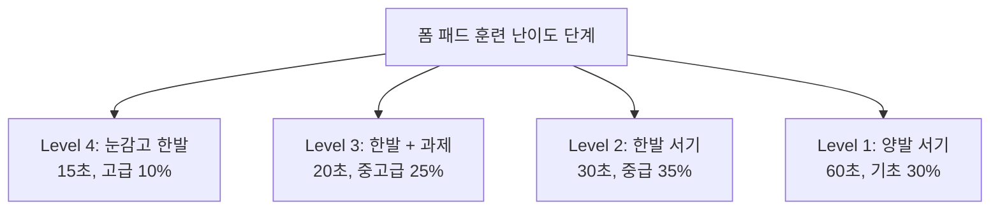
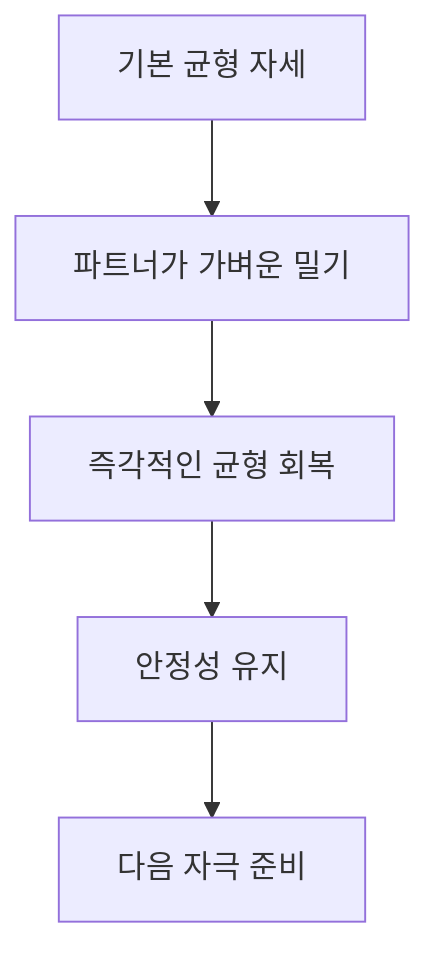
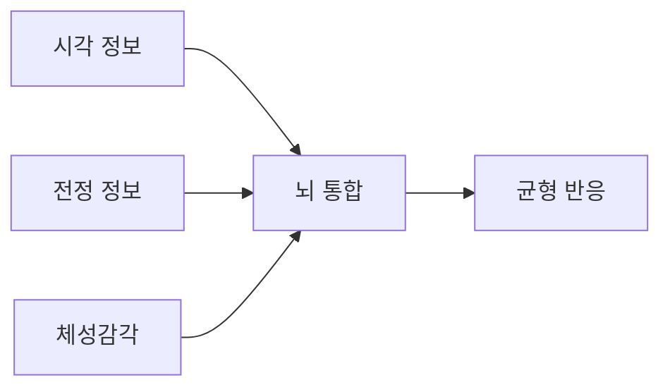
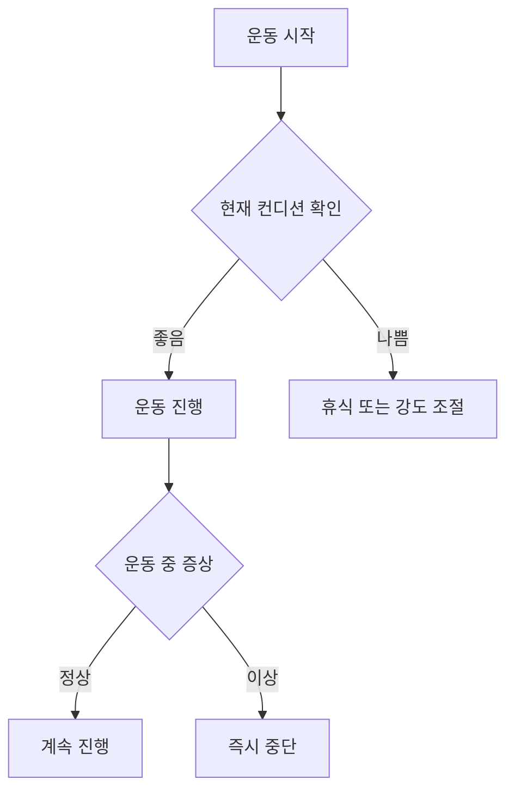
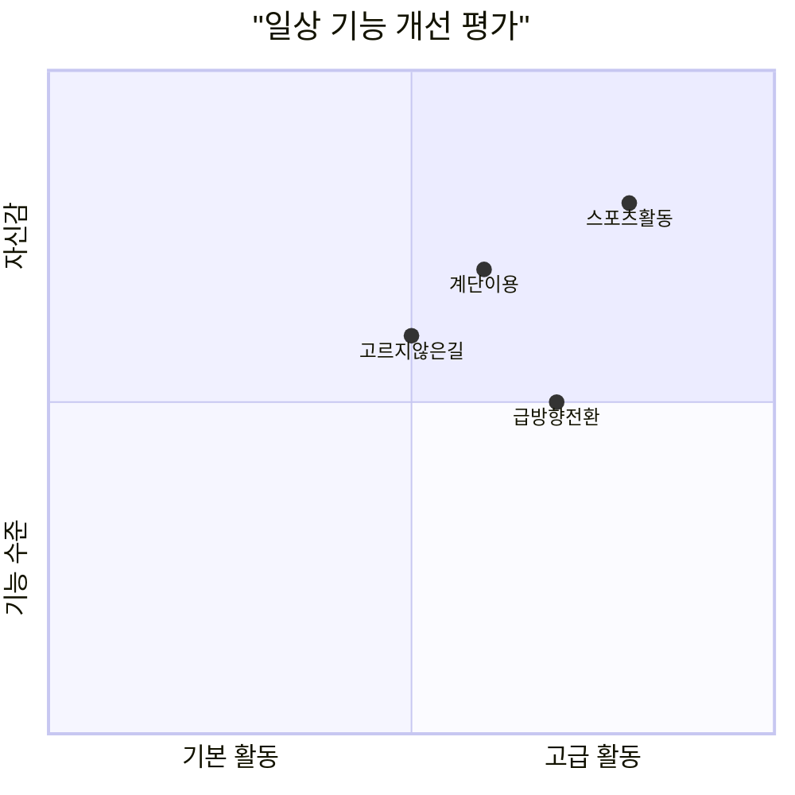

# ⚖️ 균형 및 고유수용감각 훈련

> 발목 안정성과 움직임 제어를 위한 신경근 훈련

## 📋 균형 훈련의 중요성

균형 감각과 고유수용감각은 발목 기능의 핵심 요소입니다. 특히 요족이나 무릎 외반이 있는 경우, 신경근 제어 시스템의 재교육이 필수적입니다.



### 고유수용감각의 과학적 기초

#### 신경근 제어 시스템


**주요 구성 요소**:
- **기계적 수용기**: 압력, 진동, 위치 감지
- **근육 방추**: 근육 길이와 변화율 감지
- **골지건 기관**: 근육 장력 감지
- **관절 수용기**: 관절 위치와 움직임 감지

---

## 🔰 1단계: 기본 균형 훈련 (1-3주)

### 정적 균형 운동

#### 양발 균형 (Eye Open/Closed)
**운동 방법**:
1. **단계 1**: 양발로 서서 30초간 균형 유지 (눈 뜨고)
2. **단계 2**: 양발로 서서 30초간 균형 유지 (눈 감고)
3. **단계 3**: 발 모으고 30초간 균형 유지 (눈 뜨고)
4. **단계 4**: 발 모으고 30초간 균형 유지 (눈 감고)

**운동량**: 각 단계 30초 × 3세트
**진행법**: 각 단계를 완벽히 수행 후 다음 단계 진행

#### 한 발 서기 (Single Leg Stance)
```mermaid
xychart-beta
    title "한 발 서기 능력 발달 곡선"
    x-axis [1주, 2주, 3주, 4주, 5주, 6주]
    y-axis "유지시간(초)" 0 --> 90
    line [15, 25, 40, 55, 70, 85]
```

**기본 자세**:
1. 한 발로 서서 다른 발은 무릎을 90도로 굽혀 들기
2. 손은 양옆에 자연스럽게 두기
3. 시선은 정면 고정점을 바라보기
4. 균형을 잃으면 즉시 다시 시작

**운동량**: 30초 × 3세트 × 양발
**목표**: 60초 이상 흔들림 없이 유지

#### 탠덤 스탠스 (Tandem Stance)
**운동 방법**:
1. 한 발의 뒤꿈치를 다른 발의 발가락에 닿게 하여 일직선 배치
2. 양팔은 옆으로 벌려 균형 보조
3. 30초간 흔들림 없이 유지
4. 발 위치 바꿔서 반복

**운동량**: 30초 × 3세트 (좌우 각각)

### 도전적 균형 운동

#### 한 발 서기 + 과제 수행
**운동 방법**:
1. 한 발로 서기 자세에서 시작
2. 다음 과제들을 순차적으로 수행:
   - 고개 좌우로 돌리기
   - 눈 감고 유지하기
   - 들어올린 발로 공중에 숫자 쓰기
   - 양팔 위아래로 움직이기

**운동량**: 각 과제 30초씩
**효과**: 분할 주의력, 이중 과제 수행 능력

---

## 🌊 2단계: 동적 균형 훈련 (4-6주)

### 움직임 중 균형 유지

#### 한 발 리치 운동 (Single Leg Reach)


**4방향 리치 패턴**:
1. **전방 리치**: 한 발로 서서 반대편 다리를 앞으로 최대한 뻗기
2. **측방 리치**: 옆으로 다리 뻗어 발가락으로 바닥 터치
3. **후방 리치**: 뒤로 다리 뻗어 균형 유지
4. **대각선 리치**: 사선 방향으로 다리 뻗기

**운동량**: 각 방향 8회 × 2세트 × 양발
**주의**: 서있는 발의 정렬 유지가 핵심

#### 동적 한 발 서기
**운동 방법**:
1. 한 발로 서서 들어올린 발로 다양한 패턴 그리기
2. 원, 사각형, 8자 등의 도형
3. 서있는 발의 균형 유지에 집중
4. 점점 큰 동작으로 발전

**운동량**: 각 패턴 30초 × 2세트 × 양발

### 방향 전환 균형

#### 스타 익스커션 (Star Excursion)
**운동 방법**:
1. 중앙에 한 발로 서기
2. 시계 방향으로 8방향 순차적으로 리치
3. 각 방향에서 최대한 멀리 뻗기
4. 발가락으로 바닥 가볍게 터치 후 복귀

**8방향**: 앞, 앞-오른쪽, 오른쪽, 뒤-오른쪽, 뒤, 뒤-왼쪽, 왼쪽, 앞-왼쪽

**운동량**: 완전한 스타 2회 × 양발
**측정**: 각 방향별 도달 거리 기록

#### 시계 균형 운동
**운동 방법**:
1. 시계 문양을 바닥에 그리거나 상상
2. 한 발로 12시 위치에 서기
3. 들어올린 발로 1시, 2시... 순서대로 터치
4. 12시간 완주 후 반대 방향으로 실시

**운동량**: 시계 1바퀴 × 2세트 × 양발

---

## 🏄‍♀️ 3단계: 불안정 표면 훈련 (5-8주)

### 기본 불안정 표면 운동

#### 폼 패드 균형 훈련


**준비물**: 균형 패드 (두께 5-10cm)

**진행 단계**:
1. **Level 1**: 폼 패드 위 양발 서기 (60초)
2. **Level 2**: 폼 패드 위 한 발 서기 (30초)
3. **Level 3**: 한 발 서기 + 머리 움직임 (20초)
4. **Level 4**: 눈 감고 한 발 서기 (15초)

**운동량**: 각 레벨 성공 후 다음 단계 진행

#### 보수볼 훈련 (BOSU Ball)
**준비물**: 보수볼 (반구형 균형볼)

**기본 운동**:
1. 돔 면을 위로 하여 양발로 서기
2. 중심 찾기 후 30초간 균형 유지
3. 한 발씩 들어 올려 균형 도전
4. 양손으로 가벼운 동작 추가

**운동량**: 30초 × 3세트
**안전**: 처음에는 반드시 보조자 필요

### 고급 불안정 표면 운동

#### 에어 쿠션 (Air Cushion) 훈련
**운동 방법**:
1. 에어 쿠션 위에 한 발로 서기
2. 공기압 조절로 난이도 조정
3. 다양한 과제와 결합:
   - 공 던지고 받기
   - 머리 움직임
   - 눈 감고 균형

**운동량**: 30초 × 3세트 × 양발

#### 다중 불안정 표면
**설정**: 폼 패드 + 에어 쿠션 조합

**운동 방법**:
1. 두 개의 다른 불안정 표면을 양발에 각각 배치
2. 균형 유지하며 기본 동작 수행
3. 매우 높은 난이도로 충분한 준비 후 시행

**주의사항**: 반드시 전문가 지도하에 실시

---

## 🎯 4단계: 반응성 및 적응 훈련 (7-10주)

### 예측 불가능한 자극 훈련

#### 파트너 방해 훈련


**운동 방법**:
1. 한 발로 서기 자세에서 시작
2. 파트너가 예고 없이 가볍게 밀기
3. 균형을 잃지 않고 즉시 회복
4. 다양한 방향에서 자극 제공

**운동량**: 10회 × 3세트 × 양발
**강도**: 점진적으로 자극 강도 증가

#### 시각적 교란 훈련
**운동 방법**:
1. 한 발로 서기 자세 유지
2. 파트너가 여러 색깔의 공이나 물체를 무작위로 움직임
3. 특정 색깔이나 신호에 반응하여 손으로 터치
4. 균형은 계속 유지

**운동량**: 2분 × 3세트

### 반응 속도 훈련

#### 방향 지시 반응 훈련
**운동 방법**:
1. 한 발로 서기 자세에서 시작
2. 파트너가 "앞", "뒤", "좌", "우" 지시
3. 들어올린 발로 해당 방향 터치
4. 최대한 빠르게 반응하되 균형 유지

**운동량**: 20회 × 3세트 × 양발
**측정**: 반응 시간과 정확도 기록

#### 색깔 구분 반응 훈련
**준비물**: 다양한 색깔의 콘 또는 마커

**운동 방법**:
1. 주변에 다른 색깔의 마커 배치
2. 한 발로 서서 준비
3. 특정 색깔을 부르면 해당 색깔을 손으로 터치
4. 균형 유지하며 최대한 빠르게 반응

**운동량**: 15회 × 3세트

---

## 📊 고유수용감각 평가 및 측정

### 객관적 평가 방법

#### 한 발 서기 시간 측정

```mermaid
xychart-beta
    title "연령별 한 발 서기 기준값 (초)"
    x-axis ["20-29세", "30-39세", "40-49세", "50-59세", "60세+"]
    y-axis "시간(초)" 0 --> 120
    bar "우수" [90, 85, 75, 60, 45]
    bar "양호" [60, 55, 50, 40, 30]
    bar "개선필요" [30, 25, 20, 15, 10]
```


**측정 방법**:
- 눈 뜨고 한 발 서기: 최대 60초
- 눈 감고 한 발 서기: 최대 30초
- 3회 측정 후 최고값 기록

#### 균형 오차 측정
**준비물**: 밸런스 보드 + 각도계

**측정 항목**:
- 최대 기울어짐 각도
- 평균 흔들림 범위
- 균형 회복 시간

### 주관적 평가 도구

#### 발목 안정성 자가 평가 (AIAS)
**질문 항목** (1-5점 척도):
1. 평지 걸을 때 발목이 불안한가? ___점
2. 계단 내려갈 때 조심스러운가? ___점
3. 운동 중 발목을 다칠까 걱정되는가? ___점
4. 고르지 않은 길에서 균형을 잃는가? ___점
5. 갑작스런 방향 전환이 어려운가? ___점

**총점**: ___/25점 (높을수록 불안정)

#### 기능적 평가 설문
**일상 활동 수행 능력** (0-10점):
- 계단 오르내리기: ___점
- 언덕길 걷기: ___점
- 스포츠 활동: ___점
- 일반적 보행: ___점

---

## 🧠 신경근 재교육 프로그램

### 감각 통합 훈련

#### 다감각 통합 운동


**운동 방법**:
1. 다양한 감각 조건에서 균형 훈련
2. 시각 차단 + 청각 자극
3. 시각 교란 + 촉각 피드백
4. 복합 감각 상황에서 적응

#### 감각 교육 순서
**1단계**: 시각 의존도 감소
- 눈 감고 운동 비중 증가
- 시각 외 감각에 집중

**2단계**: 전정 기관 활성화
- 머리 움직임과 함께하는 균형 훈련
- 다양한 머리 위치에서 균형 유지

**3단계**: 체성감각 강화
- 다양한 표면에서의 적응
- 발바닥 감각 의존도 증가

### 예측적 자세 조절

#### 예상 자세 조절 (APA) 훈련
**운동 방법**:
1. 움직임 시작 전 자세 준비 연습
2. 예상되는 동작에 대한 사전 조절
3. 점진적으로 예측 시간 단축

**적용 예시**:
- 공 잡기 전 균형 준비
- 방향 전환 전 자세 조정
- 점프 착지 전 근육 활성화

#### 피드포워드 제어 훈련
**목표**: 반응성에서 예측성으로 전환

**훈련 방법**:
1. 반복적인 동작 패턴 학습
2. 점진적으로 속도 증가
3. 자동화된 반응 개발

---

## 🎮 게임 기반 균형 훈련

### 디지털 게임 활용

#### 닌텐도 Wii Balance Board
**추천 게임**:
- Wii Fit Plus: 요가, 균형 게임
- Wii Sports: 스키, 스노보드
- Balance Bubble: 공 조절 게임

**운동량**: 20-30분 × 주 3회
**장점**: 재미있고 지속 가능한 동기 부여

#### 스마트폰 앱 활용
**추천 앱**:
- MyLift: 균형 측정 및 훈련
- Sway Medical: 균형 평가
- Balance Training: 맞춤형 훈련

### 전통적 게임 방식

#### 비석치기 변형 게임
**운동 방법**:
1. 한 발로 서서 돌 던지기
2. 한 발로 뛰어가서 돌 줍기
3. 균형 유지하며 되돌아오기

#### 줄다리기 균형 게임
**운동 방법**:
1. 한 발로 서서 줄다리기
2. 균형 잃지 않고 상대방과 경쟁
3. 팀을 이뤄 더 재미있게 진행

---

## ⚠️ 안전 지침 및 주의사항

### 운동 환경 안전

#### 필수 안전 조건
- [ ] 미끄럽지 않은 바닥
- [ ] 주변에 날카로운 물체 없음
- [ ] 넘어질 경우 잡을 수 있는 지지대
- [ ] 충분한 운동 공간 (3m × 3m)
- [ ] 응급처치 용품 준비

#### 운동 중 안전 수칙


### 위험 신호 및 대처

#### 즉시 중단해야 할 증상
- 현기증이나 어지러움
- 날카로운 관절 통증
- 심한 근육 경련
- 호흡 곤란
- 가슴 통증

#### 응급처치 요령
**넘어짐 발생 시**:
1. 움직이지 말고 상태 확인
2. 통증 부위 확인
3. 필요시 의료진 연락
4. RICE 요법 적용

---

## 📈 진행 평가 및 기록

### 주간 평가 체크리스트

| 주차 | 한발서기(초) | 눈감고균형(초) | 불안정면균형(초) | 반응속도(초) | 자신감(1-10) |
|------|-------------|---------------|----------------|-------------|-------------|
| 1주 | ___ | ___ | ___ | ___ | ___ |
| 2주 | ___ | ___ | ___ | ___ | ___ |
| 4주 | ___ | ___ | ___ | ___ | ___ |
| 6주 | ___ | ___ | ___ | ___ | ___ |
| 8주 | ___ | ___ | ___ | ___ | ___ |

### 기능적 개선 지표

#### 일상 생활 개선도


**측정 방법**: 월 1회 자가 평가 (1-10점 척도)

#### 객관적 측정값 추적
- **정적 균형**: 한 발 서기 최대 시간
- **동적 균형**: 스타 익스커션 도달 거리
- **반응성**: 방향 지시 반응 시간
- **안정성**: 균형 오차 범위

---

## 🎯 개인별 맞춤 프로그램

### 질환별 특화 훈련

#### 요족 환자 특화 프로그램
**중점 사항**:
- 족저압 분산 훈련
- 전족부 안정성 강화
- 충격 흡수 능력 개발

**특별 운동**:
- 발가락 균형 훈련
- 전족부 압력 조절 연습
- 아치 지지 의식 개발

#### 무릎 외반 환자 특화 프로그램
**중점 사항**:
- 고관절-무릎-발목 정렬 훈련
- 내측 근육 활성화
- 전체적인 하지 안정성

**특별 운동**:
- 정렬 의식 균형 훈련
- 내전근 활성화 균형 운동
- 기능적 스쿼트 균형

### 연령별 접근법

#### 청소년 (12-18세)
- 스포츠 특화 균형 훈련
- 게임 기반 재미있는 접근
- 빠른 발전 속도 가능

#### 성인 (19-64세)
- 직업별 특화 훈련
- 운동 목표에 맞는 맞춤화
- 체계적이고 점진적 접근

#### 고령자 (65세 이상)
- 낙상 예방 중심
- 안전성 최우선
- 천천히 확실하게 진행

---

## 🏆 성공 사례 및 팁

### 실제 개선 사례

#### 요족 환자 사례 (김○○, 28세)
**초기 상태**: 한 발 서기 15초, 불안정면 불가능
**8주 후**: 한 발 서기 90초, 보수볼 훈련 가능
**코멘트**: "처음엔 1분도 어려웠는데 이제 자신감이 생겼어요"

#### 무릎 외반 환자 사례 (박○○, 35세)
**초기 상태**: 눈 감고 균형 5초, 일상에서 자주 넘어짐
**10주 후**: 눈 감고 60초, 스포츠 활동 복귀
**코멘트**: "균형 운동 덕분에 무릎도 안정되고 걷기가 편해졌어요"

### 성공을 위한 핵심 팁

#### 진행 속도 조절
- 너무 빠른 진행은 오히려 역효과
- 한 단계씩 확실하게 마스터
- 개인차를 인정하고 조급하지 않기

#### 일관성 유지
- 매일 조금씩이 몰아서 하는 것보다 효과적
- 운동 시간과 장소를 고정하여 습관화
- 진전 상황을 기록하여 동기 부여

#### 안전 우선
- 무리하지 않고 점진적으로 발전
- 통증이나 불편함 발생 시 즉시 중단
- 정기적으로 전문가 검진 받기

---

> 💡 **균형 훈련의 핵심**: 균형과 고유수용감각 훈련은 **신경계의 재교육 과정**입니다. 근력 운동과 달리 **뇌와 신경계가 새로운 패턴을 학습**하는 데 시간이 걸립니다. **꾸준함과 인내**가 가장 중요하며, 작은 진전도 큰 의미가 있습니다. 안전을 최우선으로 하여 **자신의 한계를 점진적으로 확장**해 나가시기 바랍니다!