# 🔰 기초 단계 발목 운동

> 발목 강화의 첫 걸음: 안전하고 효과적인 기본 운동

## 📋 기초 단계 개요

기초 단계는 발목 강화 프로그램의 토대가 되는 중요한 시기입니다. 급하게 진행하지 말고 충분한 시간을 투자하여 올바른 움직임 패턴을 익히는 것이 중요합니다.


### 기초 단계 목표
- **관절 가동범위 확보**: 정상 범위의 90% 이상
- **기본 근력 개발**: 체중의 50% 지지 가능
- **통증 감소**: 일상 활동 시 통증 없음
- **움직임 패턴**: 올바른 발목 움직임 습득

---

## 🏃‍♀️ 1단계: 관절 가동범위 운동 (1-2주)

### 족저굴곡/배굴 운동 (Plantarflexion/Dorsiflexion)

#### 기본 족저굴곡 운동


**운동 방법**:
1. 의자에 편안히 앉아 발을 바닥에서 들어 올림
2. 발가락을 최대한 아래쪽으로 향하게 함
3. 종아리 뒤쪽 스트레칭 느낌이 들도록 3초간 유지
4. 천천히 시작 자세로 돌아감

**운동량**: 15회 × 3세트 × 양발
**주의사항**: 통증이 있으면 즉시 중단, 부드럽게 진행

#### 기본 배굴 운동
**운동 방법**:
1. 같은 시작 자세에서 발가락을 위쪽으로 당김
2. 정강이 앞쪽 근육에 수축감이 느껴질 때까지
3. 3초간 유지 후 천천히 이완

**운동량**: 15회 × 3세트 × 양발

### 내전/외전 운동 (Inversion/Eversion)

#### 발목 내전 운동


**운동 방법**:
1. 발을 몸의 중심선 쪽으로 기울임
2. 발바닥이 서로 마주보는 느낌
3. 발목 안쪽 근육의 수축감 확인
4. 3초 유지 후 이완

**운동량**: 12회 × 3세트 × 양발

#### 발목 외전 운동
**운동 방법**:
1. 발을 몸의 바깥쪽으로 기울임
2. 발바닥이 바깥을 향하는 느낌
3. 발목 바깥쪽 근육의 수축감 확인
4. 3초 유지 후 이완

**운동량**: 12회 × 3세트 × 양발

### 복합 가동범위 운동

#### 발목 알파벳 쓰기
**운동 방법**:
1. 발가락으로 공중에 알파벳 A부터 Z까지 쓰기
2. 큰 움직임으로 천천히 진행
3. 모든 방향의 움직임을 포함하도록 함

**운동량**: A-Z 한 번씩 × 2세트 × 양발
**효과**: 전 방향 가동범위 개선, 협응 능력 향상

---

## 💪 2단계: 기본 근력 강화 (2-3주)

### 등척성 운동 (Isometric Exercises)

#### 벽 밀기 운동 (Wall Push)


**운동 방법**:
1. 벽에서 30cm 떨어져 서기
2. 한쪽 발의 발가락 부분을 벽에 대기
3. 발목에 힘을 주어 벽을 미는 느낌
4. 10초간 수축 유지 후 이완

**운동량**: 10초 × 10회 × 양발
**주요 효과**: 전경골근, 발목 신근 강화

#### 바닥 밀기 운동 (Floor Push)
**운동 방법**:
1. 의자에 앉아 발을 바닥에 완전히 대기
2. 발가락에 힘을 주어 바닥을 누르는 느낌
3. 종아리 근육의 수축감 확인
4. 10초간 유지 후 이완

**운동량**: 10초 × 10회 × 양발
**주요 효과**: 비복근, 가자미근 강화

### 동적 근력 운동

#### 종아리 올리기 (Calf Raises)
```mermaid
xychart-beta
    title "종아리 올리기 근육 활성도 (%)"
    x-axis [시작위치, 중간위치, 최고점, 하강, 마무리]
    y-axis "활성도" 0 --> 100
    line [10, 45, 100, 60, 15]
```

**운동 방법**:
1. 서서 발 전체를 바닥에 붙임
2. 발가락 끝으로 몸을 들어 올림
3. 최고점에서 2초간 유지
4. 천천히 시작 자세로 돌아감

**운동량**: 15회 × 3세트
**변형**: 한 발씩, 계단 가장자리 이용

#### 발가락 들기 (Toe Raises)
**운동 방법**:
1. 서서 뒤꿈치만 바닥에 붙임
2. 발가락과 앞꿈치를 최대한 위로 들어 올림
3. 정강이 앞쪽 근육의 수축감 확인
4. 2초간 유지 후 천천히 내림

**운동량**: 15회 × 3세트
**주요 효과**: 전경골근, 발목 신근 강화

---

## 🎯 3단계: 기능적 기초 운동 (3-4주)

### 체중 지지 운동

#### 한쪽 다리 체중 지지
**운동 방법**:
1. 양손으로 의자나 벽을 잡고 서기
2. 한쪽 다리를 들어 올려 한 발로 서기
3. 발목의 안정성을 유지하며 균형 잡기
4. 30초간 유지 후 다리 바꿔 실시

**운동량**: 30초 × 3세트 × 양발
**진행**: 점차 지지 없이 서기 도전

#### 발뒤꿈치-발가락 걷기 (Heel-to-Toe Walk)


**운동 방법**:
1. 한 발의 뒤꿈치를 다른 발의 발가락에 닿게 하여 걷기
2. 직선을 따라 10걸음 전진
3. 균형을 잃지 않도록 주의
4. 되돌아오면서 반복

**운동량**: 10걸음 × 5회
**효과**: 동적 균형, 보행 패턴 개선

### 일상 동작 연계 운동

#### 계단 오르기 준비 운동
**운동 방법**:
1. 낮은 스텝박스(10-15cm) 준비
2. 한 발을 올려놓고 체중을 실음
3. 발목으로 몸을 밀어 올리는 느낌
4. 천천히 내려와서 반복

**운동량**: 10회 × 3세트 × 양발

#### 앉았다 일어서기 with 발목 강조
**운동 방법**:
1. 의자에 앉아 발을 바닥에 완전히 붙임
2. 발목에 힘을 주어 발가락으로 바닥을 누름
3. 이 상태에서 천천히 일어서기
4. 발목의 힘을 유지하며 다시 앉기

**운동량**: 10회 × 3세트

---

## 📊 주차별 진행 체크리스트

### 1주차 목표 및 평가

#### 목표
- [x] 모든 방향 가동범위 50% 이상 확보
- [x] 통증 없이 기본 동작 수행
- [x] 발목 알파벳 쓰기 A-M까지 가능

#### 일일 운동 스케줄

```mermaid
gantt
    title 1주차 일일 운동 스케줄
    dateFormat HH:mm
    axisFormat %H:%M

    section 아침
    가동범위 운동 : done, morning, 07:00, 08:00

    section 점심
    등척성 운동 : done, lunch, 12:30, 13:00

    section 저녁
    종합 운동 : done, evening, 19:00, 19:30
```


### 2주차 목표 및 평가

#### 목표
- [x] 가동범위 70% 이상 확보
- [x] 등척성 운동 10초 유지 가능
- [x] 종아리 올리기 10회 연속 가능

#### 자가 평가 항목
| 항목 | 목표 | 달성도 | 비고 |
|------|------|--------|------|
| 족저굴곡 각도 | 40도 | ___도 | |
| 배굴 각도 | 15도 | ___도 | |
| 등척성 유지 시간 | 10초 | ___초 | |
| 종아리 올리기 | 10회 | ___회 | |

### 3-4주차 종합 평가

#### 기초 단계 완료 기준
- [x] **가동범위**: 정상의 80% 이상
- [x] **근력**: 기본 동작 15회 이상 수행
- [x] **균형**: 한 발 서기 30초 이상
- [x] **통증**: 일상 활동 시 통증 없음
- [x] **기능**: 계단 오르기 불편함 없음

---

## 🔍 흔한 실수와 교정법

### 실수 1: 너무 빠른 진행
**증상**: 2-3일 만에 모든 동작을 완벽하게 하려고 함
**문제점**: 근육과 관절의 적응 시간 부족, 부상 위험
**교정법**: 주차별 목표에 맞춰 천천히 진행

### 실수 2: 통증 무시
**증상**: 약간의 통증이 있어도 계속 운동
**문제점**: 염증 악화, 만성 통증 발생
**교정법**: 통증 발생 시 즉시 중단, 휴식 후 재개

### 실수 3: 한쪽 발만 집중
**증상**: 아픈 쪽 발만 운동하고 건강한 발은 소홀
**문제점**: 좌우 불균형 심화
**교정법**: 항상 양쪽 발을 동일하게 운동

### 실수 4: 불규칙한 운동
**증상**: 하루는 많이, 하루는 전혀 안 함
**문제점**: 일관된 적응과 발전 어려움
**교정법**: 매일 조금씩 꾸준히 실시

---

## 🎯 동기 부여 및 관리 팁

### 진행 상황 기록

#### 운동 일지 작성법


**기록할 내용**:
- 수행한 운동 종류와 횟수
- 운동 중 느낌과 통증 정도
- 목표 대비 달성도
- 다음에 개선할 점

#### 사진/동영상 기록
- 주 1회 운동 자세 촬영
- 가동범위 변화 측정
- 전후 비교를 통한 동기 부여

### 성취감 증대 방법

#### 작은 목표 설정
- 주 단위 구체적 목표 설정
- 달성 시 작은 보상 주기
- 가족, 친구와 진행 상황 공유

#### 진전 시각화
```mermaid
xychart-beta
    title "나의 발목 기능 개선 그래프"
    x-axis [1주, 2주, 3주, 4주]
    y-axis "기능 점수" 0 --> 100
    line [30, 55, 75, 85]
```

---

## 💡 생활 속 응용법

### 틈새 시간 활용

#### 업무 중 (사무실)
- 책상 아래에서 발목 돌리기
- 의자에 앉아 종아리 올리기
- 화장실 갈 때 발가락 걷기

#### 집안일 중
- 설거지하며 한 발 서기
- TV 시청 중 발목 운동
- 양치하며 종아리 올리기

#### 대중교통 이용 시
- 지하철/버스에서 균형 잡기
- 승강장에서 발목 스트레칭
- 걸어가며 올바른 보행 연습

### 가족 함께 운동

#### 아이들과 함께
- 발목 운동을 놀이로 변환
- 균형 잡기 게임
- 함께 운동 일지 작성

#### 부부/친구와 함께
- 서로 운동 자세 확인
- 동기 부여 파트너 역할
- 진행 상황 공유

---

## 📋 4주 완주 후 평가

### 종합 기능 테스트

#### 필수 테스트 항목
1. **가동범위 측정**
   - 족저굴곡: ___도 (목표 40도 이상)
   - 배굴: ___도 (목표 15도 이상)
   - 내/외전: ___도 (목표 각 20도 이상)

2. **근력 테스트**
   - 종아리 올리기: ___회 (목표 20회 이상)
   - 발가락 들기: ___회 (목표 15회 이상)
   - 등척성 유지: ___초 (목표 15초 이상)

3. **균형 테스트**
   - 한 발 서기: ___초 (목표 60초 이상)
   - 눈 감고 서기: ___초 (목표 30초 이상)

#### 다음 단계 준비도 평가
- [ ] 모든 기초 운동을 통증 없이 수행 가능
- [ ] 일상 활동에서 발목 불편함 없음
- [ ] 운동 습관이 자연스럽게 형성됨
- [ ] 더 도전적인 운동에 대한 의욕 있음

---

## 🚀 강화 단계로의 전환

### 전환 시기 판단
**준비 완료 신호**:
- 4주 프로그램 95% 이상 완수
- 목표 기능 80% 이상 달성
- 통증 없이 모든 동작 수행
- 일상 생활 개선 체감

### 강화 단계 준비
**필요한 준비물**:
- 저항 밴드 (중강도)
- 균형 패드 또는 쿠션
- 작은 스텝박스
- 운동 일지

**마음가짐**:
- 기초의 중요성 인식
- 점진적 발전에 대한 인내
- 꾸준함의 가치 이해
- 장기적 관점 유지

---

> 💡 **기초 단계 성공의 열쇠**: 발목 강화의 기초 단계는 건물의 기초와 같습니다. **서두르지 말고 탄탄하게** 기본기를 다져야 다음 단계에서 더 큰 발전을 이룰 수 있습니다. 매일 조금씩이라도 꾸준히 하는 것이 가장 중요합니다. 4주 후에는 분명히 놀라운 변화를 경험하게 될 것입니다!