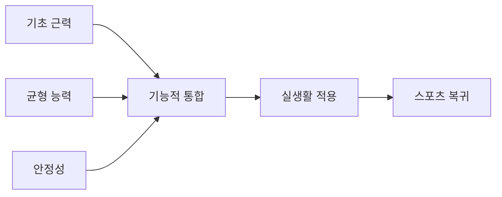
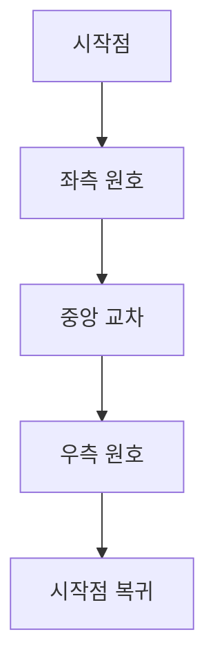
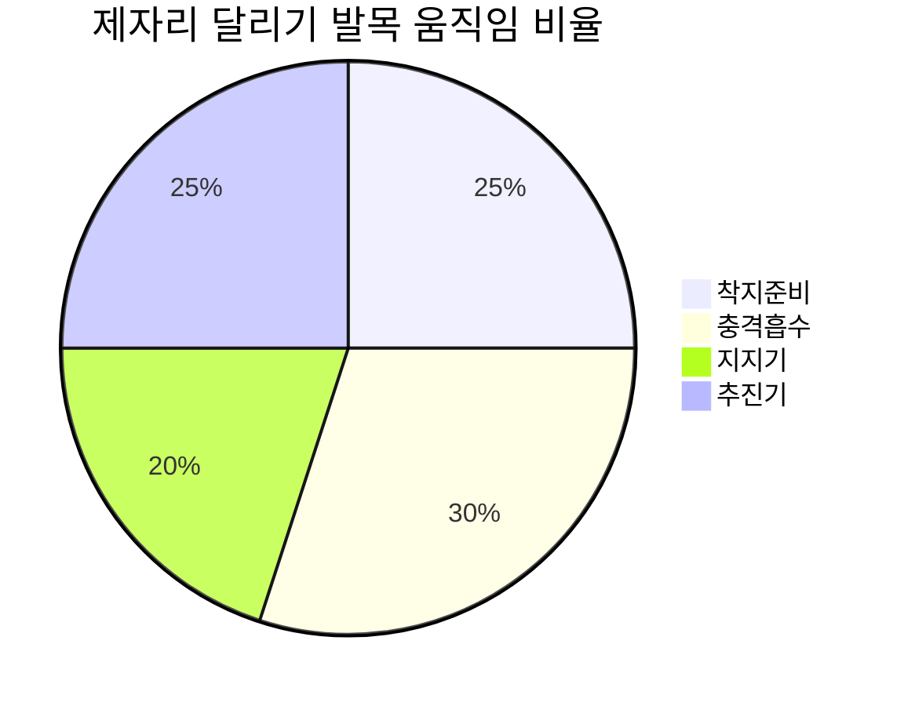
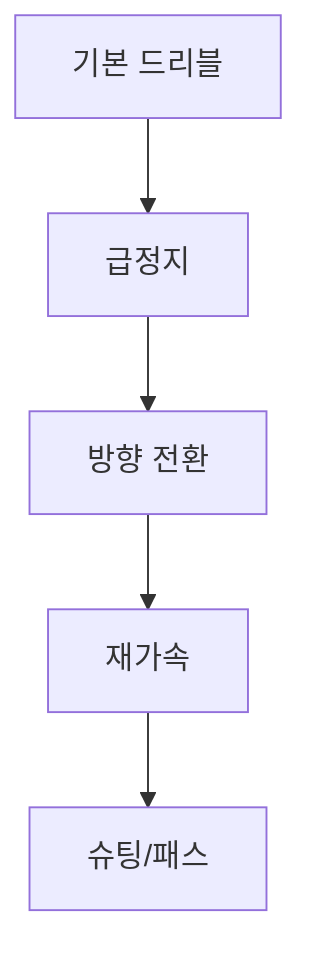
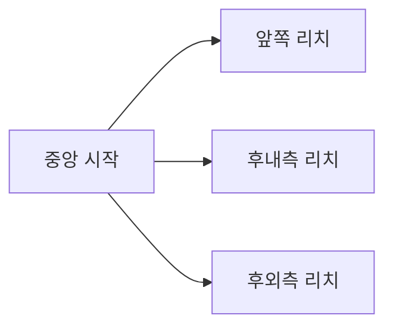
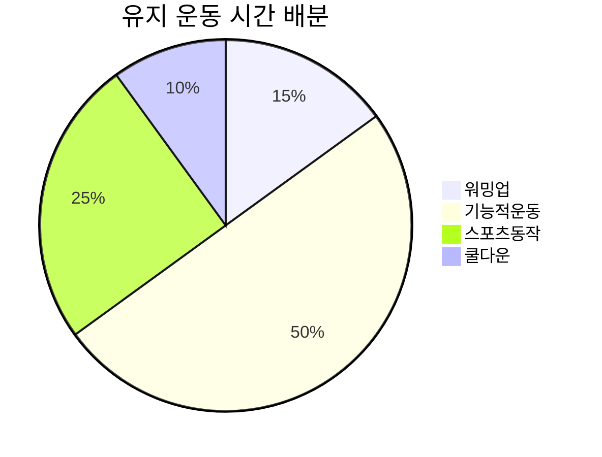
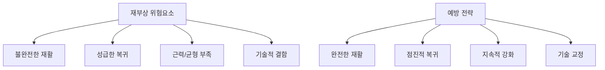

# 🏃‍♀️ 기능적 발목 운동

> 실생활 적용을 위한 통합적 움직임 훈련

## 📋 기능적 운동의 의미

기능적 운동은 앞서 학습한 근력, 균형, 안정성을 실제 생활과 스포츠 상황에 적용하는 최종 단계입니다. 요족과 무릎 외반 교정의 완성을 위한 핵심 과정입니다.



### 기능적 훈련의 목표 (9-12주)
- **일상 동작 최적화**: 걷기, 계단 이용, 방향 전환
- **스포츠 동작 준비**: 달리기, 점프, 급정지
- **부상 예방**: 예측 불가능한 상황 대응
- **자신감 회복**: 모든 활동에 대한 확신

---

## 🚶‍♀️ 1단계: 보행 최적화 훈련 (9-10주)

### 정상 보행 패턴 재교육

#### 발뒤꿈치-발가락 보행 (Heel-to-Toe Gait)


**운동 방법**:
1. 직선을 따라 뒤꿈치부터 발가락까지 순차적 착지
2. 각 단계에서 발목의 역할 의식적으로 인지
3. 보폭과 케이던스 점진적 조절
4. 양쪽 발의 대칭성 확인

**운동량**: 20보 × 5세트
**진행**: 느린 속도 → 정상 속도 → 빠른 속도

#### 다양한 표면에서의 보행
**표면 종류**:
- 평지 → 잔디 → 자갈길 → 경사면
- 실내 → 실외 환경
- 딱딱한 면 → 부드러운 면

**적응 훈련**:
1. 각 표면에서 5분간 천천히 걷기
2. 발목의 적응 반응 의식적 관찰
3. 점진적으로 속도와 거리 증가
4. 표면 변화 시 즉각적 적응 연습

### 방향 전환 보행 훈련

#### 8자 보행 (Figure-8 Walking)


**설정**: 2m 간격으로 콘 2개 배치

**운동 방법**:
1. 두 콘을 중심으로 8자 모양 걷기
2. 방향 전환 시 발목 안정성 유지
3. 좌우 턴에서 동일한 품질 유지
4. 점진적으로 속도 증가

**운동량**: 5바퀴 × 3세트 (좌우 각각 시작)

#### 급작스러운 방향 전환
**운동 방법**:
1. 정면으로 10보 걷기
2. 신호에 따라 90도, 180도 회전
3. 회전 후 즉시 안정적 보행 재개
4. 예측 불가능한 신호로 반응성 향상

**운동량**: 20회 방향 전환 × 3세트

---

## 🏔️ 2단계: 계단 및 경사면 훈련 (10주)

### 계단 오르내리기 최적화

#### 정상 계단 보행 패턴
```mermaid
xychart-beta
    title "계단 오르기 시 발목 각도 변화"
    x-axis [착지, 체중이동, 추진, 다음계단]
    y-axis "각도(도)" 0 --> 30
    line [5, 15, 25, 20]
```

**오르기 기술**:
1. **준비 단계**: 발 전체를 계단에 완전히 올리기
2. **상승 단계**: 발목으로 몸을 밀어 올리기
3. **안정화**: 다음 계단에서 균형 확보
4. **리듬**: 일정한 템포 유지

**내려가기 기술**:
1. **제어된 착지**: 앞발로 충격 흡수
2. **체중 이동**: 점진적인 하중 전환
3. **안정성 유지**: 발목의 편심성 수축
4. **다음 준비**: 연속 동작 준비

**운동량**: 2-3층 계단 × 10회 왕복

#### 다양한 계단 높이 적응
**훈련 순서**:
1. **표준 계단** (15cm): 기본 패턴 학습
2. **낮은 계단** (10cm): 빠른 리듬 연습
3. **높은 계단** (20cm): 파워와 안정성
4. **불규칙 높이**: 적응 능력 개발

### 경사면 보행 훈련

#### 오르막 보행
**기술 포인트**:
- 발가락 부분으로 지면 파악
- 짧은 보폭으로 안정성 확보
- 발목 배굴 가동범위 활용
- 균형 있는 팔 움직임

**운동량**: 10도 경사 → 15도 → 20도 (각 5분씩)

#### 내리막 보행
**기술 포인트**:
- 뒤꿈치부터 조심스럽게 착지
- 발목의 제어된 족저굴곡
- 짧고 안전한 보폭 유지
- 중심 낮추어 안정성 확보

**안전 주의사항**:
- 처음엔 난간이나 지지대 활용
- 점진적으로 경사도와 거리 증가
- 피로 시 즉시 휴식

---

## 🏃‍♂️ 3단계: 달리기 및 스포츠 준비 (11주)

### 달리기 기본기 훈련

#### 제자리 달리기 (Stationary Running)


**운동 방법**:
1. 제자리에서 가벼운 달리기 동작
2. 발목의 스프링 효과 의식
3. 앞발로 착지, 발목으로 추진
4. 리듬감 있는 움직임 유지

**운동량**: 30초 × 5세트
**포커스**: 발목의 효율적 움직임 패턴

#### 직선 조깅 (Straight Line Jogging)
**진행 단계**:
1. **Phase 1**: 50m 천천히 조깅
2. **Phase 2**: 100m 중간 속도
3. **Phase 3**: 200m 목표 속도
4. **Phase 4**: 다양한 거리와 속도

**기술 체크포인트**:
- 앞발 착지로 충격 분산
- 발목의 자연스러운 스프링 액션
- 좌우 발의 대칭적 움직임
- 상체와 하체의 협조

### 방향 전환 달리기

#### 콘 드릴 (Cone Drills)


**기본 패턴**:
1. **슬라럼**: 콘 사이를 지그재그로 달리기
2. **L-드릴**: L자 모양 경로 따라 달리기
3. **T-드릴**: T자 모양 패턴 수행
4. **사각형 드릴**: 사각형 모서리에서 90도 회전

**운동량**: 각 패턴 5회 × 2세트

#### 예측 불가능한 방향 전환
**운동 방법**:
1. 정면으로 달리다가 신호에 따라 방향 전환
2. 좌, 우, 후진 등 다양한 방향
3. 전환 시 발목 안정성 유지
4. 즉각적인 균형 회복

**훈련 효과**: 스포츠 상황 대응력, 부상 예방

---

## 🤸‍♀️ 4단계: 점프 및 착지 훈련 (12주)

### 기본 점프 훈련

#### 수직 점프 (Vertical Jump)
**운동 방법**:
1. **준비**: 발을 어깨너비로 벌리고 서기
2. **로딩**: 발목, 무릎, 고관절 동시 굽히기
3. **폭발**: 발목부터 시작하여 전신으로 점프
4. **착지**: 발가락-전족부-뒤꿈치 순서로 착지

```mermaid
xychart-beta
    title "점프 사이클 중 발목 각도 변화"
    x-axis [준비, 로딩, 이륙, 공중, 착지, 안정]
    y-axis "각도(도)" -30 --> 40
    line [0, -25, 35, 15, -20, 0]
```

**운동량**: 10회 × 4세트
**포커스**: 착지 시 발목의 충격 흡수

#### 수평 점프 (Horizontal Jump)
**운동 방법**:
1. 제자리에서 최대한 멀리 점프
2. 이륙 시 발목의 강력한 추진력 활용
3. 공중에서 착지 준비 자세
4. 안전하고 안정적인 착지

**운동량**: 8회 × 3세트
**측정**: 점프 거리 기록하여 진전 확인

### 복합 점프 훈련

#### 연속 점프 (Continuous Jumps)
**운동 종류**:
1. **바운딩**: 앞으로 연속 점프
2. **호핑**: 한 발로 연속 점프
3. **사이드 홉**: 좌우로 연속 점프
4. **박스 점프**: 높이 있는 곳으로 점프

**안전 수칙**:
- 적절한 휴식으로 피로 방지
- 착지 기술에 집중
- 점진적인 높이와 거리 증가

#### 반응성 점프 (Reactive Jumps)
**운동 방법**:
1. 상자에서 뛰어내린 후 즉시 다음 점프
2. 지면 접촉 시간 최소화
3. 발목의 빠른 반응 활용
4. 연속적인 폭발적 움직임

**운동량**: 5회 × 3세트
**효과**: 근육의 신장-단축 주기 개선

---

## ⚽ 5단계: 스포츠 특화 훈련 (12주+)

### 종목별 특화 훈련

#### 축구/농구 (방향 전환 중심)


**핵심 동작**:
- 페이크 앤 컷 (Fake & Cut)
- 크로스오버 스텝
- 급정지 후 방향 전환
- 점프 후 안정적 착지

**훈련 방법**:
1. 드리블하며 방향 전환 연습
2. 상대방 움직임에 대한 반응 훈련
3. 피벗 동작에서 발목 안정성
4. 점프 슛 후 착지 안정성

#### 테니스/배드민턴 (민첩성 중심)
**핵심 동작**:
- 사이드 스텝과 크로스 스텝
- 전후 움직임과 급정지
- 낮은 자세에서의 균형 유지
- 빠른 회복과 준비 자세

**훈련 방법**:
1. 셔틀런과 사이드 셔틀
2. 네트 주변 민첩성 훈련
3. 다양한 높이에서 발리 연습
4. 코너 플레이 시뮬레이션

#### 등산/트레킹 (지구력 중심)
**핵심 요소**:
- 불규칙한 지형 적응
- 장시간 안정성 유지
- 하중 부하 상태에서 균형
- 피로 상태에서도 안전성

**훈련 방법**:
1. 배낭을 메고 언덕 오르내리기
2. 돌멩이나 나무 위에서 균형 잡기
3. 장시간 보행 후에도 안정성 유지
4. 다양한 경사에서 적응 훈련

---

## 🎯 통합 기능 평가

### 종합 기능 테스트 배터리

#### 1. 동적 균형 테스트 (Y-Balance Test)


**측정 방법**:
1. 중앙에 한 발로 서기
2. 반대 발로 3방향 최대한 멀리 뻗기
3. 좌우 다리 각각 3회씩 측정
4. 최고 기록으로 좌우 대칭성 평가

**정상 기준**: 좌우 차이 4cm 이내

#### 2. 기능적 점프 테스트
**테스트 항목**:
- **수직 점프**: 최대 높이 측정
- **수평 점프**: 최대 거리 측정
- **삼단 점프**: 연속 점프 거리
- **측면 점프**: 좌우 방향 점프

**평가 기준**: 연령별, 성별 기준값과 비교

#### 3. 스포츠 기능 테스트
**테스트 구성**:
1. **T-테스트**: 민첩성 평가 (20초 이내)
2. **505 테스트**: 감속 후 가속 (남 2.5초, 여 2.8초 이내)
3. **일리노이 테스트**: 종합 민첩성 (남 15초, 여 17초 이내)

### 주관적 기능 평가

#### FAAM (Foot and Ankle Ability Measure)
**일상 활동 척도** (21개 항목):
- 계단 내려가기: ___/4점
- 계단 올라가기: ___/4점
- 집안일하기: ___/4점
- 고르지 않은 땅 걷기: ___/4점

**스포츠 활동 척도** (8개 항목):
- 달리기: ___/4점
- 점프하기: ___/4점
- 방향 급전환: ___/4점
- 갑작스런 시작/정지: ___/4점

**총점**: ___/100점 (90점 이상 정상 기능)

---

## 📊 장기 관리 및 유지

### 유지 운동 프로그램

#### 주 3회 유지 루틴 (30분)


**월요일**: 근력 및 안정성 유지
- 저항 밴드 운동 (10분)
- 균형 훈련 (10분)
- 기능적 움직임 (10분)

**수요일**: 스포츠 동작 연습
- 점프 및 착지 (10분)
- 방향 전환 훈련 (10분)
- 종목별 특화 동작 (10분)

**금요일**: 종합 기능 훈련
- 복합 움직임 (15분)
- 반응성 훈련 (10분)
- 실전 시뮬레이션 (5분)

### 정기 평가 및 조정

#### 월간 자가 평가
**체크 항목**:
- [ ] 일상 활동에서 불편함 없음
- [ ] 스포츠 활동 수행 가능
- [ ] 발목 자신감 유지
- [ ] 새로운 통증이나 증상 없음

#### 분기별 전문 평가
**권장 사항**:
- 물리치료사 기능 평가
- 운동 프로그램 재검토
- 새로운 목표 설정
- 필요시 프로그램 수정

---

## 🚨 부상 복귀 가이드라인

### 부상 후 단계별 복귀

#### Phase 1: 급성기 관리 (1-3일)
- RICE 원칙 적용
- 통증과 부종 관리
- 보호 및 휴식

#### Phase 2: 조기 재활 (3-14일)
- 가동범위 회복
- 기본 근력 운동
- 부분 체중 부하

#### Phase 3: 강화 재활 (2-6주)
- 점진적 근력 강화
- 균형 훈련 재도입
- 기능적 움직임 시작

#### Phase 4: 기능 회복 (4-8주)
- 스포츠 특화 훈련
- 점진적 활동 증가
- 완전 기능 회복

### 재부상 예방 전략

#### 위험 요소 관리


**핵심 원칙**:
- 충분한 재활 기간 확보
- 객관적 기준 충족 후 복귀
- 지속적인 예방 운동
- 정기적 전문가 상담

---

## 💡 실생활 적용 팁

### 일상 속 기능 유지

#### 직장에서의 응용
- 엘리베이터 대신 계단 이용
- 점심시간 짧은 산책
- 의자에서 일어날 때 발목 의식
- 복도 걸을 때 올바른 보행

#### 가정에서의 응용
- 집안일 중 한 발 서기 연습
- TV 시청 중 발목 운동
- 정원 가꾸기로 불규칙 지형 적응
- 아이들과 함께 점프 놀이

#### 여가 활동 연계
- 하이킹으로 실전 적용
- 댄스로 리듬감과 균형 개발
- 수영으로 전신 조화
- 요가로 균형과 유연성

### 장비 활용 극대화

#### 홈 트레이닝 도구
- **폼 롤러**: 근막 이완 및 불안정 훈련
- **저항 밴드**: 언제든 근력 운동
- **균형 패드**: 고유수용감각 훈련
- **스텝 박스**: 기능적 동작 연습

#### 스마트 기기 활용
- **피트니스 앱**: 운동 가이드 및 기록
- **웨어러블**: 활동량 및 균형 모니터링
- **VR 게임**: 재미있는 균형 훈련
- **온라인 클래스**: 전문가 지도 운동

---

> 💡 **기능적 훈련의 완성**: 기능적 운동 단계는 그동안 쌓아온 모든 능력을 **실제 생활에 적용하는 통합 과정**입니다. 단순히 운동으로 끝나는 것이 아니라 **일상과 스포츠에서 자연스럽게 활용**할 수 있도록 하는 것이 목표입니다. **안전을 최우선**으로 하되, **적극적인 도전**을 통해 발목의 잠재력을 최대한 발휘하시기 바랍니다. 이제 어떤 상황에서도 자신감 있게 움직일 수 있을 것입니다!