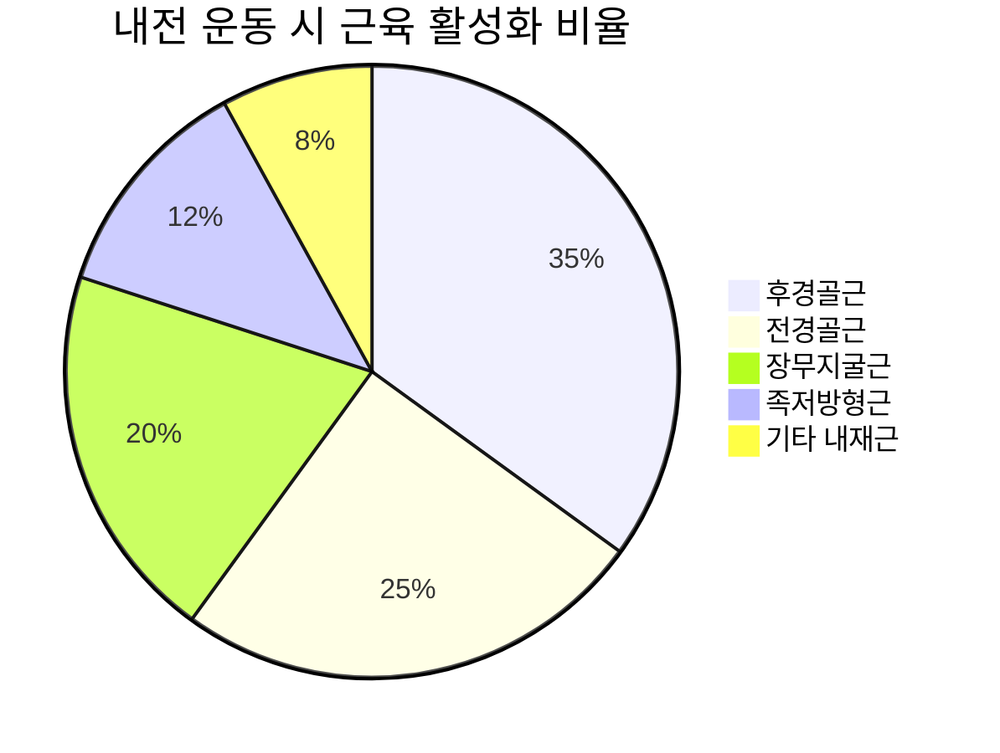
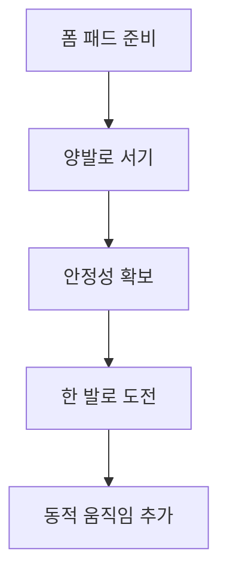
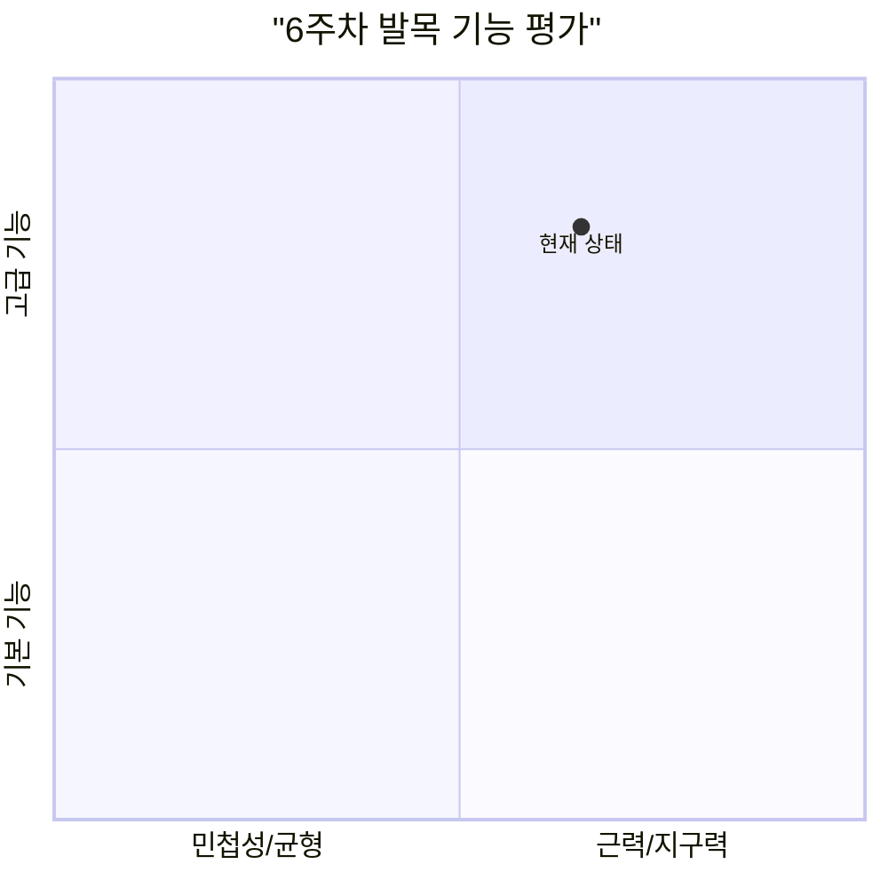
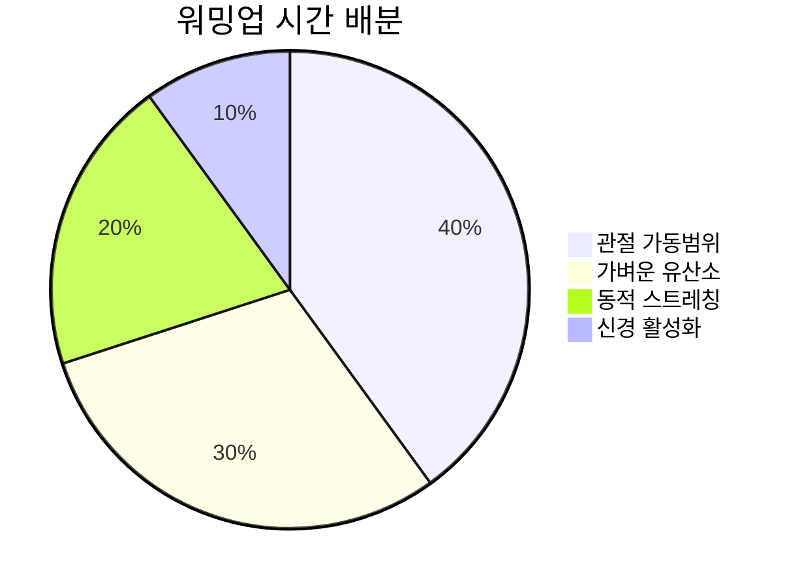
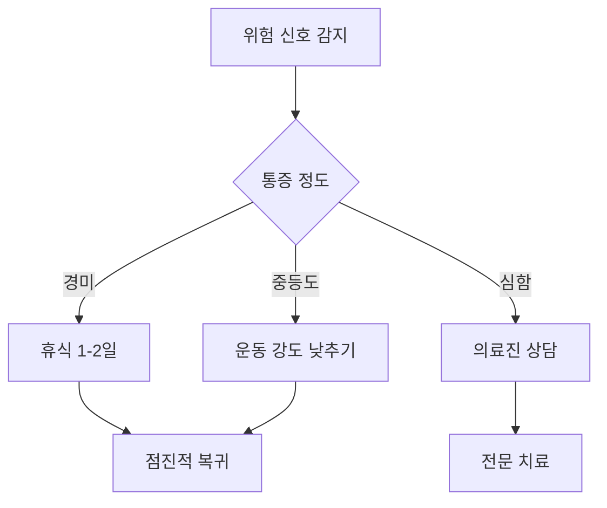

# 💪 강화 단계 발목 운동

> 본격적인 근력 강화와 안정성 개발을 위한 체계적 훈련

## 📋 강화 단계 개요

기초 단계를 성공적으로 완료한 후 시작하는 강화 단계는 실질적인 근력 향상과 기능 개선을 목표로 합니다. 저항을 이용한 운동과 동적 안정성 훈련이 핵심입니다.


### 강화 단계 목표 (5-8주)
- **근력 향상**: 기초 대비 50% 이상 증가
- **지구력 개발**: 연속 동작 30회 이상 가능
- **동적 안정성**: 움직임 중 균형 유지
- **기능 통합**: 복합 동작 수행 능력

---

## 🏋️‍♀️ 1단계: 저항 밴드 운동 (5-6주)

### 기본 저항 운동

#### 족저굴곡 저항 운동


**준비물**: 중강도 저항 밴드
**운동 방법**:
1. 의자에 앉아 밴드를 발가락 부분에 걸기
2. 밴드의 다른 끝을 고정하거나 손으로 잡기
3. 발가락을 아래쪽으로 밀며 저항 느끼기
4. 3초간 수축 유지 후 천천히 돌아오기

**운동량**: 15회 × 3세트 × 양발
**주요 근육**: 비복근, 가자미근, 족저굴곡근

#### 배굴 저항 운동
**운동 방법**:
1. 밴드를 발등에 걸고 반대편을 고정
2. 발가락을 위쪽으로 당기며 저항에 맞서기
3. 정강이 앞쪽 근육의 수축감 확인
4. 3초 유지 후 천천히 이완

**운동량**: 15회 × 3세트 × 양발
**주요 근육**: 전경골근, 장무지신근, 장지신근

### 복합 방향 저항 운동

#### 내전 저항 운동


**운동 방법**:
1. 양발을 어깨 너비로 벌리고 앉기
2. 밴드를 양발 안쪽에 걸어 X자 형태로 만들기
3. 양발을 동시에 안쪽으로 당기기
4. 발목 안쪽 근육의 강한 수축감 느끼기

**운동량**: 12회 × 4세트
**주요 효과**: 아치 지지근 강화, 요족 교정

#### 외전 저항 운동
**운동 방법**:
1. 밴드를 양발 바깥쪽에 걸기
2. 양발을 동시에 바깥쪽으로 밀어내기
3. 발목 바깥쪽 근육의 수축감 확인
4. 3초 유지 후 천천히 복귀

**운동량**: 12회 × 4세트
**주요 효과**: 외측 안정성 강화, 발목 삐끗함 방지

---

## 🏃‍♂️ 2단계: 체중 부하 운동 (6-7주)

### 진보된 종아리 운동

#### 단일 다리 종아리 올리기
**운동 방법**:
1. 벽이나 의자에 가볍게 손을 대고 서기
2. 한쪽 다리를 들어 올려 한 발로만 서기
3. 서있는 발로 몸 전체를 들어 올리기
4. 최고점에서 3초 유지 후 천천히 내리기

**운동량**: 10회 × 3세트 × 양발
**난이도 조절**: 지지 없이 → 추가 중량 활용

#### 편심성 종아리 운동 (Eccentric Calf Raises)
```mermaid
xychart-beta
    title "편심성 운동 근육 활성화 패턴"
    x-axis [올리기, 정점, 내리기시작, 중간, 최하점]
    y-axis "근육활성도(%)" 0 --> 120
    line [80, 90, 100, 115, 95]
```

**운동 방법**:
1. 양발로 종아리 올리기 수행
2. 최고점에서 한 발을 들어 올리기
3. 남은 한 발로만 천천히 내려오기 (5초간)
4. 양발로 다시 올라간 후 반대발로 반복

**운동량**: 8회 × 3세트 × 양발
**특별 효과**: 근력 향상과 손상 회복에 매우 효과적

### 복합 평면 운동

#### 멀티 플레인 홉 (Multi-plane Hops)
**운동 방법**:
1. 한 발로 서서 균형 잡기
2. 앞뒤로 작은 점프 동작 (30cm 거리)
3. 좌우로 작은 점프 동작
4. 대각선 방향으로 점프 동작

**운동량**: 각 방향 8회 × 2세트 × 양발
**주의사항**: 착지 시 발목 정렬 유지, 통증 시 즉시 중단

#### 스텝업 with 발목 강조
**준비물**: 15-20cm 높이의 스텝박스

**운동 방법**:
1. 스텝박스 앞에 서서 한 발을 올리기
2. 발목 근육에 집중하여 몸을 밀어 올리기
3. 위에서 1초간 균형 유지
4. 천천히 시작 자세로 돌아가기

**운동량**: 12회 × 3세트 × 양발

---

## ⚖️ 3단계: 동적 안정성 훈련 (7-8주)

### 불안정 표면 운동

#### 폼 패드 균형 운동


**준비물**: 균형 패드 또는 폼 롤러

**운동 방법**:
1. 균형 패드 위에 양발로 서기
2. 30초간 균형 유지 (난이도 1)
3. 한 발로 서서 30초 유지 (난이도 2)
4. 눈을 감고 한 발로 15초 유지 (난이도 3)

**운동량**: 각 난이도별 3세트씩
**진행법**: 안정감이 생기면 다음 난이도로 진행

#### 보수볼 발목 운동
**준비물**: 보수볼 (반구형 균형볼)

**운동 방법**:
1. 보수볼 위에 한 발로 서기
2. 다른 발로 공중에서 알파벳 쓰기
3. 서있는 발의 안정성 유지에 집중
4. 30초 후 발 바꿔서 실시

**운동량**: 30초 × 3세트 × 양발

### 반응성 훈련

#### 갑작스러운 방향 전환
**운동 방법**:
1. 제자리에서 가벼운 점프 준비
2. 파트너가 방향을 부르면 해당 방향으로 점프
3. 착지 후 즉시 균형 회복
4. 다음 지시까지 준비 자세 유지

**운동량**: 20회 × 3세트
**효과**: 반사적 안정성, 스포츠 상황 대응력

#### 예측 불가능한 표면 적응
**준비물**: 다양한 높이의 쿠션, 매트

**운동 방법**:
1. 눈을 감고 다양한 표면을 걸어가기
2. 각 표면에서 발목의 적응 반응 느끼기
3. 안전을 위해 파트너가 안내
4. 점점 속도를 높여가며 적응

**운동량**: 5분 × 2세트

---

## 🔥 4단계: 고강도 파워 훈련 (8주)

### 플라이오메트릭 운동

#### 발목 점프 (Ankle Hops)
```mermaid
xychart-beta
    title "발목 점프 파워 발달 곡선"
    x-axis [1주차, 2주차, 3주차, 4주차]
    y-axis "점프높이(cm)" 0 --> 25
    line [8, 12, 18, 22]
```

**운동 방법**:
1. 두 발로 서서 무릎은 거의 굽히지 않기
2. 발목 힘만으로 연속 점프하기
3. 빠른 템포로 지면 접촉 시간 최소화
4. 20초간 지속적으로 수행

**운동량**: 20초 × 4세트
**휴식**: 세트 간 1분 휴식

#### 단일 다리 바운딩
**운동 방법**:
1. 한 발로 서서 준비
2. 앞으로 최대한 멀리 점프
3. 같은 발로 착지하여 즉시 다음 점프
4. 5번 연속 점프 후 반대발로 실시

**운동량**: 5회 × 3세트 × 양발
**주의**: 착지 시 발목 정렬 유지 필수

### 스피드 & 민첩성

#### 래더 드릴 (Ladder Drills)
**준비물**: 민첩성 래더 또는 테이프로 사각형 표시

**기본 패턴**:
1. **인앤아웃**: 사각형 안으로 양발 → 밖으로 양발
2. **레터럴 스텝**: 옆으로 이동하며 빠른 스텝
3. **이크스스텝**: X자 패턴으로 발 교차
4. **싱글 레그**: 한 발로만 전체 래더 통과

**운동량**: 각 패턴 3회씩
**속도**: 점진적으로 빠르게 진행

#### 원추형 민첩성 훈련
**준비물**: 원추 6개 (2m 간격 배치)

**운동 방법**:
1. 지그재그로 원추 사이를 빠르게 달리기
2. 각 방향 전환 시 발목 안정성 유지
3. 전진과 후진 모두 수행
4. 시간을 재어 진전 상황 확인

**운동량**: 3회 × 2세트 (전진/후진)

---

## 📊 주차별 진행 모니터링

### 5주차 평가

#### 기본 근력 테스트
| 운동 종목 | 목표 | 달성도 | 평가 |
|-----------|------|--------|------|
| 저항 밴드 족저굴곡 | 15회×3세트 | ___회 | ___/5점 |
| 저항 밴드 배굴 | 15회×3세트 | ___회 | ___/5점 |
| 단일 다리 종아리 올리기 | 10회×3세트 | ___회 | ___/5점 |

#### 기능 평가
- **일상 활동 개선도**: ___% (주관적 평가)
- **운동 중 통증 정도**: ___/10점
- **전반적 만족도**: ___/10점

### 6-7주차 중간 평가

#### 동적 안정성 테스트


**테스트 항목**:
1. **폼 패드 한 발 서기**: ___초 (목표 60초)
2. **눈 감고 균형**: ___초 (목표 30초)
3. **편심성 종아리**: ___회 (목표 10회)
4. **발목 점프 지속**: ___초 (목표 15초)

### 8주차 최종 평가

#### 종합 기능 테스트
**필수 달성 기준**:
- [ ] 모든 저항 운동 목표량 달성
- [ ] 단일 다리 운동 안정적 수행
- [ ] 플라이오메트릭 운동 무리 없이 수행
- [ ] 일상 활동에서 발목 관련 불편함 없음
- [ ] 다음 단계 진행 의욕 있음

---

## 🚨 부상 예방 및 관리

### 운동 전 워밍업 (필수)

#### 5분 워밍업 루틴


1. **관절 가동범위** (2분): 발목 돌리기, 기본 움직임
2. **가벼운 유산소** (90초): 제자리 걷기, 마칭
3. **동적 스트레칭** (1분): 다리 스윙, 발목 펌프
4. **신경 활성화** (30초): 가벼운 점프, 발가락 두드리기

### 운동 후 쿨다운 (필수)

#### 5분 쿠다운 루틴
1. **점진적 감속** (1분): 운동 강도 서서히 낮추기
2. **정적 스트레칭** (3분): 종아리, 족저근막, 정강이
3. **이완 및 마사지** (1분): 발목 주변 부드럽게 마사지

### 과부하 신호 및 대처

#### 위험 신호 체크리스트
- [ ] 운동 중 날카로운 통증
- [ ] 운동 후 4시간 이상 지속되는 통증
- [ ] 부종이나 열감
- [ ] 관절에서 비정상적인 소리
- [ ] 힘이 빠지는 느낌

#### 대처 방법


---

## 💡 운동 효과 극대화 팁

### 영양 및 수분 관리

#### 운동 전 (30분-1시간 전)
- **수분**: 200-300ml 물 섭취
- **에너지**: 바나나, 견과류 등 간단한 탄수화물
- **피할 것**: 과도한 식사, 카페인

#### 운동 후 (30분 이내)
- **수분**: 400-500ml 물 섭취
- **단백질**: 15-20g 단백질 보충
- **항염**: 체리 주스, 강황 등 천연 항염 식품

### 수면 및 회복

#### 최적 회복을 위한 조건
- **수면**: 하루 7-9시간 충분한 수면
- **스트레스 관리**: 명상, 요가 등 이완 활동
- **액티브 리커버리**: 가벼운 산책, 스트레칭

### 환경 최적화

#### 운동 공간 설정
- **안전한 바닥**: 미끄럽지 않은 표면
- **충분한 공간**: 사방 2m 이상 여유 공간
- **응급용품**: 얼음팩, 테이핑 테이프 준비
- **연락망**: 응급 시 연락할 수 있는 체계

---

## 🎯 개인별 맞춤 조정

### 연령별 조정사항

#### 20-30대: 고강도 중심
- 플라이오메트릭 운동 비중 증가
- 스포츠 특화 동작 추가
- 빠른 진행 속도 가능

#### 40-50대: 균형 잡힌 접근
- 근력과 유연성 균형 유지
- 충분한 휴식 시간 확보
- 점진적이고 안전한 진행

#### 60세 이상: 안전성 우선
- 저강도 장시간 운동
- 균형 및 낙상 예방 중심
- 의료진과 긴밀한 협조

### 질환별 특별 고려사항

#### 요족 환자
- 충격 흡수 운동 강화
- 족저근막 유연성 중점
- 아치 지지근 집중 강화

#### 무릎 외반 환자
- 내측 근육 강화 우선
- 외측 안정성 보강
- 정렬 교정 동작 추가

#### 만성 발목 불안정
- 고유수용감각 훈련 비중 증가
- 반응성 운동 집중
- 기능적 브레이싱 고려

---

## 🚀 응용 단계로의 전환

### 전환 준비도 평가

#### 객관적 지표
- [ ] 모든 강화 운동 목표량 100% 달성
- [ ] 플라이오메트릭 운동 무리 없이 수행
- [ ] 불안정 표면에서 60초 이상 균형 유지
- [ ] 일상 및 스포츠 활동 시 불편함 없음

#### 주관적 지표
- [ ] 발목에 대한 자신감 회복
- [ ] 더 도전적인 운동에 대한 의욕
- [ ] 운동이 습관으로 자리 잡음
- [ ] 전반적인 삶의 질 향상 체감

### 다음 단계 미리보기

**기능적 운동 단계에서 배울 내용**:
- 스포츠 특화 동작 훈련
- 복합 관절 움직임 통합
- 실생활 적용 시나리오 훈련
- 부상 예방 통합 프로그램

---

> 💡 **강화 단계 성공의 핵심**: 이 단계는 실질적인 **근력 향상과 기능 개선**이 이루어지는 중요한 시기입니다. 기초 단계에서 다진 기본기를 바탕으로 **점진적이고 체계적인 부하 증가**가 핵심입니다. 무리하지 말고 자신의 몸의 신호에 귀 기울이며, **안전하게 한 단계씩** 발전시켜 나가시기 바랍니다. 8주 후에는 발목의 놀라운 변화를 경험하게 될 것입니다!