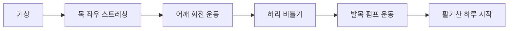
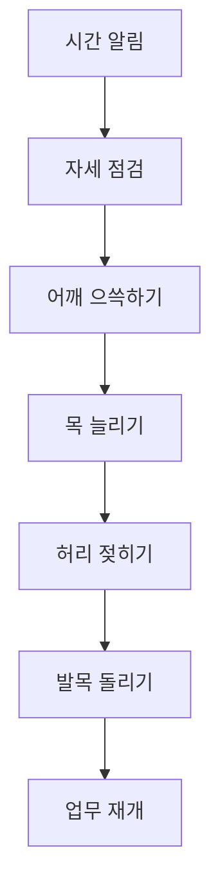
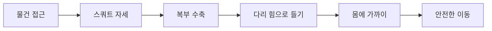
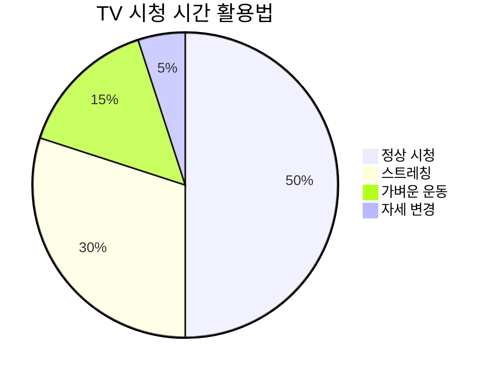
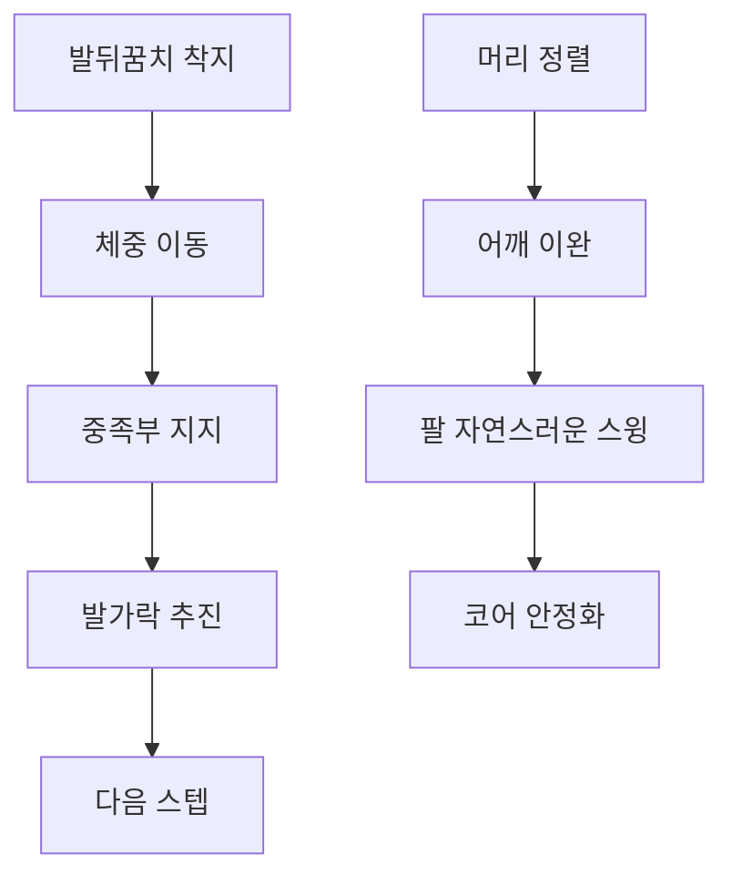
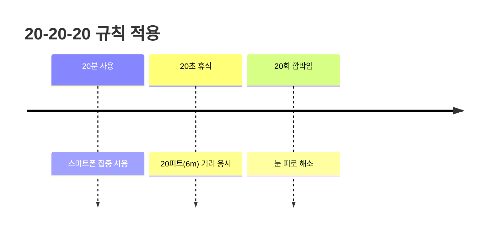
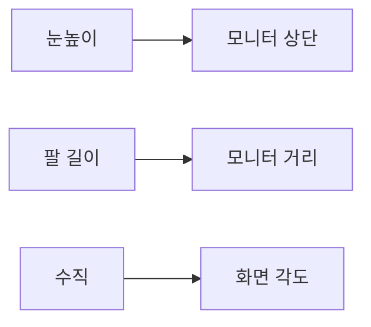
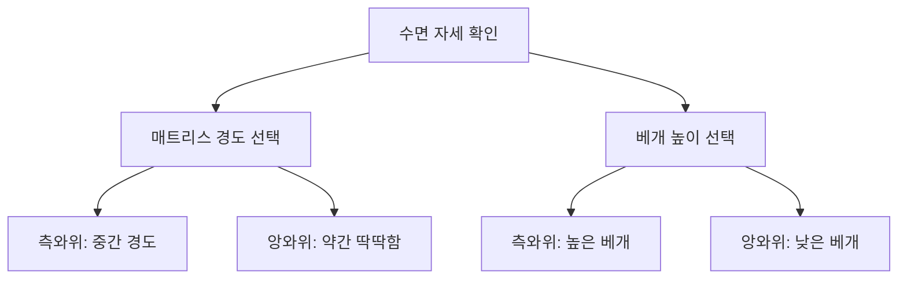
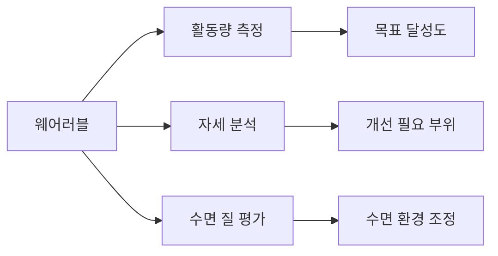

# 일상생활 개선 방법: 관절 건강을 위한 실천 가이드

## 🌅 하루 일과별 개선 전략

### 기상 직후 (5분 투자)

**핵심 루틴**:
1. **목 스트레칭**: 좌우 각 15초씩
2. **어깨 회전**: 전후방 각 10회
3. **허리 비틀기**: 좌우 각 10회
4. **발목 펌프**: 상하 20회

---

## 💼 직장에서의 시간별 관리

### 1시간마다 실시 (2분 루틴)

#### 마이크로 브레이크 운동

**2분 루틴 세부 내용**:
- **자세 리셋** (20초): 등받이에 허리 붙이기
- **어깨 릴리즈** (30초): 어깨 으쓱 10회
- **목 스트레칭** (40초): 좌우 각 20초
- **허리 신전** (20초): 뒤로 젖히기 5회
- **발목 활성화** (10초): 발목 돌리기

### 점심시간 활용 (15분 프로그램)

#### 걷기 + 스트레칭 조합
**5분 빠른 걷기**:
- 심혈관계 활성화
- 하지 근육 활성화
- 정신적 리프레시

**10분 집중 스트레칭**:
- 고관절 굴곡근 (2분)
- 흉추 신전 (2분)
- 종아리 및 햄스트링 (3분)
- 목과 어깨 (3분)

---

## 🏠 집에서의 일상 개선법

### 가사활동 중 관절 보호

#### 올바른 물건 들기 기법

**핵심 원칙**:
1. **허리 굽히지 않기**: 무릎 굽혀서 앉기
2. **물건을 몸에 가까이**: 팔 힘 최소화
3. **발 위치 조정**: 방향 전환 시 발 먼저
4. **점진적 이동**: 급작스러운 움직임 금지

#### 주방 작업 시 개선점
**싱크대 사용**:
- **한쪽 발 올리기**: 작은 받침대 활용
- **몸 위치 조정**: 싱크대에 밀착
- **정기적 자세 변경**: 5분마다 발 교체

**요리 중 스트레칭**:
- **종아리 스트레칭**: 벽 밀기 자세
- **목 롤링**: 요리 기다리는 시간 활용
- **어깨 으쓱하기**: 긴장 완화

### TV 시청 시 건강 습관

#### 능동적 시청법

**광고 시간 활용** (3분):
- **플랭크**: 30초 × 2회
- **브릿지**: 15회 × 2세트
- **스쿼트**: 10회 × 2세트
- **종아리 올리기**: 20회

**프로그램 중 실시**:
- **발목 펌프**: 지속적 실시
- **어깨 회전**: 은밀하게 실시
- **목 스트레칭**: 좌우 교대로
- **복식 호흡**: 깊고 느리게

---

## 🚶‍♀️ 이동 중 개선 방법

### 대중교통 이용 시

#### 버스/지하철에서의 운동
**서있을 때**:
- **종아리 올리기**: 균형 유지하며
- **복부 수축**: 코어 안정화
- **어깨뼈 모으기**: 등 근육 활성화

**앉아있을 때**:
- **발목 돌리기**: 혈액순환 촉진
- **허벅지 수축**: 대퇴사두근 강화
- **목 스트레칭**: 조심스럽게 실시

### 걷기 시 주의사항

#### 올바른 보행 자세

**체크포인트**:
- **시선**: 15미터 앞 응시
- **어깨**: 이완하고 자연스럽게
- **팔**: 90도 굽혀서 스윙
- **보폭**: 과도하지 않게 자연스럽게

---

## 💻 디지털 기기 사용 개선

### 스마트폰 사용 개선

#### 20-20-20 규칙

**실천 방법**:
- **타이머 설정**: 20분마다 알림
- **멀리 보기**: 창밖 풍경 관찰
- **목 스트레칭**: 상하좌우 움직임
- **어깨 릴리즈**: 어깨 돌리기

#### 올바른 스마트폰 자세
**기본 원칙**:
- **화면 높이**: 눈높이에 맞추기
- **팔 지지**: 팔꿈치 받침 활용
- **목 정렬**: 귀가 어깨 위에 위치
- **휴식**: 30분마다 5분 휴식

### 컴퓨터 작업 환경 최적화

#### 모니터 설정

**최적 설정**:
- **높이**: 모니터 상단이 눈높이
- **거리**: 팔 길이만큼 (50-70cm)
- **각도**: 약간 뒤로 기울인 상태
- **조명**: 반사 없는 간접조명

#### 키보드와 마우스 설정
**키보드**:
- **높이**: 팔꿈치가 90도
- **기울기**: 평평하거나 약간 음의 기울기
- **손목 지지**: 패드 사용으로 중립 위치

**마우스**:
- **크기**: 손에 맞는 적절한 크기
- **위치**: 키보드와 같은 높이
- **민감도**: 적절한 감도로 설정

---

## 🛌 수면 환경 개선

### 침실 환경 최적화

#### 매트리스와 베개 선택

**매트리스 선택 기준**:
- **측와위 선호**: 중간 정도 경도
- **앙와위 선호**: 약간 딱딱한 경도
- **체중 고려**: 무거울수록 딱딱하게
- **관절 문제**: 압점 완화형 선택

**베개 선택 기준**:
- **높이**: 목의 자연 곡선 유지
- **재질**: 통기성 좋은 소재
- **지지력**: 일정한 지지력 유지
- **교체 주기**: 1-2년마다 교체

### 수면 전 루틴

#### 10분 릴랙스 스트레칭
**침대에서 하는 스트레칭**:
1. **무릎 가슴에 안기** (1분)
2. **척추 비틀기** (좌우 각 1분)
3. **다리 벽에 올리기** (3분)
4. **목과 어깨 스트레칭** (2분)
5. **복식 호흡** (2분)

---

## 📱 스마트 기술 활용

### 자세 모니터링 앱

#### 추천 기능
- **자세 알림**: 정시마다 자세 점검
- **운동 리마인더**: 스트레칭 시간 알림
- **진행 상황 추적**: 개선 정도 기록
- **맞춤형 운동**: 개인별 약점 보완

### 웨어러블 기기 활용

#### 건강 지표 모니터링

**주요 기능**:
- **걸음 수**: 일일 10,000보 목표
- **앉은 시간**: 1시간 이상 시 알림
- **심박수**: 스트레스 수준 모니터링
- **수면 패턴**: 수면 질 개선 지표

---

## 🎯 단계별 실천 계획

### 1주차: 인식 개선
**목표**: 현재 습관 파악 및 기본 개선
- **자세 점검**: 하루 5회 자세 확인
- **기본 스트레칭**: 기상 후, 취침 전
- **환경 개선**: 작업 공간 정리

### 2-4주차: 습관 형성
**목표**: 규칙적인 루틴 확립
- **정시 알림**: 1시간마다 운동 알림
- **점심 운동**: 15분 걷기 + 스트레칭
- **주말 활동**: 야외 활동 증가

### 5-8주차: 강화 및 확장
**목표**: 습관 안정화 및 추가 개선
- **운동 강도 증가**: 저항 운동 추가
- **환경 최적화**: 인체공학적 도구 활용
- **생활 패턴 조정**: 전반적 라이프스타일 개선

### 9주차 이후: 유지 및 발전
**목표**: 장기적 건강 관리
- **정기 평가**: 월 1회 자세 평가
- **새로운 도전**: 다양한 활동 시도
- **지속적 학습**: 건강 정보 업데이트

---

## 📊 개선 효과 측정

### 자가 평가 체크리스트

#### 주간 평가 항목
| 항목 | 1주차 | 2주차 | 4주차 | 8주차 |
|------|-------|-------|-------|-------|
| 목/어깨 뻐근함 (1-10) | ___ | ___ | ___ | ___ |
| 허리 통증 (1-10) | ___ | ___ | ___ | ___ |
| 전반적 피로도 (1-10) | ___ | ___ | ___ | ___ |
| 수면 질 (1-10) | ___ | ___ | ___ | ___ |
| 집중력 (1-10) | ___ | ___ | ___ | ___ |

#### 객관적 지표
- **유연성**: 전굴, 후굴, 측굴 각도 측정
- **근력**: 플랭크 유지 시간
- **지구력**: 계단 오르기 심박수
- **균형**: 한 다리 서기 시간

---

## 🏆 성공 전략

### 동기 부여 방법
1. **작은 목표 설정**: 달성 가능한 목표부터
2. **진행 상황 기록**: 일기 또는 앱 활용
3. **보상 시스템**: 목표 달성 시 작은 보상
4. **동반자 찾기**: 가족, 동료와 함께 실천

### 장애물 극복
**시간 부족**:
- **마이크로 운동**: 1-2분 짧은 운동
- **일상 통합**: 양치, 대기 시간 활용
- **우선순위**: 가장 중요한 3가지 집중

**동기 저하**:
- **변화 기록**: 사진, 수치로 변화 확인
- **새로운 방법**: 지루함 방지를 위한 변화
- **전문가 도움**: 필요시 전문가 상담

---

> 💡 **핵심 메시지**: 관절 건강 개선은 하루아침에 이루어지지 않습니다. **작은 변화의 꾸준한 실천**이 큰 차이를 만들어냅니다. 완벽을 추구하기보다는 **지속 가능한 개선**에 초점을 맞추어 점진적으로 발전시켜 나가시기 바랍니다.