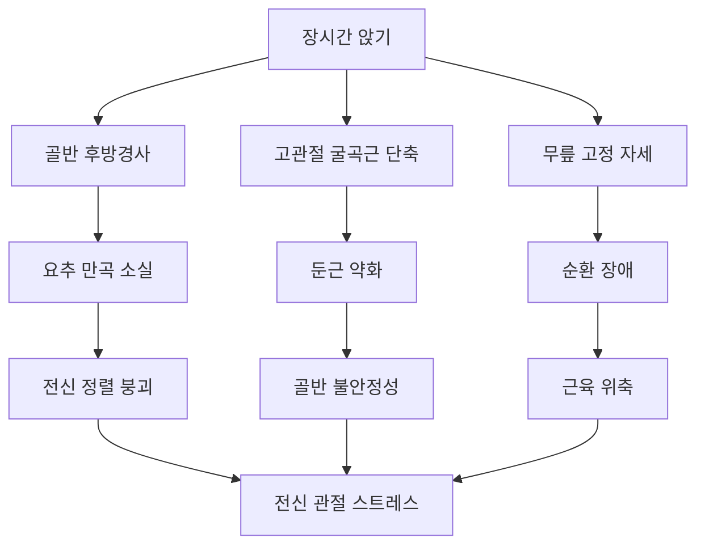
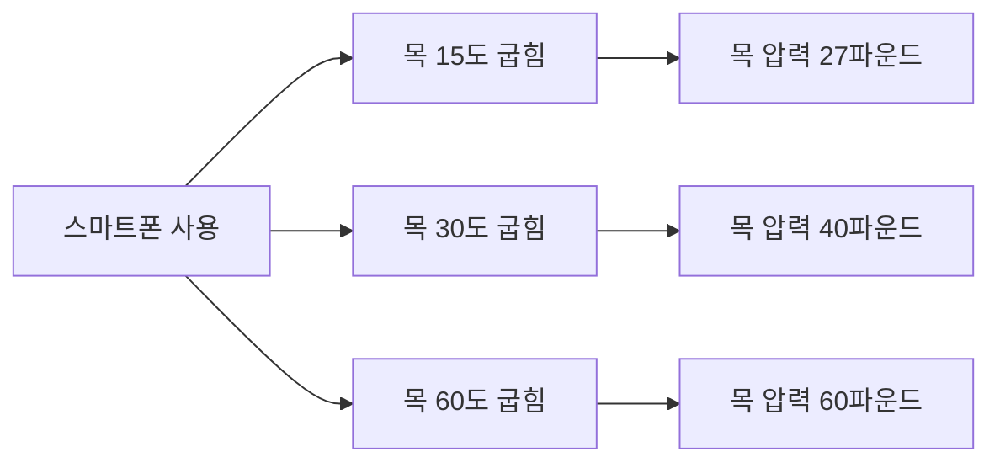
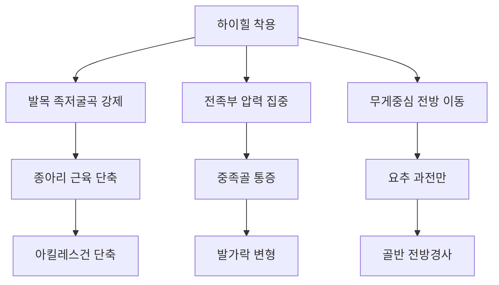
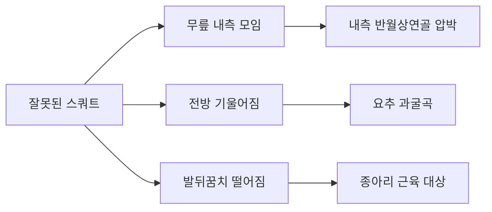
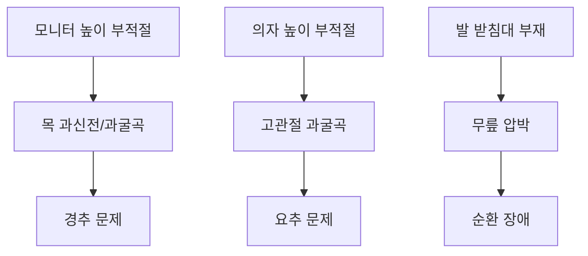
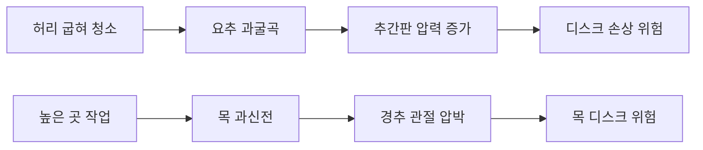
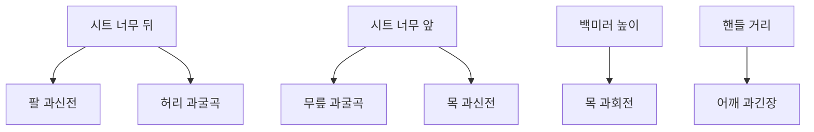
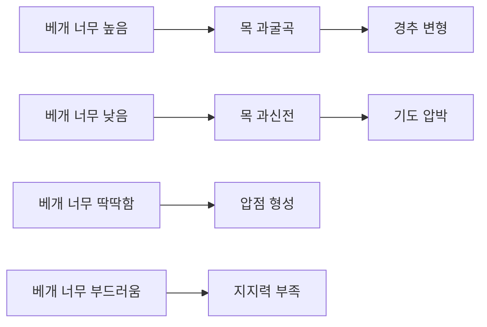
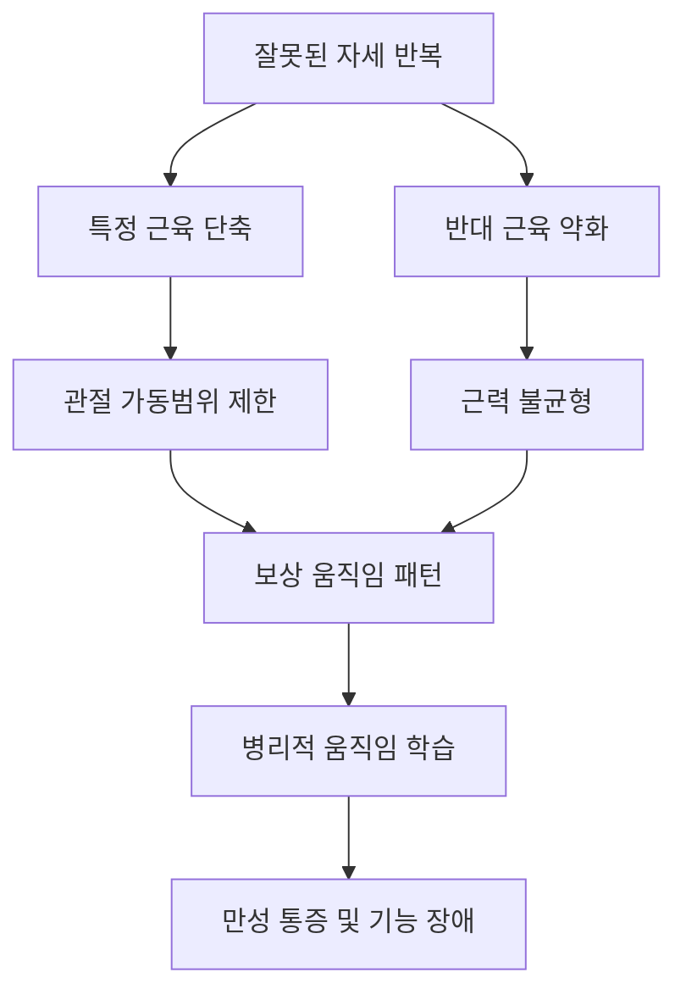
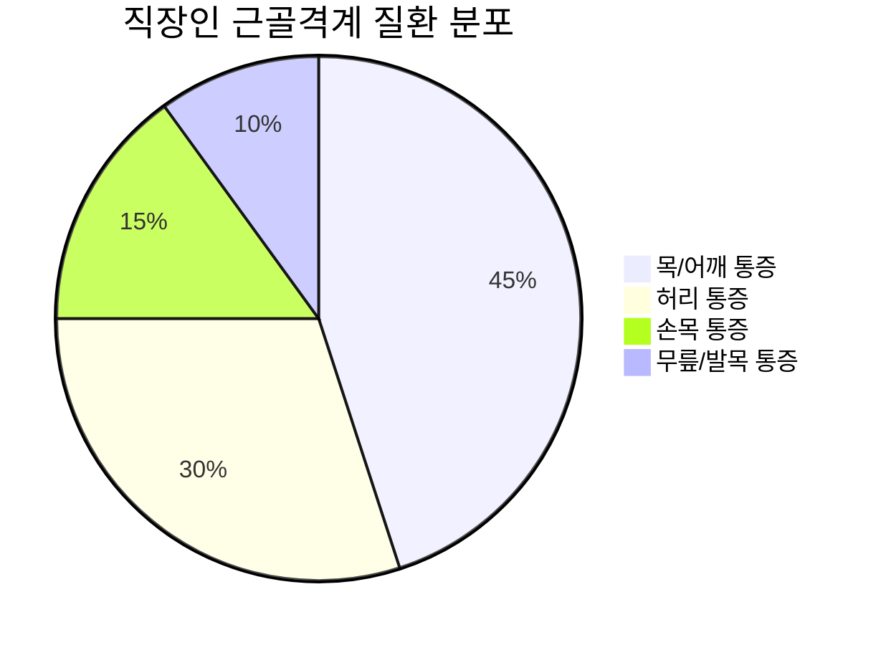

# 발목, 무릎, 고관절에 해로운 자세와 생활습관

## 🚨 현대인의 관절 건강 위기

### 문제의 심각성
현대인의 32백만 명 이상이 관절염(골관절염)을 앓고 있으며, 이는 관절의 보호 연골층이 마모되어 발생하는 퇴행성 관절 질환입니다. 대부분의 사람들은 반복적인 움직임과 고강도 활동이 관절염을 악화시킨다는 것을 알고 있지만, **잘못된 자세 또한 관절염을 악화시킬 수 있다는 사실은 잘 모르고 있습니다**.

### 자세와 관절 건강의 연관성
구부정하고 늘어진 자세는 관절에 가해지는 압력의 방향을 변화시켜, 결국 **연골 손상을 초래하는 마찰 부위를 생성**합니다. 시간이 지남에 따라 이러한 잘못된 자세는 만성 하부 요통을 유발할 수 있으며, 물리치료 클리닉에서 자주 다루는 문제가 됩니다.

---

## 🏢 현대 생활의 주요 위험 요소

### 1. 장시간 좌식 생활

#### 좌식 자세의 생체역학적 문제


**주요 영향**:
- **척추 디스크 압력 증가**: 정상 대비 40-90% 증가
- **고관절 굴곡근 단축**: 장요근, 대퇴직근 단축
- **둔근 약화**: "글루트 암네지아" 현상
- **혈액 순환 저하**: 하지 정맥혈 정체

#### 컴퓨터 작업자의 전형적 자세 문제
**최흔한 잘못된 자세**:
- **전방 머리 자세**: 목 앞쪽 근육 과긴장
- **둥근 어깨**: 가슴 근육 단축, 등 근육 약화
- **구부정한 척추**: 흉추 후만 증가

이러한 어색한 자세로 앉아있을 때, **장요근, 치골근, 후두근, 대흉근, 승모근, 흉쇄유돌근, 견갑거근, 내전근, 이상근의 근막과 근육이 긴장하는 것**이 일반적입니다.

### 2. 스마트폰 사용 자세

#### "거북목 증후군"의 악영향


**연쇄적 영향**:
- **경추 과전만**: 목뼈 자연 곡선 증가
- **흉추 후만 증가**: 등 굽음 심화
- **어깨 내회전**: 가슴 근육 단축
- **골반 보상**: 하지 정렬 변화

### 3. 잘못된 수면 자세

#### 해로운 수면 자세들
**복와위 (엎드려 자기)**:
- **목 회전**: 경추 과도한 회전으로 인한 스트레스
- **요추 과신전**: 허리 곡선 과도한 증가
- **호흡 제한**: 가슴 압박으로 인한 호흡 곤란

**부적절한 측와위**:
- **베개 부족**: 목 측굴로 인한 불균형
- **다리 비틀림**: 골반 회전으로 인한 요추 스트레스
- **어깨 압박**: 혈액순환 장애

---

## 🚶‍♀️ 보행 및 운동 시 해로운 습관

### 1. 잘못된 보행 패턴

#### 높은 굽 신발 착용


**생체역학적 변화**:
- **발목각 변화**: 족저굴곡 15-30도 증가
- **전족부 압력**: 정상 대비 7배 증가
- **보행 속도**: 정상 대비 25% 감소
- **에너지 소모**: 12-22% 증가

#### 잘못된 런닝 자세
**오버스트라이딩 (Over-striding)**:
- **발뒤꿈치 강타**: 충격력 체중의 2-3배
- **무릎 과신전**: 전십자인대 스트레스 증가
- **에너지 낭비**: 브레이킹 효과로 효율성 저하

**내측 회전 착지**:
- **무릎 내반**: 관절 불안정성 증가
- **발목 과내전**: 후경골근 과부하
- **고관절 보상**: 골반 불안정성

### 2. 운동 시 잘못된 자세

#### 스쿼트 동작 오류


**흔한 오류들**:
- **무릎 밸거스**: 무릎이 안쪽으로 모이는 현상
- **전방 기울어짐**: 허리가 과도하게 굽어지는 현상
- **발뒤꿈치 들림**: 발목 가동범위 부족으로 인한 보상

#### 런지 동작 오류
- **무릎 전방 이동**: 무릎이 발가락을 넘어서는 현상
- **골반 회전**: 좌우 불균형으로 인한 회전
- **상체 기울어짐**: 코어 근력 부족으로 인한 보상

---

## 💺 직장에서의 해로운 습관

### 1. 잘못된 작업 환경

#### 부적절한 책상 설정


**주요 문제점**:
- **모니터 높이**: 눈높이보다 낮아 목 굽힘 유발
- **의자 높이**: 무릎이 직각보다 예각으로 굽힘
- **책상 거리**: 너무 가까워 어깨 내회전 유발
- **발 지지**: 발이 바닥에 닿지 않아 허벅지 압박

#### 장시간 고정 자세 유지
**생리적 문제**:
- **근육 피로**: 정적 수축으로 인한 피로 누적
- **혈액 정체**: 정맥 환류 장애
- **관절 경직**: 활액 순환 저하
- **신진대사 저하**: 근육 활동 감소

### 2. 반복적 스트레스

#### 마우스 및 키보드 사용
**손목 과신전**:
- **수근관 증후군**: 정중신경 압박
- **건초염**: 굴근건 염증
- **관절염**: 손목 관절 퇴행성 변화

**어깨 및 목 긴장**:
- **승모근 과긴장**: 어깨 올라감
- **경추 측굴**: 한쪽으로 기울어짐
- **흉쇄유돌근 긴장**: 목 회전 제한

---

## 🏠 일상생활의 해로운 습관

### 1. 가사활동 시 잘못된 자세

#### 청소 및 빨래


**주요 위험 동작**:
- **허리 굽혀 들기**: 디스크 압력 10배 증가
- **몸 비틀며 들기**: 전단력으로 인한 손상
- **한쪽 어깨로 들기**: 척추 측굴 유발

#### 요리 및 설거지
- **싱크대 높이 부적절**: 허리 굽힘 또는 어깨 올림
- **장시간 서있기**: 요추 과전만, 족부 피로
- **무거운 조리도구**: 손목 과부하

### 2. 레저 활동의 문제

#### TV 시청 자세
**소파에 비스듬히 기대기**:
- **척추 측굴**: 한쪽으로 기울어진 자세
- **골반 비틀림**: 좌우 불균형
- **목 회전**: 화면을 보기 위한 부자연스러운 자세

#### 독서 자세
**침대에서 엎드려 읽기**:
- **목 과신전**: 경추 과도한 신전
- **팔꿈치 압박**: 신경 압박 위험
- **가슴 압박**: 호흡 제한

---

## 📱 디지털 기기 사용의 문제

### 1. 스마트폰 중독성 사용

#### "텍스트 넥" 증후군
**증상의 진행 단계**:
1. **초기**: 목과 어깨 뻐근함
2. **중기**: 두통, 목 통증
3. **말기**: 팔 저림, 근력 약화

#### 장시간 사용의 누적 효과
```mermaid
timeline
    title 스마트폰 사용 시간에 따른 증상 진행
    section 1시간
        : 경미한 목 뻐근함
    section 3시간
        : 어깨 긴장
        : 두통 시작
    section 5시간+
        : 목 통증 지속
        : 팔 저림 시작
    section 7시간+
        : 만성 목 통증
        : 근력 약화
        : 구조적 변화
```

### 2. 태블릿 및 노트북 사용

#### 랩탑 사용의 문제점
- **화면 높이**: 고정된 화면으로 인한 목 굽힘
- **키보드 위치**: 어깨 내회전 유발
- **마우스 패드**: 손목 과도한 굽힘

#### 태블릿 사용 자세
- **무릎 위 사용**: 목과 어깨 굽힘
- **침대 사용**: 전신 정렬 붕괴
- **한손 사용**: 비대칭적 부하

---

## 🚗 교통수단 이용 시 문제

### 1. 자동차 운전

#### 부적절한 운전석 설정


**주요 문제점**:
- **시트 거리**: 페달 조작을 위한 부자연스러운 자세
- **시트 각도**: 허리 지지 부족 또는 과도한 기울임
- **헤드레스트**: 목 정렬 방해
- **장시간 운전**: 고정 자세로 인한 근육 경직

#### 운전 중 해로운 습관
- **한손 운전**: 척추 회전 및 불균형
- **팔걸이 과사용**: 어깨 높이 불균형
- **백미러 조작**: 목 과회전
- **사이드미러**: 목 측굴 반복

### 2. 대중교통 이용

#### 지하철/버스에서의 문제
**스마트폰 사용**:
- **목 굽힘**: 하향 시선으로 인한 경추 굽힘
- **어깨 굽힘**: 화면 집중으로 인한 내회전
- **균형 잃기**: 중심이동으로 인한 넘어짐 위험

**부적절한 좌석 사용**:
- **다리 꼬기**: 골반 비틀림, 혈액순환 장애
- **가방 한쪽 메기**: 척추 측굴
- **졸음**: 목 꺾임, 척추 정렬 붕괴

---

## 💤 수면 관련 해로운 습관

### 1. 부적절한 침구 사용

#### 베개 문제


#### 매트리스 문제
**너무 딱딱한 매트리스**:
- **압점 형성**: 골돌기 부위 압박
- **척추 정렬 불량**: 자연 곡선 지지 부족
- **혈액순환 장애**: 모세혈관 압박

**너무 부드러운 매트리스**:
- **척추 처짐**: 중력으로 인한 과도한 굽힘
- **근육 긴장**: 지지 부족으로 인한 보상 수축
- **관절 스트레스**: 부자연스러운 정렬

### 2. 수면 자세의 문제

#### 수면 자세별 위험도
| 수면 자세 | 위험도 | 주요 문제점 | 영향 받는 관절 |
|----------|--------|-------------|----------------|
| 복와위 | ★★★★★ | 목 과회전, 요추 과신전 | 경추, 요추 |
| 측와위 (부적절) | ★★★☆☆ | 척추 측굴, 어깨 압박 | 흉추, 어깨 |
| 앙와위 (부적절) | ★★☆☆☆ | 요추 과전만 | 요추 |
| 올바른 측와위 | ★☆☆☆☆ | 최소한의 위험 | - |

---

## 🧬 해로운 습관의 생리학적 메커니즘

### 1. 근육 불균형 발생

#### 길이-장력 관계 변화


#### 근막 시스템의 변화
**근막 긴장 증가**:
- **콜라겐 섬유 재배열**: 단축된 길이로 고정
- **히알루론산 점성 증가**: 조직 간 마찰 증가
- **혈액순환 저하**: 영양 공급 및 노폐물 제거 장애

### 2. 관절 연골의 퇴행성 변화

#### 비정상적 압력 분포
**연골 마모 과정**:
1. **압력 집중**: 특정 부위에 과도한 부하
2. **연골 세포 사멸**: 영양 공급 부족으로 인한 세포 죽음
3. **기질 분해**: 콜라겐과 프로테오글리칸 파괴
4. **골극 형성**: 보상적 뼈 성장
5. **관절 공간 협소**: 연골 두께 감소

#### 활액의 변화
- **점성 감소**: 윤활 기능 저하
- **염증 매개체 증가**: IL-1β, TNF-α 증가
- **산화 스트레스**: 자유 라디칼 증가

---

## 📊 현대인의 자세 관련 통계

### 1. 직장인 건강 실태

#### 근골격계 질환 현황


**주요 통계 데이터**:
- **목/어깨 통증**: 직장인의 78% 경험
- **허리 통증**: 만성 통증 환자의 60%가 자세 관련
- **손목 통증**: 컴퓨터 사용자의 35% 경험
- **두통**: 잘못된 목 자세로 인한 긴장성 두통 25%

### 2. 연령대별 특징

#### 생애 주기별 주요 문제
| 연령대 | 주요 문제 | 원인 | 발생률 |
|--------|-----------|------|--------|
| 10-20대 | 거북목, 라운드숄더 | 스마트폰, 게임 | 65% |
| 30-40대 | 허리 통증, 목 통증 | 장시간 근무, 육아 | 80% |
| 50-60대 | 관절염, 디스크 | 누적된 자세 문제 | 90% |
| 70대+ | 전신 관절 문제 | 종합적 퇴행성 변화 | 95% |

---

## 🎯 조기 경고 신호

### 1. 신체적 징후

#### 즉각적 신호
- **근육 긴장**: 목, 어깨, 허리 뻐근함
- **관절 뻣뻣함**: 아침 기상 시 경직감
- **피로감**: 쉽게 피로해지는 현상
- **두통**: 긴장성 두통 빈발

#### 진행된 신호
- **만성 통증**: 3개월 이상 지속되는 통증
- **가동범위 제한**: 관절 움직임 제한
- **근력 약화**: 특정 근육군의 힘 저하
- **보행 이상**: 절뚝거림, 불안정한 걸음

### 2. 기능적 징후

#### 일상생활 제한
- **계단 오르기 곤란**: 무릎, 고관절 문제
- **물건 들기 어려움**: 허리, 어깨 문제
- **장시간 서있기 불가**: 전신 근력 부족
- **수면 질 저하**: 통증으로 인한 수면 장애

---

## 🔧 해로운 습관 개선의 우선순위

### 1단계: 즉시 개선 (0-2주)
- **작업 환경 개선**: 모니터 높이, 의자 조정
- **스마트폰 사용 줄이기**: 사용 시간 제한
- **수면 환경 개선**: 베개, 매트리스 교체

### 2단계: 습관 형성 (2-8주)
- **정기적 휴식**: 1시간마다 5분 휴식
- **스트레칭 루틴**: 아침, 점심, 저녁 스트레칭
- **운동 습관**: 주 3회 이상 규칙적 운동

### 3단계: 생활 방식 변화 (8주 이후)
- **활동적 생활**: 계단 이용, 걷기 늘리기
- **근력 운동**: 약화된 근육 집중 강화
- **전문가 상담**: 정기적 자세 평가 및 교정

---

> ⚠️ **경고**: 잘못된 자세와 생활습관은 단기간에 문제를 일으키지 않지만, 장기간 누적되면 돌이킬 수 없는 구조적 변화를 초래할 수 있습니다. **예방이 치료보다 훨씬 중요**하며, 조기에 발견하여 교정하는 것이 관절 건강을 지키는 핵심입니다.