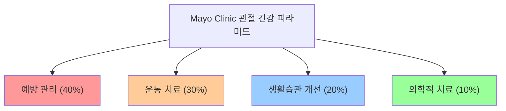
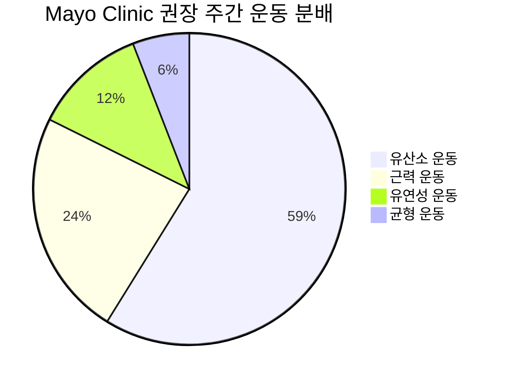
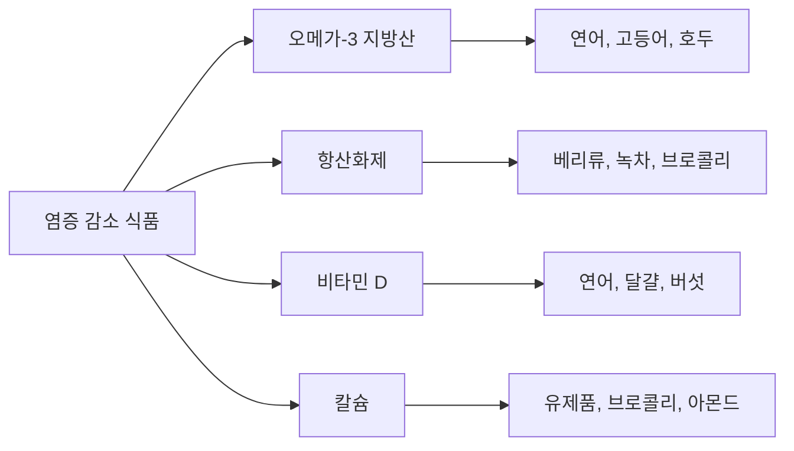
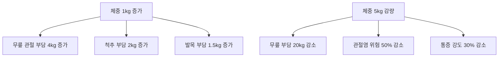
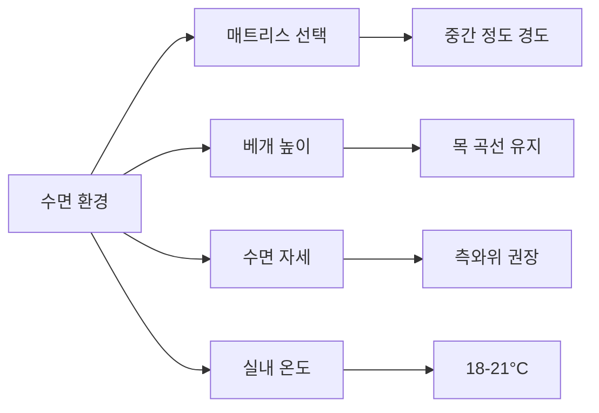
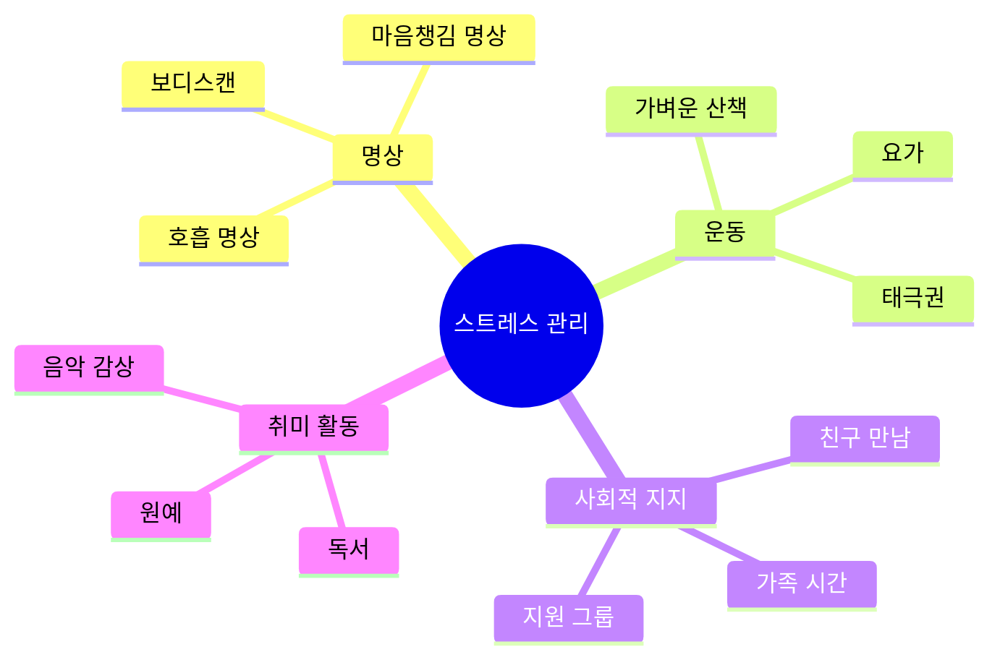
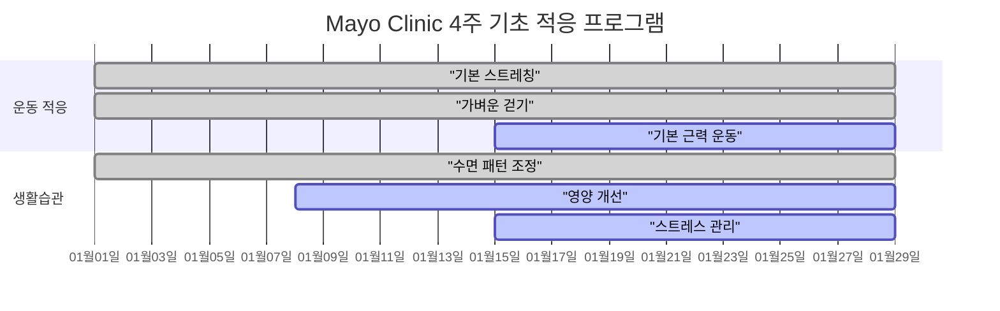
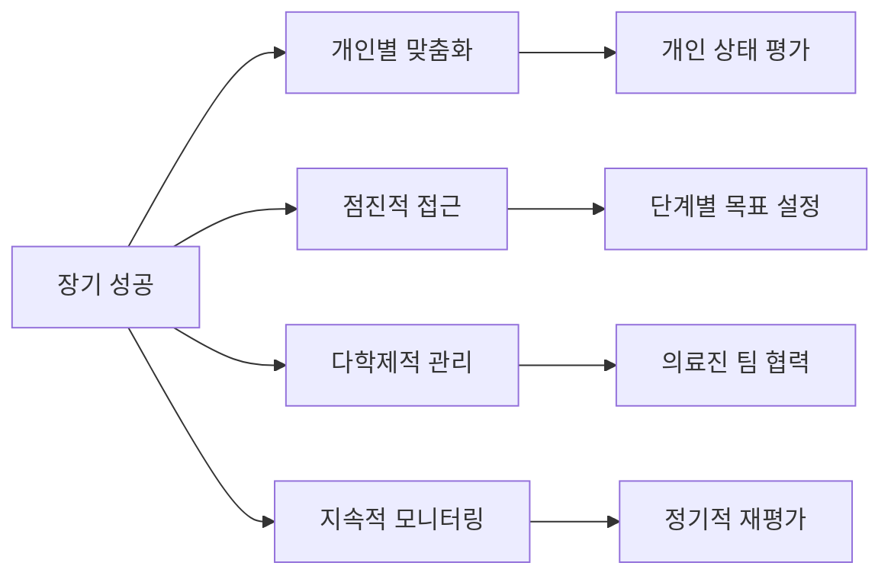

# 🏥 Mayo Clinic 관절 건강 가이드라인

> Mayo Clinic의 의학적 근거 기반 관절 건강 관리 지침

## 📋 Mayo Clinic 공식 권장사항

### 🎯 핵심 원칙

**Mayo Clinic의 4대 관절 건강 원칙**:
1. **예방적 관리**: 문제 발생 전 적극적 관리
2. **생활습관 중심**: 약물보다 생활습관 우선
3. **점진적 개선**: 급격한 변화보다 꾸준한 개선
4. **개인별 맞춤**: 개인의 상태에 맞는 맞춤형 접근

---

## 🏃‍♀️ Mayo Clinic 운동 권장사항

### 주간 운동 목표

**구체적 권장사항**:
- **유산소 운동**: 주 150분 (중강도) 또는 75분 (고강도)
- **근력 운동**: 주 2회 이상, 주요 근육군 포함
- **유연성 운동**: 매일 5-10분
- **균형 운동**: 주 2-3회 (특히 50세 이상)

### 관절별 특화 운동

#### 무릎 관절 (Mayo Clinic 권장)
**강화 운동**:
- **직다리 올리기**: 15회 × 3세트
- **월 시트**: 벽에 기대어 30초-1분
- **계단 오르기**: 일일 10-15분

**유연성 운동**:
- **대퇴사두근 스트레칭**: 30초 × 3회
- **햄스트링 스트레칭**: 30초 × 3회
- **종아리 스트레칭**: 30초 × 3회

#### 발목 관절 (Mayo Clinic 권장)
**강화 운동**:
- **발목 펌프**: 20회 × 3세트
- **발가락 걷기**: 2-3분
- **밴드 저항 운동**: 15회 × 3세트

**유연성 운동**:
- **아킬레스건 스트레칭**: 30초 × 3회
- **족저근막 스트레칭**: 30초 × 3회
- **발목 회전**: 각 방향 10회

---

## 🍎 Mayo Clinic 영양 지침

### 관절 건강 필수 영양소

#### 염증 감소 식품

**Mayo Clinic 권장 일일 섭취량**:
- **오메가-3**: 1-2g (생선 2회/주)
- **비타민 D**: 600-800 IU
- **칼슘**: 1000-1200mg
- **비타민 C**: 75-90mg

#### 피해야 할 음식
**염증 유발 식품 (Mayo Clinic 경고)**:
- **가공육**: 햄, 소시지, 베이컨
- **정제당**: 단 음료, 과자, 케이크
- **트랜스지방**: 마가린, 쇼트닝
- **과도한 오메가-6**: 옥수수유, 대두유

---

## 💊 Mayo Clinic 보충제 가이드

### 관절 건강 보충제 순위

| 순위 | 보충제 | 효과 증거 | Mayo 권장도 | 일일 용량 |
|------|--------|-----------|-------------|-----------|
| 1 | 글루코사민 | 중등도 | B등급 | 1500mg |
| 2 | 콘드로이틴 | 중등도 | B등급 | 800-1200mg |
| 3 | 오메가-3 | 강함 | A등급 | 1-2g |
| 4 | 비타민 D | 강함 | A등급 | 600-800 IU |
| 5 | 커큐민 | 약함 | C등급 | 500-1000mg |

**Mayo Clinic 보충제 복용 원칙**:
1. **의사 상담 필수**: 복용 전 반드시 전문의 상담
2. **품질 확인**: USP 또는 NSF 인증 제품 선택
3. **상호작용 주의**: 기존 약물과의 상호작용 확인
4. **효과 모니터링**: 3-6개월 복용 후 효과 평가

---

## 🏥 Mayo Clinic 체중 관리 지침

### 관절 부담과 체중의 관계

**Mayo Clinic 권장 체중 관리 전략**:
- **목표 설정**: 주 0.5-1kg 감량
- **칼로리 관리**: 일일 500-750 칼로리 제한
- **운동 병행**: 유산소 + 근력 운동 조합
- **장기적 접근**: 6개월 이상 꾸준한 관리

---

## 🛌 Mayo Clinic 수면 가이드

### 관절 건강과 수면의 관계

**수면과 관절 건강 연관성 (Mayo Clinic 연구)**:
- **수면 부족**: 염증 증가, 통증 감수성 상승
- **적정 수면**: 7-9시간, 관절 회복 최적화
- **수면 질**: 깊은 잠, 성장호르몬 분비 촉진

#### 관절 친화적 수면 환경

**Mayo Clinic 권장 수면 자세**:
- **측와위**: 무릎 사이 베개 끼우기
- **앙와위**: 무릎 밑 베개 받치기
- **복와위**: 가능한 피하기 (목과 허리에 부담)

---

## 🧘‍♀️ Mayo Clinic 스트레스 관리

### 스트레스와 관절 건강

**스트레스가 관절에 미치는 영향 (Mayo Clinic 분석)**:
- **코르티솔 증가**: 염증 반응 악화
- **근육 긴장**: 관절 부담 증가
- **수면 장애**: 회복 능력 저하
- **생활습관 악화**: 운동 부족, 과식

#### 스트레스 관리 전략

**Mayo Clinic 권장 일일 스트레스 관리**:
- **명상**: 10-20분 마음챙김 명상
- **호흡 운동**: 4-7-8 호흡법 (3회 반복)
- **점진적 이완**: 근육 긴장-이완 (15분)
- **사회적 연결**: 가족/친구와 의미 있는 대화

---

## 📊 Mayo Clinic 진행 모니터링

### 관절 건강 자가 평가 도구

#### 주간 체크리스트
| 항목 | 목표 | 1주 | 2주 | 3주 | 4주 |
|------|------|-----|-----|-----|-----|
| 유산소 운동 (분/주) | 150 | ___ | ___ | ___ | ___ |
| 근력 운동 (회/주) | 2 | ___ | ___ | ___ | ___ |
| 스트레칭 (일/주) | 7 | ___ | ___ | ___ | ___ |
| 수면 시간 (시간/일) | 7-9 | ___ | ___ | ___ | ___ |
| 체중 관리 (kg) | 목표값 | ___ | ___ | ___ | ___ |

#### 통증 및 기능 평가 (0-10점)
**Mayo Clinic VAS (Visual Analog Scale)**:
- **0**: 전혀 아프지 않음
- **5**: 중간 정도 통증
- **10**: 참을 수 없는 통증

**기능적 평가 항목**:
- 계단 오르내리기 수월함
- 장시간 서있기 가능성
- 일상 활동 수행 능력
- 수면 질 평가

---

## 🔄 Mayo Clinic 적응 및 진행 전략

### 단계별 적응 프로그램

#### 1-4주차: 기초 적응기

**주차별 목표**:
- **1주차**: 기본 스트레칭, 수면 패턴 조정
- **2주차**: 걷기 운동 추가, 영양 개선 시작
- **3주차**: 기본 근력 운동 시작, 스트레스 관리
- **4주차**: 프로그램 전체 적응, 진행 평가

#### 5-12주차: 강화 발전기
**운동 강도 증가**: 주당 10-15% 점진적 증가
**기능 목표 설정**: 구체적이고 측정 가능한 목표
**정기 평가**: 4주마다 진행 상황 재평가

---

## ⚠️ Mayo Clinic 주의사항 및 경고

### 즉시 의료진 상담이 필요한 경우

**응급 상황**:
- **급성 관절 부종**: 24시간 이내 급격한 부종
- **극심한 통증**: 10점 만점에 8점 이상
- **관절 잠김**: 관절 움직임 완전 제한
- **발열 동반**: 관절 통증과 함께 38°C 이상 발열

**주의 징후**:
- **지속적 악화**: 2주 이상 지속되는 통증 증가
- **기능 저하**: 일상 활동 수행 능력 현저한 감소
- **야간 통증**: 수면을 방해하는 관절 통증
- **부분적 마비**: 저림, 무감각, 근력 약화

### 운동 중 주의사항

**Mayo Clinic 안전 원칙**:
1. **점진적 시작**: 천천히 강도 증가
2. **통증 모니터링**: 운동 중 통증 발생 시 중단
3. **적절한 휴식**: 근육 회복 시간 확보
4. **수분 보충**: 충분한 수분 섭취
5. **전문가 지도**: 복잡한 운동은 전문가 지도

---

## 📚 Mayo Clinic 추가 리소스

### 교육 자료
- **Mayo Clinic 관절염 가이드**: 종합적 관절 건강 정보
- **운동 처방 앱**: 개인별 맞춤 운동 프로그램
- **영양 플래너**: 관절 건강 친화적 식단 계획
- **통증 관리 툴킷**: 비약물적 통증 관리 방법

### 온라인 지원
- **Mayo One 가상 진료**: 전문의 온라인 상담
- **환자 커뮤니티**: 경험 공유 및 정보 교환
- **웨비나 시리즈**: 관절 건강 교육 프로그램
- **모바일 앱**: 일일 활동 및 증상 추적

---

## 🎯 Mayo Clinic 성공 요인

### 장기 성공을 위한 핵심 요소

**Mayo Clinic 성공률 데이터**:
- **보존적 치료**: 85-90% 기능 개선
- **생활습관 개선**: 70-80% 통증 감소
- **체중 관리**: 65-75% 관절 부담 경감
- **운동 치료**: 80-85% 근력 및 유연성 향상

---

> 💡 **Mayo Clinic 핵심 메시지**: 관절 건강은 하루아침에 이루어지지 않습니다. **증거 기반의 체계적인 접근**과 **개인별 맞춤 관리**를 통해 점진적으로 개선할 수 있습니다. 무엇보다 **예방적 관리**에 중점을 두고, 문제가 발생하기 전부터 적극적으로 관절 건강을 관리하는 것이 중요합니다.

> 📅 **업데이트**: 2025년 1월 기준 Mayo Clinic 최신 가이드라인 및 연구 결과 반영