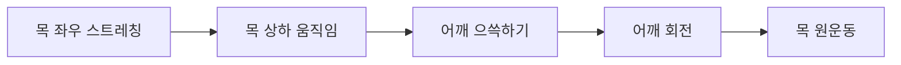
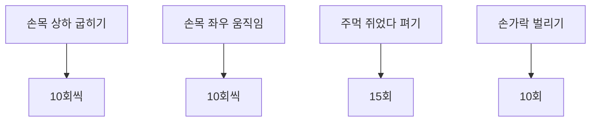
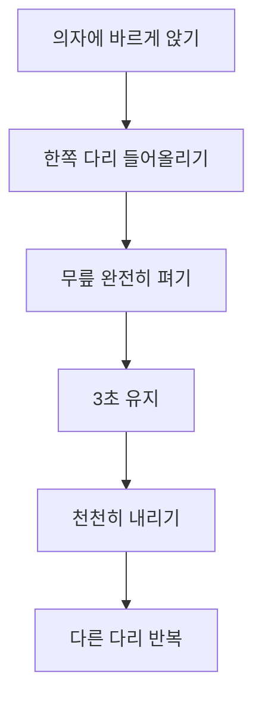
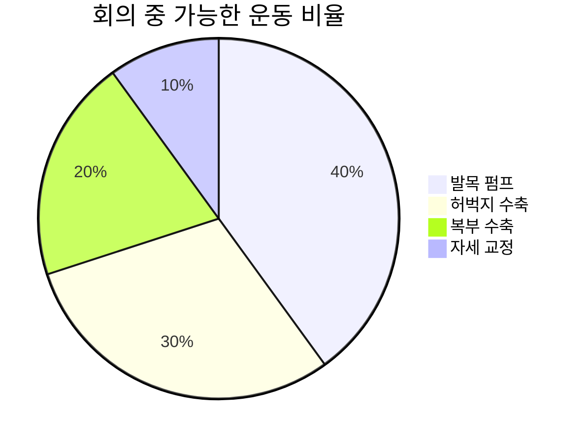
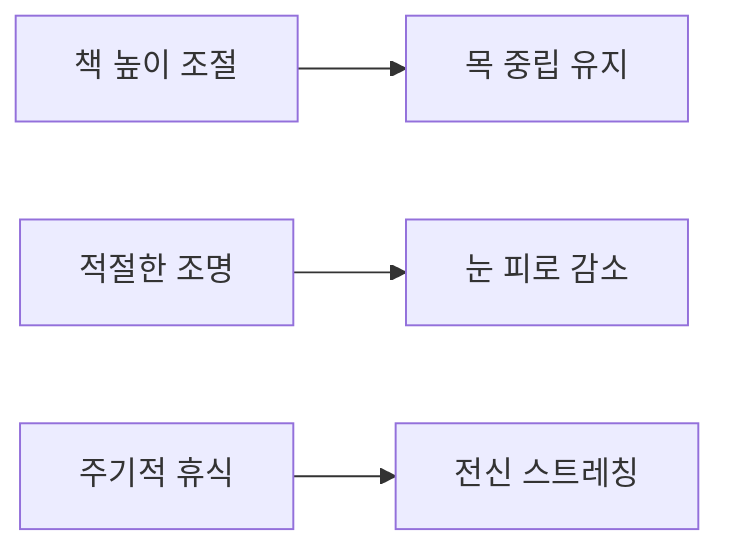
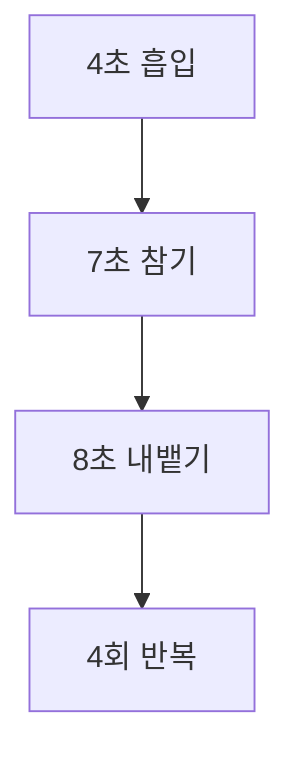
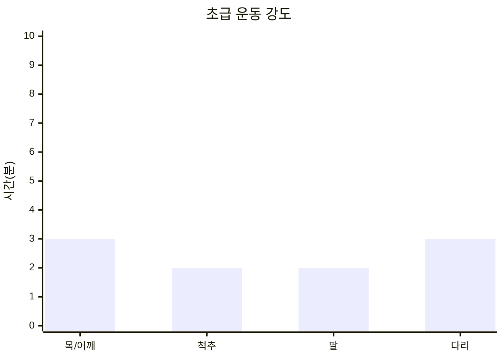

# 앉아서 실행할 수 있는 관절 건강 운동법

## 🪑 의자 운동의 과학적 근거

### 연구 기반 효과성
**뇌졸중 재활 연구 결과** (2023 체계적 문헌고찰):
- **균형 개선**: 표준화 평균 차이 0.76
- **이동성 향상**: 표준화 평균 차이 0.68
- **안전성**: 체중 부하 운동의 안전한 대안
- **접근성**: 재택 텔레재활을 통한 전달 가능

**직장 내 스트레칭 연구**:
- **통증 감소**: 최대 72% 통증 완화
- **생산성 향상**: 22% 증가
- **창의성 증진**: 17% 향상
- **집중력 개선**: 지속적 개선 효과

---

## 💺 기본 의자 운동 프로그램

### 상체 운동 (10분 프로그램)

#### 1. 목과 어깨 운동 (3분)


**목 스트레칭 세트**:
- **좌우 스트레칭**: 각 15초 × 2회
- **상하 움직임**: 각 10회
- **대각선 스트레칭**: 각 방향 10초

**어깨 운동**:
- **어깨 으쓱하기**: 5초 유지 × 10회
- **어깨 회전**: 전후방 각 10회
- **어깨뼈 모으기**: 5초 유지 × 10회

#### 2. 척추 운동 (4분)

**척추 비틀기**:
- **자세**: 등받이에 등을 붙이고 앉기
- **동작**: 상체를 좌우로 비틀기
- **강도**: 각 방향 15초 × 3회
- **주의**: 골반은 고정, 상체만 회전

**척추 신전**:
- **자세**: 의자 가장자리에 앉기
- **동작**: 가슴을 앞으로 내밀며 등 젖히기
- **강도**: 5초 유지 × 10회
- **효과**: 흉추 후만 개선

#### 3. 팔과 손목 운동 (3분)

**손목 운동**:


**팔 스트레칭**:
- **상완삼두근**: 머리 뒤로 팔 굽히기 20초
- **상완이두근**: 팔 뒤로 뻗어 스트레칭 20초
- **어깨 내전근**: 가슴 앞 팔 당기기 20초

### 하체 운동 (10분 프로그램)

#### 1. 발목과 종아리 운동 (3분)

**발목 펌프 운동**:
- **목적**: 혈액순환 촉진, 부종 감소
- **방법**: 발목 배굴-족저굴곡 반복
- **횟수**: 50회 × 2세트

**발목 원운동**:
- **시계방향**: 10회
- **반시계방향**: 10회
- **양발 교대**: 각각 실시

**종아리 올리기**:
- **자세**: 발뒤꿈치를 바닥에 고정
- **동작**: 발가락을 최대한 위로
- **강도**: 2초 유지 × 20회

#### 2. 무릎과 허벅지 운동 (4분)

**앉은 자세 다리 신전**:


**운동 세부사항**:
- **자세**: 등받이에 등을 붙이고 앉기
- **동작**: 한쪽 다리씩 수평으로 들어올리기
- **강도**: 3초 유지 × 10회 (각 다리)
- **효과**: 대퇴사두근 강화

**허벅지 수축 운동**:
- **등척성 수축**: 허벅지에 힘주고 5초 유지
- **횟수**: 15회 × 2세트
- **효과**: 대퇴사두근 활성화

#### 3. 고관절 운동 (3분)

**앉은 자세 고관절 굽히기**:
- **동작**: 무릎을 가슴 쪽으로 당기기
- **강도**: 각 다리 15초 × 2회
- **효과**: 고관절 굴곡근 스트레칭

**고관절 외전 운동**:
- **준비물**: 저항밴드 (선택사항)
- **동작**: 무릎 사이 벌리기
- **강도**: 5초 유지 × 15회

---

## 🏢 직장에서의 실용적 운동

### 회의 중 은밀한 운동

#### 테이블 아래 운동


**눈에 띄지 않는 운동**:
- **발목 펌프**: 지속적으로 실시
- **허벅지 수축**: 5초씩 간헐적 실시
- **복부 수축**: 호흡과 함께 실시
- **자세 교정**: 주기적으로 등받이에 기대기

### 전화 통화 중 운동

#### 멀티태스킹 운동법
**서서 통화 시**:
- **제자리 걷기**: 혈액순환 촉진
- **종아리 올리기**: 하지 근력 강화
- **어깨 회전**: 상체 긴장 완화

**앉아서 통화 시**:
- **척추 비틀기**: 좌우 교대로
- **다리 신전**: 한쪽씩 교대로
- **목 스트레칭**: 통화 방향 반대로

### 점심시간 15분 프로그램

#### 종합 의자 운동 루틴
```mermaid
gantt
    title 점심시간 15분 운동 스케줄
    dateFormat YYYY-MM-DD
    axisFormat %H:%M

    section 워밍업
    "목과어깨" : done, warmup, 2024-01-01, 2024-01-01

    section 상체운동
    "척추운동" : active, upper, 2024-01-01, 2024-01-01
    "팔운동" : active, arms, 2024-01-01, 2024-01-01

    section 하체운동
    "다리운동" : pending, lower, 2024-01-01, 2024-01-01

    section 마무리
    전신스트레칭 : pending, cooldown, 13, 2
```

**단계별 실행**:
1. **워밍업** (3분): 목, 어깨 가볍게 풀기
2. **상체 강화** (6분): 척추, 팔 운동
3. **하체 활성화** (4분): 다리, 발목 운동
4. **마무리** (2분): 전신 스트레칭

---

## 🏠 집에서의 고급 의자 운동

### TV 시청 중 운동

#### 소파 활용 운동법
**팔걸이 활용**:
- **팔 디핑**: 삼두근 강화 운동
- **다리 들어올리기**: 복근 운동
- **팔 푸시업**: 가슴 운동

**쿠션 활용**:
- **등 지지**: 허리 스트레칭
- **다리 받침**: 하지 거상
- **저항 도구**: 압축 운동

#### 프로그램별 맞춤 운동
**드라마 시청 시** (50분):
- **상업광고**: 집중 운동 시간
- **장면 전환**: 자세 변경
- **엔딩**: 마무리 스트레칭

**스포츠 중계 시**:
- **경기 중**: 가벼운 운동
- **하프타임**: 집중 운동
- **경기 종료**: 종합 스트레칭

### 독서 중 운동

#### 독서 자세 개선


**독서 시 운동법**:
- **페이지 넘김**: 손목 스트레칭
- **챕터 마무리**: 목 운동
- **휴식 시간**: 전신 스트레칭

---

## 🧘‍♀️ 의자 요가와 명상

### 의자 요가 시퀀스

#### 5분 의자 요가 루틴
**산 자세 (Mountain Pose)**:
- **자세**: 발을 바닥에 평평히
- **호흡**: 깊고 느린 호흡
- **시간**: 1분

**의자 비틀기 (Chair Twist)**:
- **동작**: 상체를 좌우로 비틀기
- **호흡**: 비틀 때 숨 내쉬기
- **시간**: 각 방향 30초

**의자 전굴 (Chair Forward Fold)**:
- **동작**: 상체를 앞으로 숙이기
- **효과**: 척추 스트레칭
- **시간**: 1분

### 호흡 운동

#### 4-7-8 호흡법


**실행 방법**:
1. **흡입**: 코로 4초간 숨 들이마시기
2. **보유**: 7초간 숨 참기
3. **호출**: 입으로 8초간 숨 내쉬기
4. **반복**: 4사이클 실시

---

## 📊 의자 운동의 강도 조절

### 운동 강도 단계

#### 초급 (1-2주차)


**특징**:
- **총 시간**: 10분
- **강도**: 낮음
- **빈도**: 하루 3회
- **목표**: 습관 형성

#### 중급 (3-6주차)
**특징**:
- **총 시간**: 15분
- **강도**: 중간
- **빈도**: 하루 2회
- **목표**: 근력 향상

#### 고급 (7주차 이후)
**특징**:
- **총 시간**: 20분
- **강도**: 높음
- **빈도**: 하루 1-2회
- **목표**: 유지 및 발전

### 도구 활용한 강화 운동

#### 저항밴드 활용
**상체 운동**:
- **밴드 당기기**: 등 근육 강화
- **팔 벌리기**: 어깨 근육 강화
- **상체 비틀기**: 복사근 강화

**하체 운동**:
- **다리 벌리기**: 중둔근 강화
- **다리 신전**: 대둔근 강화
- **발목 운동**: 종아리 강화

#### 소도구 활용
**수건 활용**:
- **목 견인**: 목 스트레칭
- **어깨 스트레칭**: 가동범위 증가
- **다리 스트레칭**: 햄스트링 신장

**물병 활용**:
- **아령 대용**: 팔 운동
- **균형 훈련**: 코어 강화
- **저항 도구**: 다양한 근력 운동

---

## 🎯 특수 상황별 운동법

### 장거리 여행 시

#### 비행기/기차에서
**이코노미 증후군 예방**:
- **발목 펌프**: 매 30분마다
- **종아리 마사지**: 혈액순환 촉진
- **좌석 내 스트레칭**: 제한적 공간 활용

#### 자동차 여행 시
**휴게소 5분 운동**:
- **전신 스트레칭**: 운전 자세 해소
- **걷기**: 혈액순환 촉진
- **목 운동**: 운전 긴장 완화

### 회복기 환자용

#### 수술 후 재활
**초기 단계**:
- **호흡 운동**: 폐 기능 회복
- **발목 운동**: 혈전 예방
- **가벼운 스트레칭**: 관절 가동범위 유지

**진행 단계**:
- **근력 강화**: 점진적 저항 증가
- **기능 훈련**: 일상생활 동작 연습
- **지구력 향상**: 시간 연장

---

## 📈 효과 측정 및 진행 관리

### 자가 평가 도구

#### 주간 체크리스트
| 항목 | 월 | 화 | 수 | 목 | 금 | 토 | 일 |
|------|----|----|----|----|----|----|---|
| 아침 운동 (10분) | □ | □ | □ | □ | □ | □ | □ |
| 점심 운동 (15분) | □ | □ | □ | □ | □ | - | - |
| 저녁 운동 (10분) | □ | □ | □ | □ | □ | □ | □ |
| 자세 의식적 교정 | □ | □ | □ | □ | □ | □ | □ |

#### 월간 평가
**객관적 지표**:
- **유연성**: 목, 척추 가동범위
- **근력**: 다리 신전 지속 시간
- **지구력**: 연속 운동 가능 시간
- **균형**: 의자에서 일어나는 속도

**주관적 지표**:
- **통증 수준**: 0-10점 척도
- **피로도**: 0-10점 척도
- **만족도**: 0-10점 척도
- **지속 의향**: 0-10점 척도

---

## 💡 성공을 위한 팁

### 습관 형성 전략
1. **작게 시작**: 2-3분부터 시작
2. **일정한 시간**: 매일 같은 시간에 실시
3. **환경 조성**: 알림 설정, 도구 준비
4. **진행 기록**: 운동 일지 작성

### 동기 유지 방법
- **변화 인식**: 사진이나 측정으로 변화 확인
- **목표 설정**: 구체적이고 달성 가능한 목표
- **보상 시스템**: 달성 시 작은 보상
- **동반자**: 가족, 동료와 함께 실시

---

> 🌟 **핵심 포인트**: 의자 운동은 **언제 어디서나 할 수 있는 최고의 건강 투자**입니다. 완벽한 환경을 기다리지 말고, 지금 당장 앉아 있는 의자에서 시작하세요. **작은 움직임이 큰 변화의 시작**입니다!