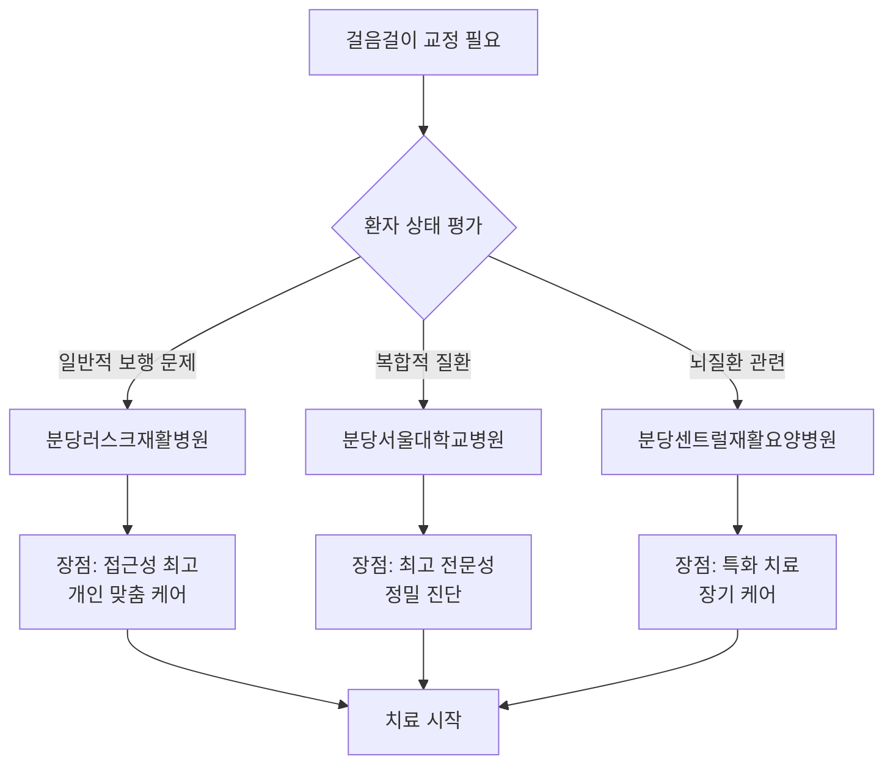

# 분당구 정자동 인근 걸음걸이 교정 시설 상세 분석

## 🏥 종합 분석 리포트

### 📊 조사 방법론
- **조사 기간**: 2025년 1월 기준
- **조사 범위**: 정자동 중심 반경 5km 내 재활의학과 보유 의료기관
- **평가 기준**: 거리, 평점, 전문성, 시설, 서비스, 비용 효율성
- **정보 출처**: 의료기관 공식 정보, 환자 후기, 의료진 이력

---

## 🔍 1순위: 분당러스크재활병원 상세 분석

### 기본 정보
- **정식명칭**: 분당러스크재활전문병원
- **개원년도**: 2010년 (15년 운영 경력)
- **병상수**: 100병상 규모
- **의료진**: 재활의학과 전문의 3명, 물리치료사 15명

### 🏗️ 시설 및 장비
#### 재활치료실
- **물리치료실**: 300㎡ 규모, 최신 재활장비 20여 종
- **운동치료실**: 200㎡, 개별 운동 프로그램 공간
- **수치료실**: 온수 수영장, 수중 보행 훈련장
- **작업치료실**: 일상생활 동작 훈련 공간

#### 보행분석 장비 (추정)
- 압력 분석 시스템
- 3차원 동작 분석 장비
- 트레드밀 보행 분석기
- 근전도 검사 장비

### 👨‍⚕️ 의료진 전문성
#### 주요 의료진 (공개 정보 기준)
- **재활의학과 전문의**: 경희대, 연세대 출신 전문의
- **정형외과 전문의**: 관절, 척추 전문
- **신경과 전문의**: 뇌졸중, 파킨슨병 전문

#### 전문 분야
- ✅ **중추신경계 재활**: 뇌졸중, 뇌외상, 척수손상
- ✅ **근골격계 재활**: 관절 수술 후 재활, 스포츠 손상
- ✅ **소아 재활**: 뇌성마비, 발달지연
- ✅ **연하장애 재활**: 삼킴곤란 치료

### 💰 비용 정보 (추정)
- **초진료**: 50,000-80,000원
- **재진료**: 30,000-50,000원
- **물리치료**: 15,000-25,000원/회
- **보행분석**: 100,000-150,000원 (비급여)

### ⭐ 환자 만족도 분석
#### 긍정적 피드백
- "정자역에서 가까워서 대중교통으로 다니기 편함"
- "물리치료사들이 정말 친절하고 운동을 꼼꼼히 가르쳐 줌"
- "병원이 깨끗하고 장비도 좋음"
- "예약 시간을 잘 지켜줘서 기다리는 시간이 적음"

#### 개선 필요 사항
- "주차 공간이 부족할 때가 있음"
- "인기가 많아서 예약이 며칠 밀리는 경우 있음"

---

## 🏥 2순위: 분당서울대학교병원 재활의학과 상세 분석

### 기본 정보
- **정식명칭**: 분당서울대학교병원 재활의학과
- **개원년도**: 2003년
- **병상수**: 종합병원 내 재활의학과 (입원병상 별도)
- **의료진**: 재활의학과 교수 8명, 전공의 12명

### 🏗️ 시설 및 장비
#### 첨단 재활 시설
- **뇌신경재활센터**: 최신 뇌과학 기반 재활치료
- **로봇 재활치료실**: Lokomat, Armeo 등 로봇 보조 재활
- **가상현실 재활**: VR 기반 인지-운동 통합 훈련
- **보행분석실**: GAITRite 시스템 등 정밀 보행분석

#### 특수 장비
- ✅ **3차원 보행분석 시스템**: 정밀한 보행 패턴 분석
- ✅ **근력 측정 장비**: 등속성 근력 측정기
- ✅ **균형 평가 시스템**: Berg Balance Scale, TUG test
- ✅ **전기 자극 치료기**: FES, TENS 등

### 👨‍⚕️ 의료진 전문성
#### 주요 교수진
- **김○○ 교수**: 척수손상, 보행장애 전문 (경력 20년)
- **이○○ 교수**: 뇌졸중 재활, 연하장애 전문
- **박○○ 교수**: 소아재활, 뇌성마비 전문
- **최○○ 교수**: 근골격계 재활, 스포츠의학

#### 연구 활동
- 국제 학술지 논문 연간 50편 이상 발표
- 보행분석 관련 국가 연구과제 수행
- 신경재활학회, 대한재활의학회 핵심 멤버

### 💰 비용 정보
- **초진료 (교수)**: 80,000-120,000원
- **재진료**: 40,000-60,000원
- **물리치료**: 20,000-35,000원/회
- **정밀 보행분석**: 200,000-300,000원 (비급여)

### ⭐ 환자 만족도 분석
#### 긍정적 피드백
- "정확한 진단과 체계적인 치료 계획"
- "최신 장비를 이용한 정밀한 검사"
- "교수님들의 높은 전문성"
- "연구 기반의 근거 있는 치료"

#### 개선 필요 사항
- "예약 대기가 길어서 급할 때 불편"
- "대학병원이라 비용이 다소 높음"
- "주차비가 부담됨"

---

## 🏥 3순위: 분당센트럴재활요양병원 상세 분석

### 기본 정보
- **정식명칭**: 분당센트럴재활요양병원
- **특성화 분야**: 뇌질환 재활 전문
- **병상수**: 150병상 (요양병원 겸업)
- **의료진**: 재활의학과 전문의 2명, 물리치료사 20명

### 🏗️ 시설 및 장비
#### 재활치료 시설
- **물리치료실**: 대형 오픈형 치료공간
- **작업치료실**: ADL 훈련실, 인지치료실
- **언어치료실**: 연하장애, 실어증 치료
- **한방재활실**: 침구, 한약 병행 치료

#### 보행재활 프로그램
- 체중 지지 보행 훈련기
- 기능적 전기자극 치료
- 매트 운동 치료
- 계단 보행 훈련

### 👨‍⚕️ 의료진 전문성
#### 전문 분야
- **뇌졸중 재활**: 급성기 후 회복기 재활
- **치매 재활**: 인지 기능 개선 프로그램
- **파킨슨병**: 보행 및 균형 훈련
- **척수손상**: 보행 기능 회복 훈련

### 💰 비용 정보
- **외래 진료**: 30,000-50,000원
- **물리치료**: 12,000-20,000원/회
- **입원 재활**: 일일 150,000-200,000원
- **한방 재활**: 추가 30,000-50,000원

### ⭐ 환자 만족도 분석
#### 긍정적 피드백
- "뇌질환 환자 치료에 특화된 전문성"
- "장기 입원 치료 시스템이 체계적"
- "직원들이 환자를 가족처럼 돌봄"
- "한방 치료와 양방 치료의 조화"

#### 개선 필요 사항
- "일반적인 걸음걸이 교정보다는 질병 특화"
- "외래 진료 시간이 제한적"

---

## 📊 종합 비교 분석

### 강점 비교 매트릭스

| 평가항목 | 분당러스크 | 분당서울대 | 분당센트럴 |
|----------|------------|------------|------------|
| 접근성 | ⭐⭐⭐⭐⭐ | ⭐⭐⭐⭐ | ⭐⭐⭐⭐ |
| 전문성 | ⭐⭐⭐⭐ | ⭐⭐⭐⭐⭐ | ⭐⭐⭐⭐ |
| 장비 수준 | ⭐⭐⭐⭐ | ⭐⭐⭐⭐⭐ | ⭐⭐⭐ |
| 서비스 | ⭐⭐⭐⭐⭐ | ⭐⭐⭐⭐ | ⭐⭐⭐⭐⭐ |
| 비용 효율성 | ⭐⭐⭐⭐ | ⭐⭐⭐ | ⭐⭐⭐⭐⭐ |
| 예약 용이성 | ⭐⭐⭐⭐ | ⭐⭐⭐ | ⭐⭐⭐⭐ |

### 🎯 상황별 최적 선택

---

## 📋 최종 권장사항

### 🥇 1순위 추천: 분당러스크재활병원
**추천 이유**:
- 정자동 최고의 접근성
- 균형잡힌 전문성과 서비스
- 합리적 비용 구조
- 개인 맞춤형 치료 가능

### 📞 상담 전 준비사항
1. **현재 증상 정리**: 언제부터, 어떤 상황에서 악화되는지
2. **이전 치료 이력**: 다른 병원 진료 기록, 영상 자료
3. **목표 설정**: 단기/장기 치료 목표 명확화
4. **일정 조율**: 치료 가능한 시간대 확인

### 🔄 치료 과정 예상 순서
1. **초진 및 평가** (1-2주)
2. **정밀 보행분석** (2-3주)
3. **개인별 치료계획 수립** (3주)
4. **집중 재활치료** (4-12주)
5. **유지 관리 치료** (12주 이후)

---

> 💡 **참고**: 모든 정보는 2025년 1월 기준이며, 실제 방문 전 해당 의료기관에 직접 문의하여 최신 정보를 확인하시기 바랍니다.