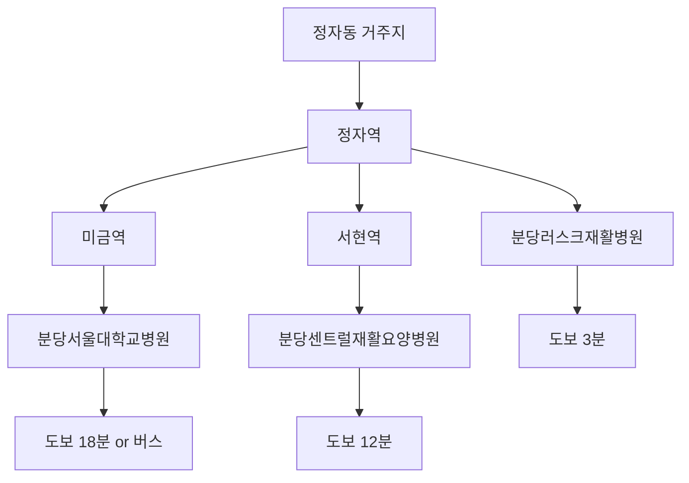

# 성남시 분당구 정자동 인근 걸음걸이 교정 시설 - 거리순 랭킹

## 📍 위치 기준점: 분당구 정자동

### 🥇 1위: 분당러스크재활병원
**📍 위치**: 경기도 성남시 분당구 정자일로156번길 6 (정자동, 뉴본타워) 3-8층
**🚇 접근성**: 정자역에서 289m
**📞 연락처**: 031-716-0007

#### 거리 정보
- **정자동 중심부로부터**: 약 0.3km (도보 3분)
- **정자역으로부터**: 289m (도보 3분)
- **대중교통**: 지하철 분당선 정자역 1번 출구

#### 진료과목
- 재활의학과
- 가정의학과
- 내과
- 신경과
- 신경외과
- 정형외과

#### 특화 분야
- 중추신경계 재활 (뇌졸중, 척수손상, 뇌성마비)
- 근골격계 재활
- 수술 후 재활치료

### 🥈 2위: 분당서울대학교병원 재활의학과
**📍 위치**: 경기도 성남시 분당구 구미로 173번길 82
**🚇 접근성**: 미금역에서 약 1.5km
**📞 연락처**: 1588-3369

#### 거리 정보
- **정자동 중심부로부터**: 약 2.8km (차량 8분)
- **미금역으로부터**: 1.5km (도보 18분)
- **대중교통**: 지하철 분당선 미금역, 버스 이용 권장

#### 전문 분야
- 뇌신경재활센터 운영
- 보행훈련 전문 프로그램
- 매트 이동 및 생활 동작 훈련
- 의자차 및 기구를 이용한 보행 훈련
- 환자 맞춤형 운동치료

#### 특징
- 국내 최고 수준의 치료진
- 최신 재활 장비 보유
- 종합병원 내 재활의학과로 다학제적 접근 가능

### 🥉 3위: 분당센트럴재활요양병원
**📍 위치**: 경기도 성남시 분당구 이매동 120-5
**🚇 접근성**: 서현역/이매역 인근
**📞 연락처**: 031-706-9090

#### 거리 정보
- **정자동 중심부로부터**: 약 3.2km (차량 10분)
- **서현역으로부터**: 약 1km (도보 12분)
- **이매역으로부터**: 약 800m (도보 10분)

#### 특화 분야
- 뇌질환재활 특성화병원
- 중풍 후 재활치료
- 장기 재활 치료 프로그램

---

## 📊 거리별 비교표

| 순위 | 병원명 | 정자동 중심부 거리 | 가장 가까운 역 | 역에서 거리 | 도보시간 |
|------|--------|-------------------|----------------|-------------|----------|
| 1위 | 분당러스크재활병원 | 0.3km | 정자역 | 289m | 3분 |
| 2위 | 분당서울대학교병원 | 2.8km | 미금역 | 1.5km | 18분 |
| 3위 | 분당센트럴재활요양병원 | 3.2km | 서현역 | 1km | 12분 |

## 🚇 대중교통 접근성 분석

## 💡 접근성 종합 평가

### 최고 접근성: 분당러스크재활병원
- **장점**: 정자동 내 위치, 정자역 바로 인근
- **추천 대상**: 대중교통 이용자, 정자동 거주민

### 우수 접근성: 분당서울대학교병원
- **장점**: 종합병원의 전문성, 다양한 진료과 연계
- **고려사항**: 거리가 다소 멀어 차량 이용 권장

### 양호 접근성: 분당센트럴재활요양병원
- **장점**: 장기 치료 시 입원 가능
- **고려사항**: 주로 뇌질환 특화, 일반 걸음걸이 교정은 확인 필요

---

## 📝 선택 가이드

### 거리 우선 선택 시
1. **분당러스크재활병원** (정자동 거주민 최적)
2. **분당서울대학교병원** (종합적 치료 원할 시)
3. **분당센트럴재활요양병원** (장기 재활 필요 시)

### 교통편 고려사항
- **대중교통 이용자**: 분당러스크재활병원 강력 추천
- **자가용 이용자**: 모든 병원 접근 용이, 주차 여건 사전 확인 권장
- **택시 이용자**: 분당러스크재활병원이 가장 경제적