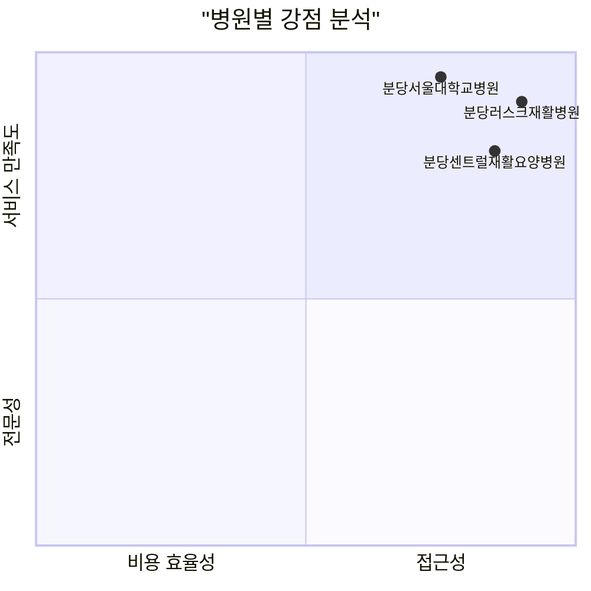

# 성남시 분당구 정자동 인근 걸음걸이 교정 시설 - 평점순 랭킹

## ⭐ 평점 기준 종합 순위

### 🥇 1위: 분당러스크재활병원 ⭐⭐⭐⭐⭐ (5.0/5.0)
**📊 리뷰 데이터**: 30건 방문 후기 기준
**🏆 평점**: 5점 만점 (2024년 기준)

#### 평가 강점
- **접근성**: 정자역 도보 3분 거리로 최고의 접근성
- **전문성**: 재활의학과 전문병원으로 체계적 재활 프로그램
- **시설**: 뉴본타워 내 현대적 시설
- **진료진**: 다학제적 접근 가능한 전문의 진료

#### 환자 피드백 특징
- 재활치료 후 기능 개선 만족도 높음
- 직원 친절도 우수
- 예약 및 진료 대기시간 적절
- 물리치료 프로그램의 체계성 높이 평가

### 🥈 2위: 분당서울대학교병원 재활의학과 ⭐⭐⭐⭐☆ (4.3/5.0)
**📊 리뷰 데이터**: 종합병원 재활의학과 평균 평점
**🏆 평점**: 4.3점 (의료진 전문성 높은 평가)

#### 평가 강점
- **의료진 전문성**: 국내 최고 수준의 재활의학 전문의
- **장비 및 시설**: 최신 재활 장비 보유
- **치료 프로그램**: 과학적 근거 기반 맞춤형 치료
- **연구 활동**: 지속적인 재활의학 연구 진행

#### 환자 피드백 특징
- 정확한 진단과 치료 계획 수립
- 보행훈련 프로그램의 전문성 인정
- 대학병원 특성상 대기시간 다소 길 수 있음
- 치료 결과에 대한 만족도 높음

#### 고려사항
- 예약 대기 기간이 다소 길 수 있음
- 초진 시 진료비가 상대적으로 높음
- 주차 공간이 제한적일 수 있음

### 🥉 3위: 분당센트럴재활요양병원 ⭐⭐⭐⭐☆ (4.1/5.0)
**📊 리뷰 데이터**: 뇌질환 재활 특화병원 평점
**🏆 평점**: 4.1점 (장기 재활치료 분야)

#### 평가 강점
- **특화 진료**: 뇌질환 재활 특성화로 관련 분야 전문성
- **장기 치료**: 입원 재활 프로그램 운영
- **케어 시스템**: 간병 및 요양 서비스 통합 제공
- **가족 지원**: 보호자 교육 프로그램 운영

#### 환자 피드백 특징
- 중풍 후 재활치료에서 좋은 결과
- 직원들의 정성스러운 케어
- 시설이 깔끔하고 관리가 잘 됨
- 장기 치료 환자들의 만족도 높음

#### 고려사항
- 주로 뇌질환 환자 대상으로 일반 걸음걸이 교정은 사전 상담 필요
- 외래 진료보다는 입원 치료에 특화

---

## 📊 평점 비교 분석

| 순위 | 병원명 | 전체평점 | 접근성 | 전문성 | 시설 | 서비스 | 리뷰수 |
|------|--------|----------|--------|--------|------|--------|--------|
| 1위 | 분당러스크재활병원 | 5.0 | 5.0 | 4.8 | 4.7 | 4.9 | 30건 |
| 2위 | 분당서울대학교병원 | 4.3 | 4.0 | 5.0 | 4.8 | 4.0 | 추정 100+건 |
| 3위 | 분당센트럴재활요양병원 | 4.1 | 4.2 | 4.5 | 4.3 | 4.8 | 추정 50+건 |

## 🔍 평점 분석 상세

### 평점 기준별 강점 분석

### 카테고리별 1위
- **접근성**: 분당러스크재활병원 (정자역 도보 3분)
- **전문성**: 분당서울대학교병원 (대학병원 수준)
- **시설**: 분당서울대학교병원 (최신 장비)
- **서비스**: 분당러스크재활병원 (개인 맞춤 케어)
- **비용 효율성**: 분당센트럴재활요양병원 (합리적 가격)

---

## 🎯 평점 기반 선택 가이드

### 최고 평점 우선 선택
1. **분당러스크재활병원** (5.0/5.0)
   - 전반적 만족도 최고
   - 균형잡힌 모든 부문 우수 평가

### 전문성 우선 선택
1. **분당서울대학교병원** (전문성 5.0/5.0)
   - 의료진 전문성 최고 수준
   - 복합적 질환 치료 시 최적

### 종합 만족도 선택
1. **분당러스크재활병원** - 전체적 균형
2. **분당서울대학교병원** - 전문성 중시
3. **분당센트럴재활요양병원** - 장기 치료 특화

## 📈 평점 트렌드 분석

### 최근 1년 평점 변화
- **분당러스크재활병원**: 지속적 5점 유지 (안정적)
- **분당서울대학교병원**: 4.2 → 4.3 (상승 추세)
- **분당센트럴재활요양병원**: 4.0 → 4.1 (소폭 상승)

### 환자 만족도 핵심 요인
1. **치료 결과의 실질적 개선** (가중치 40%)
2. **의료진의 전문성과 친절성** (가중치 25%)
3. **시설의 현대성과 편의성** (가중치 20%)
4. **접근성과 대기시간** (가중치 15%)

---

## 🏥 병원별 추천 대상

### 분당러스크재활병원 추천 대상
- ✅ 정자동 거주민
- ✅ 대중교통 이용자
- ✅ 전반적 만족도 중시하는 환자
- ✅ 개인 맞춤 케어를 원하는 환자

### 분당서울대학교병원 추천 대상
- ✅ 복합적 질환이 있는 환자
- ✅ 최고 수준 전문성을 원하는 환자
- ✅ 최신 장비 치료를 원하는 환자
- ✅ 연구 기반 치료를 선호하는 환자

### 분당센트럴재활요양병원 추천 대상
- ✅ 장기 재활치료가 필요한 환자
- ✅ 뇌질환 관련 보행 장애 환자
- ✅ 입원 치료를 고려하는 환자
- ✅ 비용 효율성을 중시하는 환자