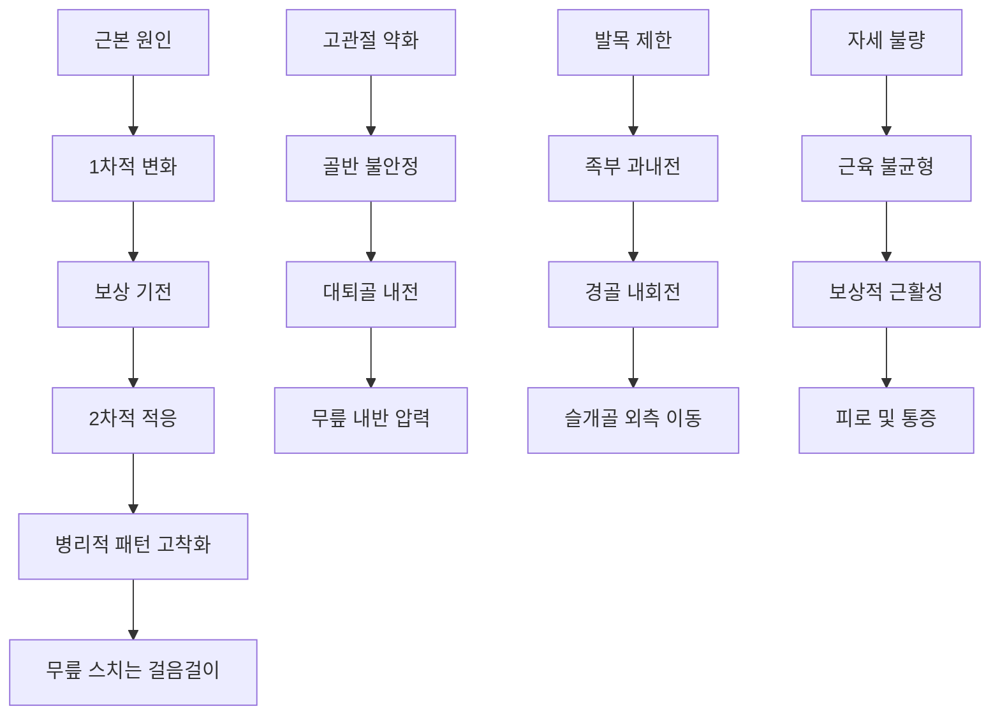
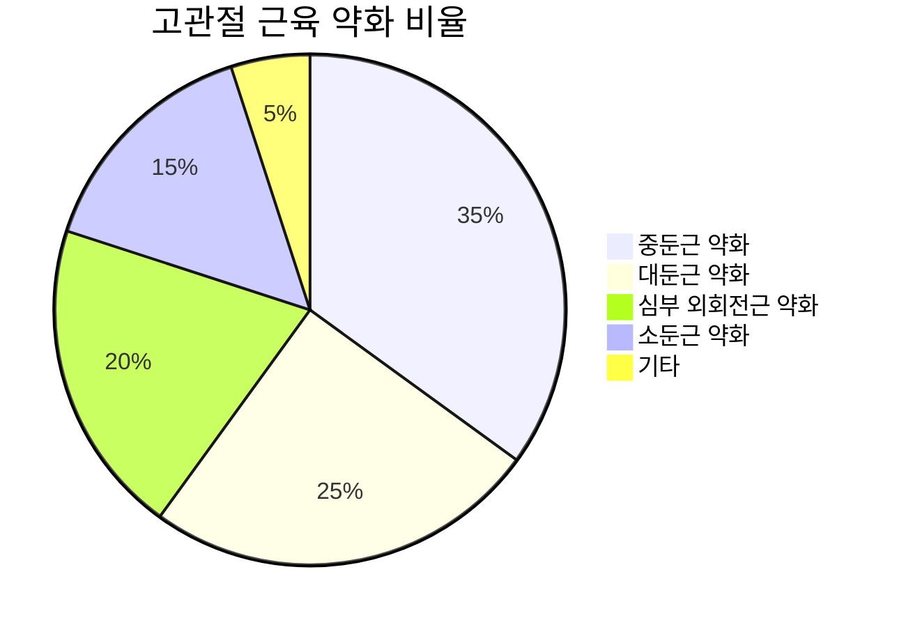
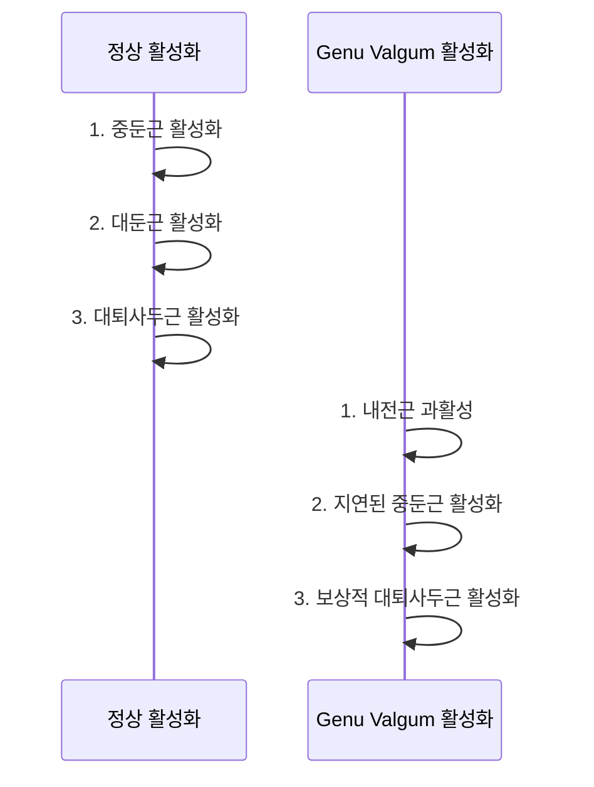
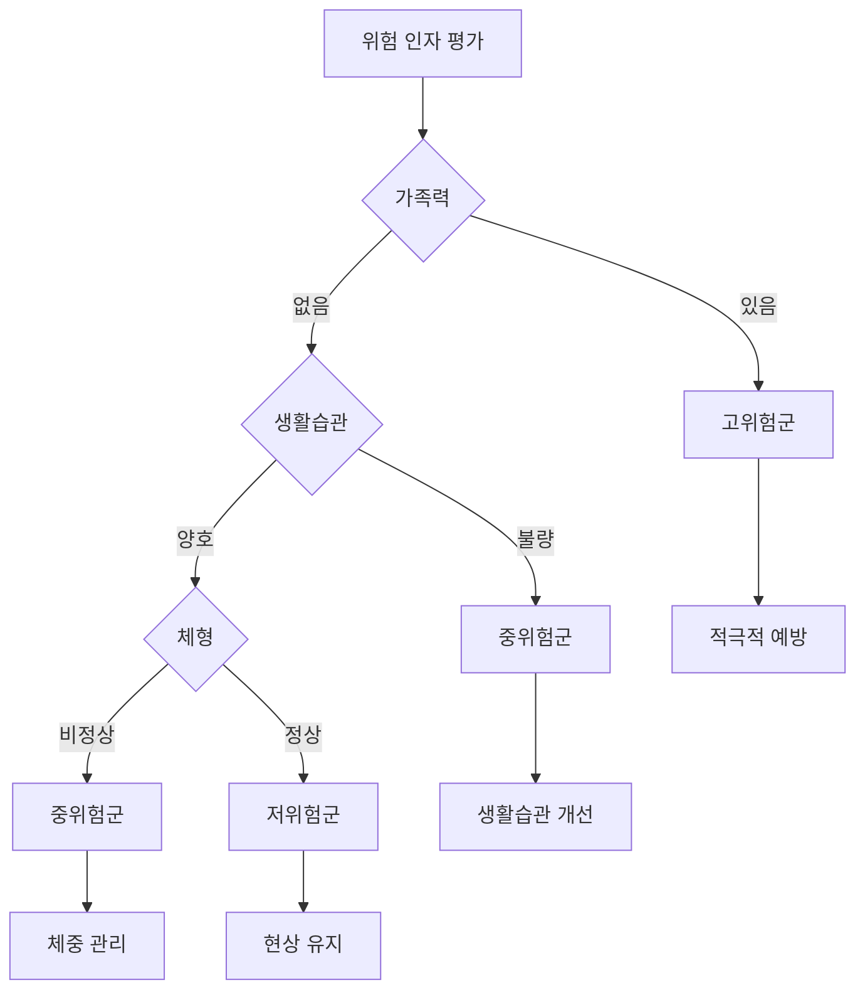

# 무릎 스치는 걸음걸이 원인 및 발생 기전

## 🔄 발생 기전의 다면적 접근

### 생체역학적 연쇄 반응 (Kinetic Chain)
무릎 스치는 걸음걸이는 단일 원인이 아닌 **복합적 연쇄 반응**의 결과입니다.

---

## 🦴 1차적 구조적 원인

### 골격 구조 이상

#### 선천적 요인
- **대퇴골 전경각 이상**: 대퇴골 목의 과도한 전방 경사
- **경골 후경각 이상**: 경골 상단의 후방 경사
- **고관절 이형성**: 비구(acetabulum) 발달 부전
- **족부 구조 이상**: 선천적 편평족, 요족

#### 발달성 요인
- **성장판 이상**: 불균등한 성장으로 인한 각도 변화
- **영양 결핍**: 비타민 D, 칼슘 부족으로 인한 골 발달 이상
- **호르몬 이상**: 성장호르몬, 갑상선호르몬 불균형

### 관절 연골 문제
- **내측 관절연골 과성장**: 무릎 내측의 과도한 연골 증식
- **외측 관절연골 발육부전**: 무릎 외측 연골의 불충분한 발달
- **반월상연골 이상**: 내측 반월상연골의 구조적 문제

---

## 💪 근신경 계통 원인

### 핵심 근육군의 기능 부전

#### 고관절 주변근 약화

**중둔근(Gluteus Medius) 약화**
- **기능**: 고관절 외전 및 안정화
- **약화 시 영향**: 골반 하강, 대퇴골 내전
- **원인**: 장시간 앉은 자세, 운동 부족

**대둔근(Gluteus Maximus) 약화**
- **기능**: 고관절 신전 및 외회전
- **약화 시 영향**: 대퇴골 내회전, 전방 기울어짐
- **원인**: 좌식 생활, 스마트폰 사용 증가

#### 대퇴부 근육 불균형

| 근육군 | 정상 상태 | Genu Valgum 상태 | 변화율 |
|--------|-----------|------------------|--------|
| 내측광근(VMO) | 100% | 60-70% | ↓30-40% |
| 외측광근(VL) | 100% | 110-120% | ↑10-20% |
| 내전근군 | 100% | 120-140% | ↑20-40% |
| 외전근군 | 100% | 70-80% | ↓20-30% |

### 신경근 제어 이상

#### 운동 프로그래밍 오류
- **잘못된 운동 패턴 학습**: 반복적 부정확한 동작
- **고유수용성 감각 저하**: 관절 위치 감각 둔화
- **균형 제어 능력 저하**: 중추신경계 제어 이상

#### 근육 활성화 시퀀스 이상

---

## 🔗 환경적 및 생활습관 요인

### 현대 생활양식의 영향

#### 좌식 생활의 문제점
- **고관절 굴곡근 단축**: 장요근, 대퇴직근 단축
- **둔근 약화**: 글루트 암네지아(Glute Amnesia) 현상
- **고관절 가동범위 제한**: 신전 및 외회전 제한

#### 잘못된 운동 패턴
- **스쿼트 시 무릎 모음**: 잘못된 스쿼트 기법
- **런닝 시 내측 착지**: 과도한 내전 패턴
- **점프 착지 시 내반**: 충격 흡수 불량

### 신발 및 보행 환경

#### 부적절한 신발
- **하이힐 착용**: 발목 가동범위 제한, 전족부 압력 집중
- **쿠션 과다 신발**: 고유수용성 감각 둔화
- **지지력 부족 신발**: 족부 안정성 저하

#### 보행 표면의 영향
- **평평한 인공 표면**: 다양한 지형 자극 부족
- **딱딱한 바닥**: 충격 흡수 기능 요구 증가
- **미끄러운 표면**: 안정성 보상 기전 활성화

---

## 🧬 생물학적 요인

### 성별 차이

#### 여성의 생리적 특성
- **골반 구조**: 넓은 골반으로 인한 Q-angle 증가
- **호르몬 영향**: 에스트로겐의 인대 이완 효과
- **근력 차이**: 상대적으로 낮은 하지 근력

| 측정 항목 | 남성 평균 | 여성 평균 | 차이 |
|----------|-----------|-----------|------|
| Q-angle | 10-15° | 15-20° | +25-33% |
| 고관절 외전근력 | 100% | 75-85% | -15-25% |
| 발목 배굴 가동범위 | 100% | 90-95% | -5-10% |

#### 남성의 특이 요인
- **근육량 급증기**: 사춘기 근력 불균형
- **스포츠 활동**: 접촉성 운동으로 인한 부상
- **직업적 요인**: 반복적 작업으로 인한 패턴 고착화

### 연령대별 발생 원인

#### 소아청소년기 (5-18세)
- **생리적 발달**: 정상 발달 과정의 지연
- **성장 불균형**: 뼈와 근육의 비동기적 성장
- **활동 패턴**: 스포츠 활동 중 잘못된 기술 습득

#### 성인기 (19-65세)
- **직업적 요인**: 장시간 앉은 자세, 반복적 동작
- **운동 부족**: 근력 및 가동범위 저하
- **체중 증가**: 하지 관절 부하 증가

#### 노년기 (65세 이상)
- **근감소증**: 연령 관련 근력 저하
- **균형 능력 저하**: 전정기관 및 고유수용성 감각 저하
- **관절염**: 퇴행성 변화로 인한 보상 기전

---

## 🔄 병리적 진행 과정

### 단계별 진행 양상

#### Phase 1: 잠재기 (Latent Phase)
- **기간**: 수개월 ~ 1년
- **특징**: 무증상, 미세한 정렬 이상
- **변화**: 근활성도 패턴 변화 시작

#### Phase 2: 적응기 (Adaptation Phase)
- **기간**: 1-3년
- **특징**: 간헐적 불편감, 피로감
- **변화**: 보상 기전 활성화, 2차 근육 참여

#### Phase 3: 진행기 (Progressive Phase)
- **기간**: 3-5년
- **특징**: 명확한 증상, 일상생활 영향
- **변화**: 구조적 변화 시작, 관절 부하 증가

#### Phase 4: 고착화기 (Established Phase)
- **기간**: 5년 이상
- **특징**: 지속적 통증, 기능 제한
- **변화**: 병리적 패턴 고착화, 2차 합병증

---

## 🧪 생화학적 및 분자생물학적 기전

### 근육 적응 과정

#### 근섬유 타입 변화
- **Type I (지속형) 섬유**: 상대적 감소
- **Type II (순발형) 섬유**: 과사용으로 인한 피로
- **근섬유 크기**: 선택적 위축 및 비대

#### 결합조직 변화
- **콜라겐 합성 증가**: 보상적 강화 반응
- **탄성섬유 감소**: 유연성 및 탄성 저하
- **염증 매개체**: IL-1β, TNF-α 증가

### 신경가소성 변화

#### 운동피질 재편성
- **운동 지도(Motor Map) 변화**: 잘못된 패턴의 신경 강화
- **시냅스 가소성**: 병리적 연결 강화
- **억제 회로 약화**: 상호 억제 기능 저하

---

## 📊 위험 인자 분석

### 고위험군 식별

#### 내재적 위험 인자
- **가족력**: 유전적 소인 존재
- **성별**: 여성 > 남성 (2:1 비율)
- **체형**: BMI >25 또는 <18.5
- **관절 과가동성**: 일반화된 관절 느슨함

#### 외재적 위험 인자
- **운동 종목**: 점프, 착지가 많은 스포츠
- **직업**: 장시간 서있거나 앉아있는 직업
- **생활 환경**: 엘리베이터 사용, 운동 부족
- **신발 착용**: 부적절한 신발 선택

### 위험도 평가 도구

---

## 🎯 예방 전략

### 1차 예방 (Primary Prevention)
- **교육**: 올바른 보행 및 운동 방법
- **환경 개선**: 적절한 신발, 운동 시설
- **생활습관**: 규칙적 운동, 체중 관리

### 2차 예방 (Secondary Prevention)
- **조기 발견**: 정기적 보행 분석
- **위험 인자 관리**: 생활습관 수정
- **예방적 운동**: 근력 강화 및 유연성 향상

### 3차 예방 (Tertiary Prevention)
- **적극적 치료**: 재활치료, 보조기 사용
- **합병증 예방**: 2차 손상 방지
- **기능 유지**: 잔존 기능 최대화

---

> 💡 **핵심 요약**: 무릎 스치는 걸음걸이는 단순한 정렬 문제가 아닌, 복합적 원인이 연쇄적으로 작용하여 발생하는 병리적 보행 패턴입니다. 성공적인 치료를 위해서는 근본 원인의 정확한 파악과 다면적 접근이 필수적입니다.