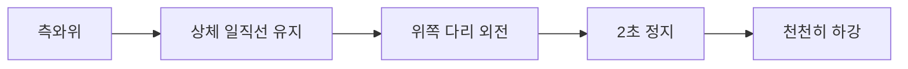
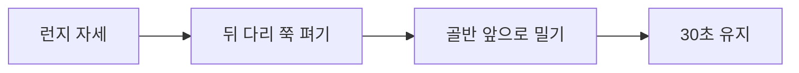

# 무릎 스치는 걸음걸이 교정 운동법

## 🎯 운동치료 목표 및 원칙

### 치료 목표
1. **근본 원인 해결**: 중둔근 강화를 통한 골반 안정성 확보
2. **운동연쇄 정상화**: 발목-무릎-고관절 정렬 개선
3. **기능적 움직임 회복**: 일상생활 및 스포츠 활동 시 정상 패턴
4. **통증 감소**: 관절 부하 재분산을 통한 통증 완화

### 운동치료 원칙
- **점진적 부하**: 단계적 강도 증가
- **특이성 원칙**: 기능적 움직임 패턴 적용
- **개별화**: 개인의 약점 및 보상 패턴 고려
- **지속성**: 최소 12-16주간 규칙적 실시

---

## 🏃‍♂️ 단계별 운동 프로그램

### Phase 1: 기초 안정화 (1-4주)

#### 목표
- 기본 근활성화 패턴 학습
- 통증 및 염증 감소
- 관절 가동범위 회복

#### 핵심 운동 5가지

**1. 중둔근 활성화 (Glute Med Activation)**

- **자세**: 측와위, 몸통 일직선
- **동작**: 위쪽 다리를 30도 외전, 2초 정지
- **횟수**: 15-20회 × 3세트
- **주의점**: 골반 회전 방지, 순수 외전 동작

**2. 클램쉘 (Clamshell)**
- **자세**: 측와위, 무릎 90도 굽힘
- **동작**: 발을 붙인 채 무릎만 벌리기
- **횟수**: 12-15회 × 3세트
- **진행**: 저항밴드 추가

**3. 브릿지 (Bridge)**
- **자세**: 앙와위, 무릎 90도 굽힘
- **동작**: 엉덩이 들어올리기, 3초 정지
- **횟수**: 15-20회 × 3세트
- **포인트**: 대둔근 수축감 집중

**4. 월 스쿼트 (Wall Squat)**
- **자세**: 벽에 등 대고 서기
- **동작**: 무릎 사이 공 끼고 스쿼트
- **횟수**: 12-15회 × 3세트
- **목적**: 무릎 정렬 학습

**5. 카프 레이즈 (Calf Raise)**
- **자세**: 서있는 자세
- **동작**: 발끝으로 몸 들어올리기
- **횟수**: 15-20회 × 3세트
- **목적**: 발목 안정성 강화

### Phase 2: 근력 강화 (5-8주)

#### 목표
- 기능적 근력 향상
- 동적 안정성 개선
- 운동 패턴 교정

#### 핵심 운동 6가지

**1. 싱글 레그 글루트 브릿지 (Single Leg Glute Bridge)**
- **자세**: 앙와위, 한쪽 다리 들기
- **동작**: 한쪽 다리로 브릿지
- **횟수**: 10-12회 × 3세트 (양쪽)
- **난이도**: 저항밴드 추가 가능

**2. 라테랄 밴드 워크 (Lateral Band Walk)**
- **자세**: 반쪽 스쿼트 자세 유지
- **동작**: 저항밴드로 옆걸음
- **거리**: 10-15걸음 × 3세트 (양방향)
- **포인트**: 무릎이 안쪽으로 모이지 않도록 주의

**3. 스텝업 (Step-up)**
- **자세**: 20-30cm 높이 박스 앞
- **동작**: 한 발씩 올라가기
- **횟수**: 10-12회 × 3세트 (양쪽)
- **주의점**: 내려올 때 무릎 정렬 유지

**4. 몬스터 워크 (Monster Walk)**
- **자세**: 저항밴드를 발목에 착용
- **동작**: 대각선 방향으로 걷기
- **거리**: 10보 × 3세트 (4방향)
- **목적**: 다면적 고관절 강화

**5. 밴드 풀 어파트 (Band Pull Apart)**
- **자세**: 서있는 자세, 팔 앞으로 뻗기
- **동작**: 저항밴드를 가슴까지 당기기
- **횟수**: 15-20회 × 3세트
- **목적**: 상체 안정성 및 자세 교정

**6. 데드버그 (Dead Bug)**
- **자세**: 앙와위, 팔다리 90도
- **동작**: 대각선 팔다리 내리기
- **횟수**: 8-10회 × 3세트 (양쪽)
- **목적**: 코어 안정성 강화

### Phase 3: 기능적 훈련 (9-12주)

#### 목표
- 스포츠 특이적 움직임 패턴
- 고강도 활동 대비
- 재발 방지

#### 핵심 운동 7가지

**1. 싱글 레그 스쿼트 (Single Leg Squat)**
- **자세**: 한쪽 다리로 서기
- **동작**: 한쪽 다리로 스쿼트
- **깊이**: 무릎 90도까지
- **횟수**: 8-10회 × 3세트
- **평가**: 무릎 정렬 상태 확인

**2. 라테랄 런지 (Lateral Lunge)**
- **자세**: 서있는 자세
- **동작**: 옆으로 큰 보폭 런지
- **깊이**: 허벅지 수평까지
- **횟수**: 10-12회 × 3세트 (양쪽)

**3. 커티시 런지 (Curtsy Lunge)**
- **자세**: 서있는 자세
- **동작**: 한쪽 다리를 뒤 대각선으로
- **횟수**: 10-12회 × 3세트 (양쪽)
- **목적**: 다면적 고관절 강화

**4. 점프 스쿼트 (Jump Squat)**
- **자세**: 스쿼트 자세
- **동작**: 점프 후 부드럽게 착지
- **횟수**: 8-10회 × 3세트
- **주의점**: 착지 시 무릎 정렬

**5. 라테랄 바운드 (Lateral Bound)**
- **자세**: 한쪽 다리로 서기
- **동작**: 옆으로 점프하여 반대편 다리로 착지
- **거리**: 60-80cm
- **횟수**: 6-8회 × 3세트

**6. 싱글 레그 데드리프트 (Single Leg Deadlift)**
- **자세**: 한쪽 다리로 서기
- **동작**: 몸통 앞으로 숙이며 균형 잡기
- **횟수**: 8-10회 × 3세트
- **목적**: 동적 균형 및 고관절 안정성

**7. 보수 볼 스쿼트 (Bosu Ball Squat)**
- **자세**: 보수볼 위에 서기
- **동작**: 불안정한 면에서 스쿼트
- **횟수**: 10-12회 × 3세트
- **목적**: 고유수용성 감각 향상

---

## 🧘‍♀️ 유연성 및 가동범위 운동

### 필수 스트레칭 6가지

**1. 고관절 굴곡근 스트레칭**

- **타겟**: 장요근, 대퇴직근
- **자세**: 런지 자세
- **시간**: 30초 × 3세트 (양쪽)

**2. IT밴드 스트레칭**
- **타겟**: 장경인대
- **자세**: 측와위에서 다리 교차
- **시간**: 30초 × 3세트 (양쪽)

**3. 종아리 스트레칭**
- **타겟**: 비복근, 가자미근
- **자세**: 벽 밀기 자세
- **시간**: 30초 × 3세트 (양쪽)

**4. 고관절 내전근 스트레칭**
- **타겟**: 내전근군
- **자세**: 나비 자세
- **시간**: 30-45초 × 3세트

**5. 대퇴사두근 스트레칭**
- **타겟**: 대퇴직근, 외측광근
- **자세**: 서서 발목 잡고 당기기
- **시간**: 30초 × 3세트 (양쪽)

**6. 이상근 스트레칭**
- **타겟**: 이상근
- **자세**: 앉아서 발목을 반대편 무릎에
- **시간**: 30초 × 3세트 (양쪽)

---

## 📱 일상생활 통합 운동

### 사무실에서 할 수 있는 운동

**1. 의자 중둔근 운동**
- **자세**: 의자에 앉은 상태
- **동작**: 무릎 사이 쿠션 끼고 압박
- **시간**: 10초 × 10회

**2. 데스크 카프 레이즈**
- **자세**: 서있는 자세
- **동작**: 책상 잡고 발끝 들기
- **횟수**: 15회 × 3세트

**3. 월 스쿼트**
- **자세**: 벽에 등 대고
- **동작**: 가벼운 스쿼트
- **횟수**: 10회 × 3세트

### 집에서 할 수 있는 운동

**1. 침대 클램쉘**
- **자세**: 침대에 측와위
- **동작**: 클램쉘 운동
- **횟수**: 15회 × 2세트

**2. 계단 스텝업**
- **자세**: 계단 앞
- **동작**: 천천히 올라가기
- **횟수**: 10회 × 3세트

**3. TV 보며 브릿지**
- **자세**: 바닥에 앉아
- **동작**: TV 보며 브릿지
- **시간**: 광고 시간 활용

---

## 📊 운동 진행도 측정

### 자가 평가 체크리스트

#### 주간 평가 (매주 실시)
| 항목 | 1주차 | 4주차 | 8주차 | 12주차 |
|------|-------|-------|-------|--------|
| 중둔근 근력 (0-10) | ___ | ___ | ___ | ___ |
| 무릎 정렬 (0-10) | ___ | ___ | ___ | ___ |
| 통증 수준 (0-10) | ___ | ___ | ___ | ___ |
| 기능적 활동 (0-10) | ___ | ___ | ___ | ___ |

#### 기능적 테스트
**1. 싱글 레그 스쿼트 테스트**
- **기준**: 무릎이 발가락 라인 안쪽으로 들어가지 않음
- **횟수**: 10회 연속 가능

**2. 스텝다운 테스트**
- **기준**: 착지 시 무릎 정렬 유지
- **높이**: 20cm에서 부드럽게 착지

**3. Y-밸런스 테스트**
- **기준**: 발 길이의 65% 이상 도달
- **방향**: 전방, 후외측, 후내측

---

## ⚠️ 운동 시 주의사항

### 금기사항
- **급성 통증 시**: 운동 중단, 의료진 상담
- **관절 부종**: 염증 조절 후 운동 재개
- **신경학적 증상**: 방사통, 근력 약화 시 즉시 중단

### 안전 수칙
1. **워밍업**: 5-10분 가벼운 유산소 운동
2. **점진적 증가**: 주당 10% 이내 강도 증가
3. **휴식**: 근육통 시 48시간 휴식
4. **수분 섭취**: 운동 전후 충분한 수분 보충

### 전문가 상담 시기
- **4주 후 개선 없음**: 운동 방법 재평가
- **통증 악화**: 즉시 의료진 상담
- **기능 저하**: 보조기구 또는 수술 고려

---

## 🎯 맞춤형 운동 처방

### 연령대별 특화 프로그램

#### 청소년 (12-18세)
- **강조점**: 성장기 정렬 교정
- **운동량**: 격일 실시
- **주의점**: 과도한 부하 금지

#### 성인 (19-65세)
- **강조점**: 기능적 근력 강화
- **운동량**: 주 3-4회
- **목표**: 일상생활 개선

#### 노인 (65세 이상)
- **강조점**: 균형 및 낙상 방지
- **운동량**: 주 2-3회
- **보조**: 안전 장비 활용

### 증상별 맞춤 처방

#### 발목 통증 우세형
- **우선순위**: 족부 안정성 강화
- **핵심 운동**: 카프 레이즈, 밸런스 훈련
- **보조**: 아치 지지 깔창

#### 무릎 통증 우세형
- **우선순위**: VMO 강화, 슬개골 안정화
- **핵심 운동**: 월 스쿼트, 레그 익스텐션
- **보조**: 슬개골 테이핑

#### 고관절 통증 우세형
- **우선순위**: 중둔근 강화, 가동범위 개선
- **핵심 운동**: 클램쉘, 라테랄 워크
- **보조**: 고관절 스트레칭

---

## 📈 성공 사례 및 예상 결과

### 일반적인 개선 타임라인
- **2-4주**: 근활성화 패턴 개선, 통증 감소
- **6-8주**: 근력 향상, 보행 패턴 개선
- **10-12주**: 기능적 움직임 정상화
- **16주 이후**: 스포츠 복귀, 재발 방지

### 성공률 데이터
- **경증 환자**: 90-95% 완전 회복
- **중등증 환자**: 80-85% 현저한 개선
- **중증 환자**: 65-70% 기능적 개선

---

> 💪 **성공의 열쇠**: 꾸준함과 정확한 동작이 가장 중요합니다. 처음에는 쉬운 운동부터 시작하여 점진적으로 난이도를 높여가며, 무엇보다 정확한 자세로 실시하는 것이 핵심입니다.