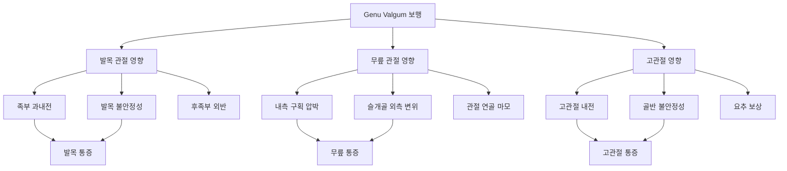
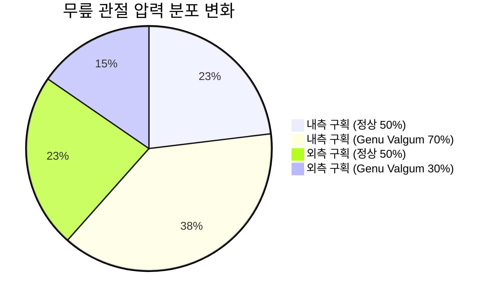
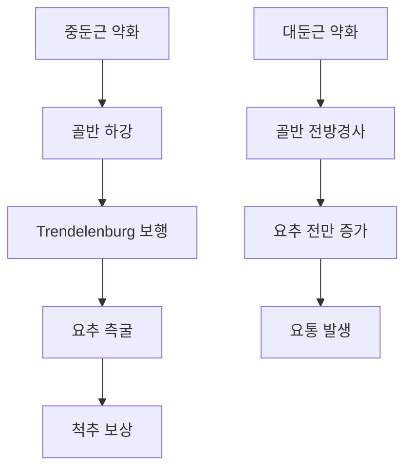
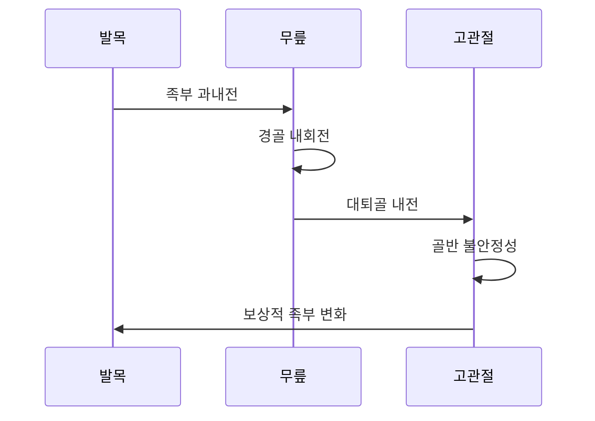

# 무릎 스치는 걸음걸이가 관절에 미치는 영향

## 🦴 관절별 영향 분석 개요

무릎 스치는 걸음걸이(Genu Valgum)는 하지 전체의 운동연쇄에 영향을 미쳐 발목, 무릎, 고관절에 **복합적이고 연쇄적인 부정적 영향**을 초래합니다.

---

## 🦶 발목 관절에 미치는 영향

### 생체역학적 변화

#### 족부 과내전 (Excessive Pronation)
- **정의**: 발의 과도한 내측 회전 및 아치 하강
- **발생 기전**: 무릎 내반 → 경골 내회전 → 족부 내전 유발
- **정량적 변화**: 정상 대비 15-25도 과도한 내전

#### 후족부 외반 (Rearfoot Valgus)
- **종골 외반각**: 정상 2-4도 → 증가 6-12도
- **거골 경사각**: 과도한 내측 경사
- **아킬레스건 변위**: 외측으로 벗어난 주행

### 발목 통증의 발생 기전

#### 내측 발목 통증
**원인**: 내측 인대 복합체 과신장
- **삼각인대 스트레스**: 지속적 신장으로 인한 미세 손상
- **후경골근 건염**: 과사용으로 인한 건초염
- **족저근막염**: 족궁 하강으로 인한 과도한 견인

#### 외측 발목 불안정성
**원인**: 비정상적 힘 분산으로 인한 외측 인대 약화
- **전거비인대 약화**: 반복적 미세 손상
- **종비인대 신장**: 만성적 스트레스
- **급성 염좌 위험 증가**: 불안정성으로 인한 빈번한 접질림

### 발목 관절의 이차적 변화

#### 관절 연골 손상
| 부위 | 정상 압력 | Genu Valgum 압력 | 증가율 |
|------|-----------|------------------|--------|
| 내측 거골돔 | 100% | 140-160% | +40-60% |
| 외측 거골돔 | 100% | 80-90% | -10-20% |
| 내측 종골 관절면 | 100% | 150-180% | +50-80% |

#### 근건 복합체 변화
- **후경골근**: 편심성 수축 증가, 건염 위험
- **장비골근**: 보상적 과활성
- **전경골근**: 상대적 약화
- **비복근**: 내측두 과활성, 외측두 저활성

---

## 🦵 무릎 관절에 미치는 영향

### 관절 내 압력 분포 변화

#### 대퇴-경골 관절 (Tibiofemoral Joint)

**내측 구획 과부하**
- **압력 증가**: 정상 대비 40-60% 증가
- **접촉 면적 감소**: 점 접촉으로 변화
- **연골 마모 가속화**: 조기 관절염 위험

**외측 구획 저부하**
- **압력 감소**: 정상 대비 20-30% 감소
- **근육 약화**: 외측 안정화 근육 위축
- **관절 간격 증가**: 외측 인대 이완

#### 슬개-대퇴 관절 (Patellofemoral Joint)
- **슬개골 외측 변위**: Q-angle 증가로 인한 외측 추적
- **외측 압력 집중**: 외측 관절면 과부하
- **내측 지지 상실**: 내측광근(VMO) 약화

### 무릎 통증의 다양한 양상

#### 내측 무릎 통증
**급성 통증**
- **원인**: 내측 반월상연골 압박, 내측 측부인대 견인
- **특징**: 체중 부하 시 악화, 계단 오르기 시 심화
- **위치**: 관절선 따라 국소적 압통

**만성 통증**
- **원인**: 관절 연골 마모, 활막염
- **특징**: 지속적 둔통, 아침 강직감
- **합병증**: 조기 관절염, 기능적 제한

#### 전방 무릎 통증 (슬개대퇴 통증)
**슬개골 연골연화증**
- **발생률**: Genu Valgum 환자의 60-80%
- **기전**: 슬개골 외측 압력 집중
- **증상**: 앉았다 일어날 때 통증, 계단 내려갈 때 악화

### 무릎 관절의 장기적 변화

#### 관절염 진행 단계
1. **초기 (1-3년)**: 연골 표면 거칠어짐
2. **중기 (3-7년)**: 연골 두께 감소, 골극 형성
3. **말기 (7년 이상)**: 연골 완전 마모, 뼈 노출

#### 인대 및 반월상연골 손상
- **내측 측부인대**: 만성 견인으로 인한 신장
- **전십자인대**: 상대적 이완 및 기능 저하
- **내측 반월상연골**: 압박으로 인한 찢어짐 위험

---

## 🦴 고관절에 미치는 영향

### 고관절 운동학적 변화

#### 대퇴골 내전 및 내회전
- **내전각 증가**: 정상 대비 10-15도 증가
- **내회전각 증가**: 정상 대비 8-12도 증가
- **굴곡 제한**: 후방 관절낭 단축

#### 골반 안정성 저하

### 고관절 통증의 특성

#### 전방 고관절 통증
**고관절 충돌 증후군 (FAI)**
- **원인**: 대퇴골 과도한 내회전으로 인한 충돌
- **유형**: Cam 타입, Pincer 타입 복합
- **증상**: 깊이 앉을 때 통증, 회전 시 제한

#### 외측 고관절 통증
**대전자 주위 통증 증후군**
- **원인**: 중둔근 건염, 활액낭염
- **기전**: 과사용 및 보상적 근활성
- **특징**: 측와위에서 통증, 계단 오르기 시 악화

#### 후방 고관절 통증
**이상근 증후군**
- **원인**: 과도한 내회전으로 인한 이상근 경직
- **증상**: 좌골신경 유사 통증, 방사통
- **악화 요인**: 장시간 앉은 자세

### 고관절의 이차적 합병증

#### 관절순 손상 (Labral Tear)
- **발생률**: Genu Valgum 환자의 30-40%
- **위치**: 주로 전상방 관절순
- **기전**: 반복적 충돌로 인한 마모

#### 조기 관절염
- **위험도**: 정상 대비 2-3배 증가
- **부위**: 전방 및 상방 관절면
- **진행 속도**: 가속화된 연골 마모

---

## 🔄 관절 간 상호작용 및 연쇄 반응

### 상행성 운동연쇄 (Ascending Kinetic Chain)

#### 발목 → 무릎 → 고관절

### 하행성 운동연쇄 (Descending Kinetic Chain)

#### 고관절 → 무릎 → 발목
- **중둔근 약화** → 골반 불안정 → 대퇴골 내전 → 무릎 내반 → 족부 과내전
- **대둔근 약화** → 골반 전경사 → 무릎 과신전 → 발목 족저굴곡 증가

---

## 📊 통증 패턴의 시간적 진행

### 급성기 (0-6주)
| 관절 | 주요 증상 | 발생 빈도 | 특징 |
|------|-----------|-----------|------|
| 발목 | 내측 통증 | 70% | 활동 후 통증 |
| 무릎 | 전방 통증 | 85% | 계단 시 악화 |
| 고관절 | 외측 통증 | 45% | 측와위 시 통증 |

### 아급성기 (6주-3개월)
- **발목**: 만성 불안정성, 반복적 염좌
- **무릎**: 슬개대퇴 통증 지속, 관절 부종
- **고관절**: 중둔근 건염, 활액낭염

### 만성기 (3개월 이상)
- **발목**: 족저근막염, 후경골근 건염
- **무릎**: 연골연화증, 조기 관절염 징후
- **고관절**: 관절순 손상, 충돌 증후군

---

## 🎯 관절별 특화 관리 전략

### 발목 관절 보호 전략
- **즉각적 조치**: 아치 지지 깔창, 테이핑
- **운동치료**: 후경골근 강화, 고유수용성 훈련
- **장기 관리**: 족부 정렬 교정, 신발 선택

### 무릎 관절 보호 전략
- **급성기**: 염증 조절, 부하 감소
- **회복기**: VMO 강화, 슬개골 안정화
- **유지기**: 기능적 운동, 정렬 유지

### 고관절 보호 전략
- **근력 강화**: 중둔근, 대둔근 집중 훈련
- **가동범위**: 고관절 굴곡근 스트레칭
- **기능 훈련**: 균형 및 보행 교정

---

## ⚠️ 경고 신호 및 합병증

### 즉시 의료진 상담이 필요한 증상
- **발목**: 급성 부종, 체중 부하 불가
- **무릎**: 관절 잠김, 심한 부종
- **고관절**: 서혜부 심한 통증, 파행

### 장기적 합병증 위험
- **발목**: 만성 불안정성, 외상성 관절염
- **무릎**: 조기 관절염, 반월상연골 파열
- **고관절**: 관절순 손상, 고관절 충돌증

---

> 💡 **핵심 메시지**: 무릎 스치는 걸음걸이는 단순히 무릎만의 문제가 아니라, 하지 전체 관절에 연쇄적 영향을 미치는 복합적 문제입니다. 특히 발목과 무릎 통증이 초기에 나타나므로, 조기 발견과 적극적 중재가 중요합니다.