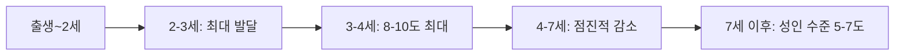
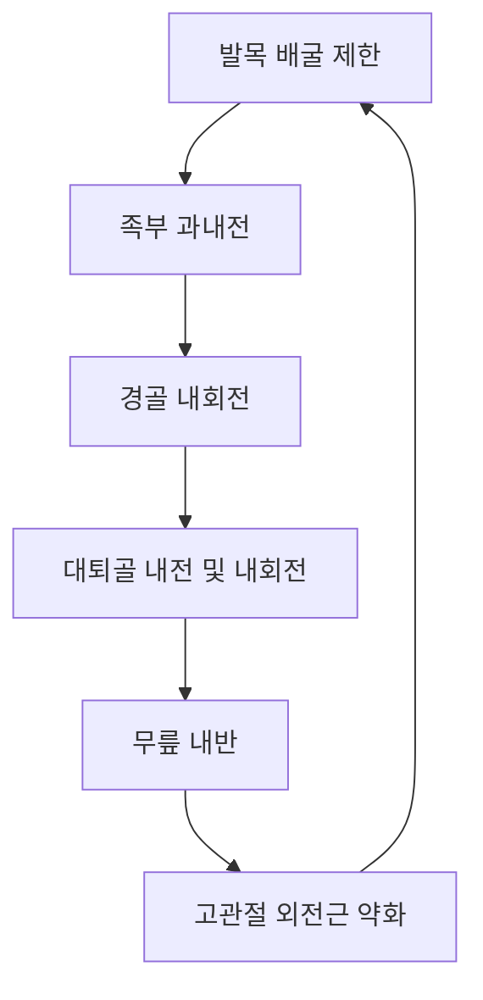
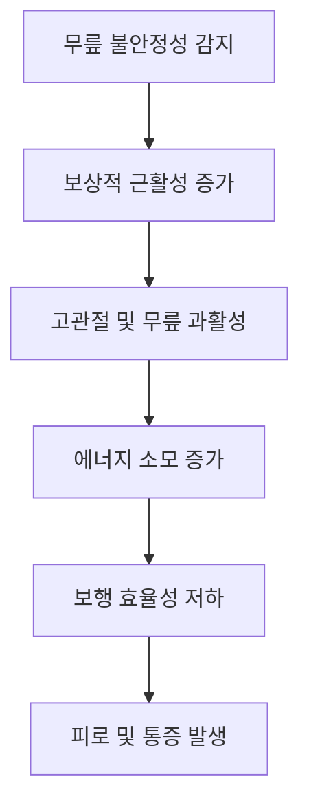

# 무릎이 스치는 걸음걸이 의학적 분석

## 🔍 의학적 진단명: Genu Valgum (내반슬, 넉 니)

### 정의
**Genu Valgum**은 서있을 때 무릎은 서로 접촉하지만 발목은 떨어져 있는 상태로, 일반적으로 "넉 니(Knock Knee)" 또는 "내반슬"이라고 불리는 의학적 상태입니다.

### 임상적 특징
- 무릎이 서로 "스치거나" "접촉"하는 보행 패턴
- 발목이 벌어진 상태에서 무릎만 붙어있는 자세
- 보행 시 무릎의 내측 충돌(medial thrust) 현상
- 좌우로 흔들리는 불안정한 걸음걸이

---

## 📊 생리적 vs 병리적 Genu Valgum

### 생리적 Genu Valgum (정상 발달 과정)

- **2세**: 처음 나타남
- **3-4세**: 최대 8-10도까지 증가
- **7세**: 성인 수준인 5-7도로 자연 회복

### 병리적 Genu Valgum (치료 필요)
- **7세 이후**: 지속되거나 악화되는 경우
- **성인**: 정상 범위(5-7도)를 초과하는 경우
- **편측성**: 한쪽만 심한 경우
- **진행성**: 시간이 지날수록 악화되는 경우

---

## 🔬 발생 기전 및 원인

### 1차적 원인 (근골격계)

#### 🦴 골격 구조적 원인
- **대퇴골 내반각 증가**: 대퇴골 목과 몸통 사이각 증가
- **경골 외반 변형**: 경골 상단부의 외측 경사
- **관절 연골 이상**: 내측 관절연골 과성장 또는 외측 성장 부족

#### 💪 근육 불균형
- **고관절 외전근 약화**: 중둔근(gluteus medius) 기능 부전
- **고관절 내전근 과활성**: 내전근군의 단축 및 과긴장
- **대퇴사두근 불균형**: 내측광근(VMO) 약화

### 2차적 원인 (연쇄 반응)

#### 🦶 발목 및 발 문제
- **발목 배굴 제한**: 종아리근육 단축으로 인한 가동범위 제한
- **족부 과내전**: 편평족으로 인한 과도한 내측 회전
- **후족부 외반**: 발뒤꿈치 외측 기울어짐

#### 🔄 운동연쇄 반응

---

## ⚖️ 생체역학적 분석

### 보행 시 역학적 변화

#### 입각기(Stance Phase) 변화
- **하중 수용기**: 무릎 내측으로의 과도한 압력 집중
- **중간 입각기**: 무릎 안정성 감소로 인한 측방 동요 증가
- **추진기**: 비효율적인 힘 전달로 인한 에너지 손실

#### 지면 반력(Ground Reaction Force) 변화
| 구분 | 정상 보행 | Genu Valgum 보행 |
|------|-----------|-------------------|
| 수직 반력 | 균등 분산 | 내측 집중 |
| 전후 반력 | 원활한 전환 | 지연된 추진력 |
| 측방 반력 | 최소 동요 | 증가된 측방 이동 |

### 관절 모멘트 변화
- **무릎 관절**: 내반 모멘트 감소, 외반 모멘트 증가
- **발목 관절**: 내반 모멘트 감소, 불안정성 증가
- **고관절**: 외전 모멘트 증가, 보상적 근활성 필요

---

## 🧠 신경근 제어 분석

### 근육 활성도 패턴 변화

#### 과활성 근육군
- **내전근군**: 장내전근, 단내전근, 치골근
- **내측 햄스트링**: 반건양근, 반막양근
- **비복근 내측두**: 족저굴곡 과활성

#### 저활성 근육군
- **중둔근**: 고관절 외전 및 안정화 기능 저하
- **대둔근**: 고관절 신전 및 외회전 약화
- **내측광근(VMO)**: 슬개골 안정화 기능 저하

### 운동 제어 전략 변화

---

## 📈 진행 단계별 분석

### Stage 1: 초기 단계
- **증상**: 경미한 무릎 스침, 가끔 불편감
- **생체역학**: 미세한 정렬 이상, 보상 가능
- **예후**: 운동치료로 충분히 개선 가능

### Stage 2: 중기 단계
- **증상**: 명확한 무릎 접촉, 간헐적 통증
- **생체역학**: 명확한 정렬 이상, 보상 기전 활성화
- **예후**: 집중적 재활치료 필요

### Stage 3: 진행 단계
- **증상**: 지속적 무릎 접촉, 일상생활 지장
- **생체역학**: 심각한 정렬 이상, 2차 합병증 발생
- **예후**: 복합적 치료 접근 필요, 수술 고려

---

## 🎯 진단 기준 및 평가

### 임상적 측정법

#### 거리 측정법
- **Intercondylar Distance**: 무릎을 붙인 상태에서 내과간 거리
  - 정상: <6cm
  - 경도: 6-10cm
  - 중등도: 10-15cm
  - 중증: >15cm

#### 각도 측정법
- **Q-angle**: 대퇴사두근의 견인각
  - 남성 정상: 10-15도
  - 여성 정상: 15-20도
  - Genu Valgum: 정상치 초과

### 영상 진단

#### X-ray 측정
- **Mechanical Axis**: 대퇴골두 중심-발목 중심선
- **Anatomical Axis**: 대퇴골-경골 해부학적 축
- **Joint Line Convergence Angle**: 관절면 수렴각

#### 동적 분석
- **3D Gait Analysis**: 3차원 보행 분석
- **Force Plate Analysis**: 지면 반력 분석
- **EMG Analysis**: 근전도 분석

---

## 🏥 감별 진단

### 유사 질환들
- **Genu Varum** (O다리): 무릎이 벌어지는 반대 상태
- **Patellar Maltracking**: 슬개골 추적 이상
- **Hip Dysplasia**: 고관절 이형성증
- **Leg Length Discrepancy**: 다리 길이 차이

### 동반 질환
- **Flat Foot** (편평족): 족부 구조 이상
- **Ankle Instability**: 발목 불안정성
- **Patellofemoral Pain**: 슬개대퇴 통증 증후군

---

## 📚 최신 연구 동향

### 2020-2025년 주요 연구 결과
- **3차원 보행분석**: 보다 정밀한 운동학적 분석 가능
- **로봇 재활치료**: 정확한 정렬 교정 훈련
- **개인맞춤 깔창**: 3D 프린팅 기술을 활용한 맞춤형 치료
- **가상현실 재활**: 실시간 피드백을 통한 보행 교정

### 치료 효과 연구
- **운동치료 효과**: 12주 집중 프로그램으로 70-85% 개선
- **깔창 치료**: 즉각적 정렬 개선 및 통증 감소
- **복합 치료**: 운동+깔창+교육으로 90% 이상 만족도

---

> 📋 **참고 문헌**
> - Kinetic and kinematic analysis of gait pattern of children with genu valgum (2016)
> - Balance control and lower limb joint work in children with bilateral genu valgum (2021)
> - Three-dimensional hip and knee kinematics during walking in females with genu valgum (2015)
> - Effects of simulated genu valgum on ground reaction forces and subtalar joint function (2005)