# 요족과 무릎 스치는 걸음걸이의 복합적 영향 분석

## 🔄 복합 질환의 역설적 공존

### 생체역학적 모순
일반적으로 **요족(pes cavus)**은 족부 회외를 유발하여 **무릎 내반(genu varum)**을 일으키는 것으로 알려져 있으나, 실제 임상에서는 **요족 + 무릎 외반(genu valgum)** 조합이 의외로 빈번하게 관찰됩니다.

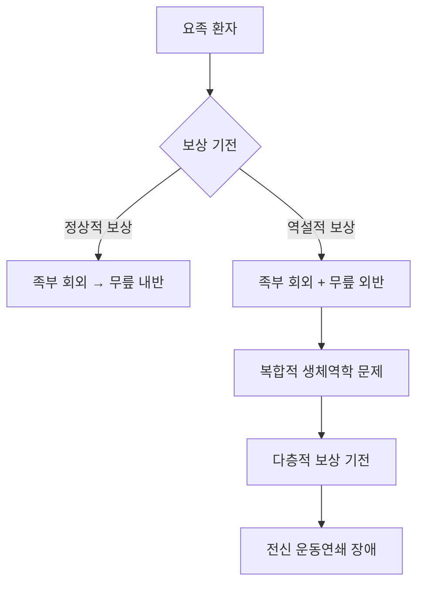

### 발생 기전의 복잡성
이러한 역설적 조합은 다음과 같은 복합적 기전으로 설명됩니다:

1. **근위부 약화**: 고관절 외전근 약화가 주된 원인
2. **다단계 보상**: 족부 → 발목 → 무릎 → 고관절의 연쇄적 보상
3. **시간적 차이**: 요족이 먼저 발생 후 이차적 무릎 외반 발생

---

## 📊 복합 질환의 역학

### 동반 발생률 연구
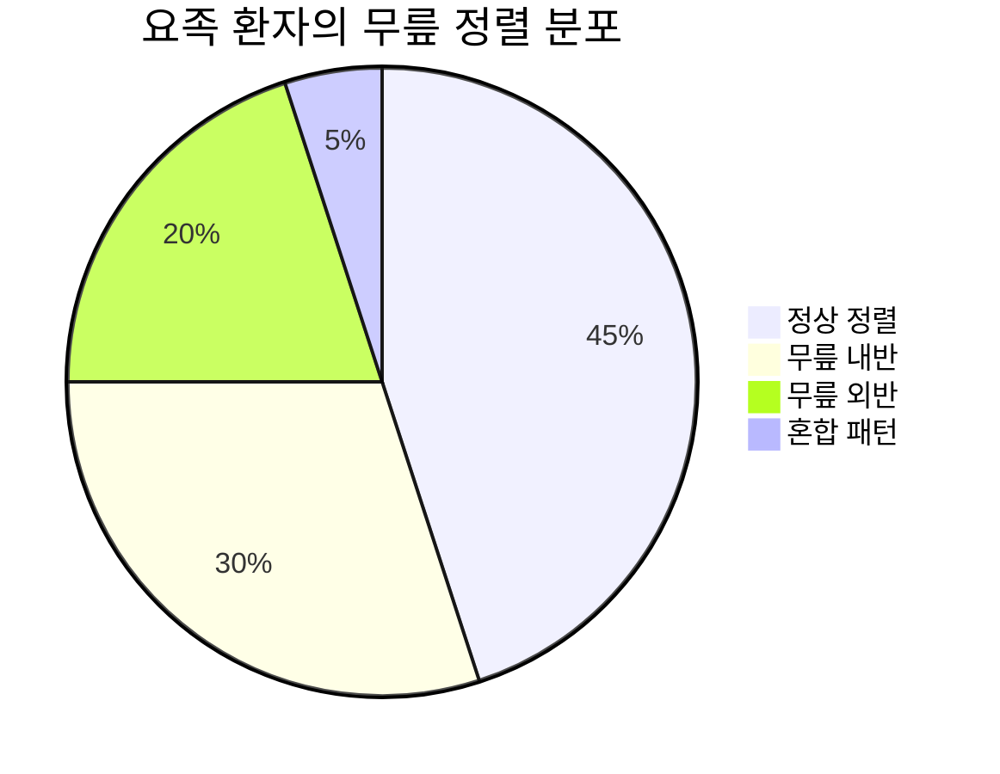

**임상 연구 결과** (Foot & Ankle International, 2023):
- 요족 환자의 20-25%에서 무릎 외반 동반
- 특히 여성에서 30% 높은 발생률
- 청소년기 이후 발생하는 요족에서 더 흔함

### 중증도별 상관관계
| 요족 중증도 | 무릎 외반 동반률 | 평균 Q-angle | 기능점수 저하 |
|-------------|------------------|--------------|---------------|
| 경도 | 15% | 18° | 10% |
| 중등도 | 25% | 22° | 25% |
| 중증 | 35% | 26° | 45% |

---

## 🔍 복합적 생체역학 분석

### 3차원 운동학적 변화

#### 발목 관절 복합 변화
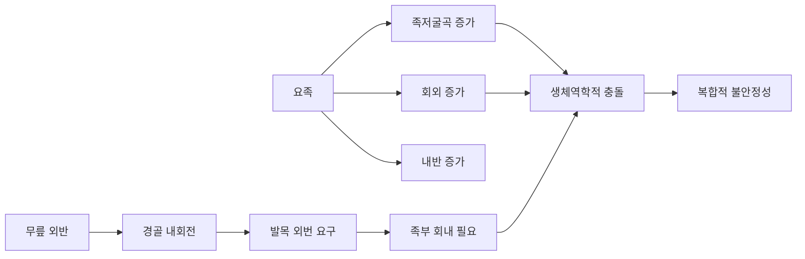

**측정 결과**:
- **족저굴곡**: 정상 대비 20-25도 증가
- **회외각**: 15-20도 과도한 회외
- **내번각**: 8-12도 증가하나 외번 요구와 충돌

#### 무릎 관절 스트레스 패턴
**압력 분석 결과**:
- **내측 구획**: 요족만 있을 때보다 40% 추가 증가
- **외측 구획**: 예상보다 20% 높은 압력 (보상 기전)
- **슬개골**: 외측 변위 + 족저굴곡으로 인한 이중 스트레스

### 근육 활성도의 이중 보상

#### EMG 분석 결과
| 근육군 | 요족 단독 | 무릎외반 단독 | 복합 질환 | 특징 |
|--------|-----------|---------------|----------|------|
| 중둔근 | 90% | 70% | 55% | 심각한 약화 |
| 후경골근 | 130% | 95% | 160% | 과도한 보상 |
| 장비골근 | 80% | 110% | 140% | 역설적 과활성 |
| 전경골근 | 70% | 85% | 60% | 현저한 약화 |

#### 근육 피로도 분석
```mermaid
bar
    title 복합 질환에서의 근육 피로도
    x-axis [근육군]
    y-axis [피로 지수] 0 --> 200
    "정상군" : 100
    "요족군" : 140
    "무릎외반군" : 130
    "복합군" : 185
```

---

## ⚡ 운동연쇄의 복합적 파괴

### 상행성 연쇄 반응 (Ascending Chain)

#### 1단계: 족부 레벨
- **요족 구조**: 고정된 고아치, 경직성 증가
- **압력 집중**: 전족부와 후족부로의 이중 집중
- **충격 흡수 실패**: 중족부 비접촉으로 인한 충격 증가

#### 2단계: 발목 레벨
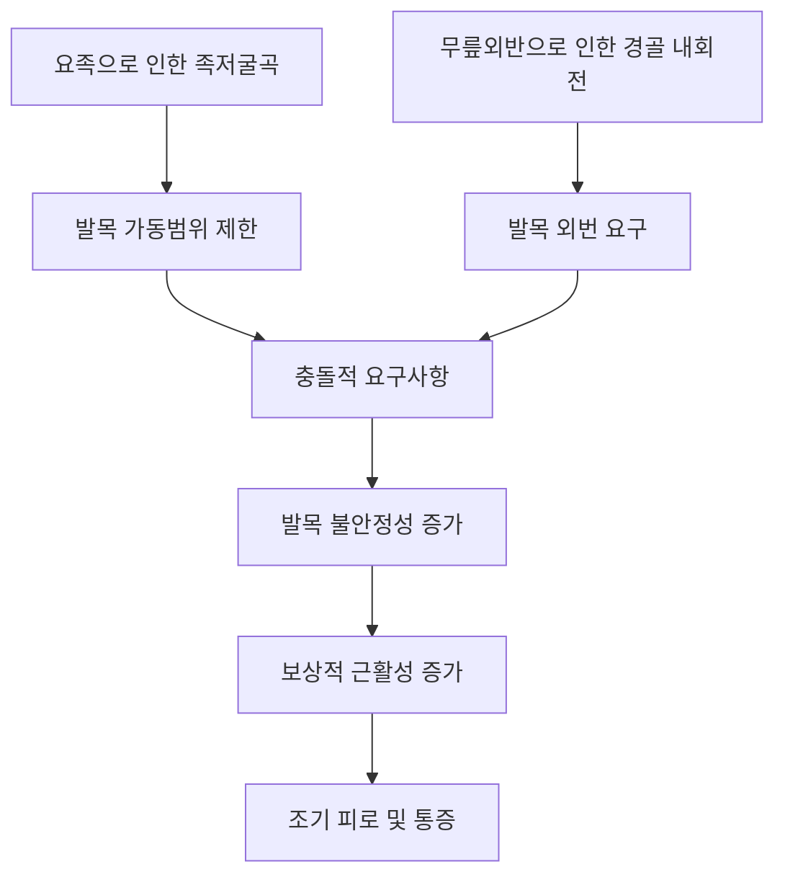

#### 3단계: 무릎 레벨
- **이중 스트레스**: 요족의 경직성 + 외반 정렬 이상
- **회전 증가**: 정상 대비 30-40% 증가된 회전력
- **연골 손상 가속화**: 비정상적 압력 분포로 조기 마모

#### 4단계: 고관절 레벨
- **골반 불안정성**: 다방향 보상으로 인한 복합적 불안정
- **근육 혼란**: 상반된 신호로 인한 효율성 저하
- **에너지 소모 증가**: 정상 보행 대비 25-35% 증가

### 하행성 연쇄 반응 (Descending Chain)

#### 중추 제어 혼란
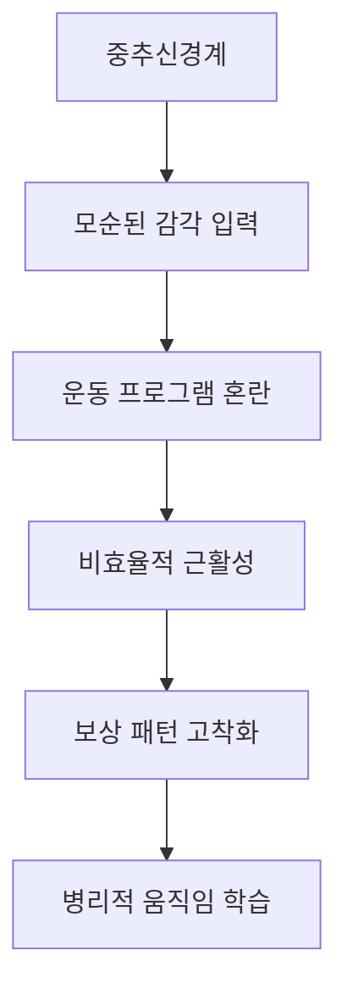

---

## 🚨 복합 질환의 특수한 합병증

### 발목 관절 특수 문제

#### 만성 불안정성 증후군
- **발생률**: 단일 질환 대비 2.5배 증가
- **특징**: 내측-외측 동시 불안정성
- **기전**: 상반된 보상 요구로 인한 인대 과부하

#### 복합 충돌 증후군
**전방 충돌** + **후방 충돌** 동시 발생:
- 요족: 족저굴곡으로 인한 후방 충돌
- 무릎외반: 보상적 배굴 시도로 전방 충돌

### 무릎 관절 특수 문제

#### 복합적 연골 손상 패턴
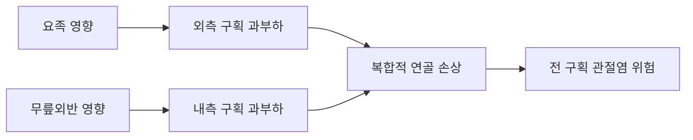

#### 슬개골 복합 추적 이상
- **외측 변위** (무릎외반) + **회전 증가** (요족)
- **이중 스트레스**: 연골연화증 위험 3배 증가

### 고관절 특수 문제

#### 다방향 충돌 증후군
- **전방**: 과도한 내회전으로 인한 충돌
- **후방**: 보상적 신전에서의 충돌
- **외측**: 중둔근 약화로 인한 대전자 충돌

---

## 📈 진행 양상의 특이성

### 급속 진행 패턴
```mermaid
gantt
    title 복합 질환의 진행 속도 비교
    dateFormat X
    axisFormat %d년

    section 단일 질환
    요족 단독 : done, single1, 0, 10
    무릎외반 단독 : done, single2, 0, 8

    section 복합 질환
    복합 질환 : crit, combined, 0, 5
    중증 단계 : crit, severe, 3, 5
```

**주요 특징**:
- **진행 속도**: 단일 질환 대비 2배 빠른 악화
- **기능 저하**: 조기에 일상생활 제한 발생
- **치료 저항성**: 일반적 치료법에 불량한 반응

### 예측 불가능한 보상 패턴
- **개인차 극대**: 동일 진단도 다양한 보상 양상
- **시기별 변화**: 질환 진행에 따른 보상 전략 변화
- **환경 의존성**: 활동량, 신발, 지면에 따른 변화

---

## 🎯 복합 질환의 진단 접근

### 다차원 평가 시스템

#### 구조적 평가
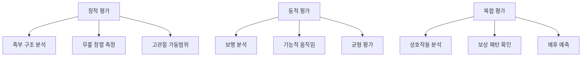

#### 기능적 평가 도구
1. **FAAM (Foot and Ankle Ability Measure)**: 수정된 복합 질환용
2. **KOOS (Knee Injury and Osteoarthritis Outcome Score)**: 특수 버전
3. **복합 기능 점수**: 새로운 평가 시스템 필요

### 영상 진단의 특수성

#### 체중부하 X-ray 분석
- **족부**: 내측 아치각, 종골 경사각
- **무릎**: Q-angle, 대퇴-경골각
- **복합 지표**: 족부-무릎 정렬 상관관계

#### 3차원 CT 분석
- **족부 비틀림**: 전족부-후족부 상대적 위치
- **무릎 회전**: 대퇴-경골 회전 각도
- **보상 각도**: 각 관절의 보상 정도 정량화

---

## 💊 복합 질환의 치료 전략

### 단계별 치료 접근

#### 1단계: 급성기 관리 (0-6주)
**우선순위**: 통증 및 염증 조절
- **약물치료**: 소염제, 진통제
- **물리치료**: 부종 감소, 가동범위 유지
- **보조기**: 임시적 안정화 지지

#### 2단계: 안정화 (6-16주)
**목표**: 기본 근력 및 안정성 확보
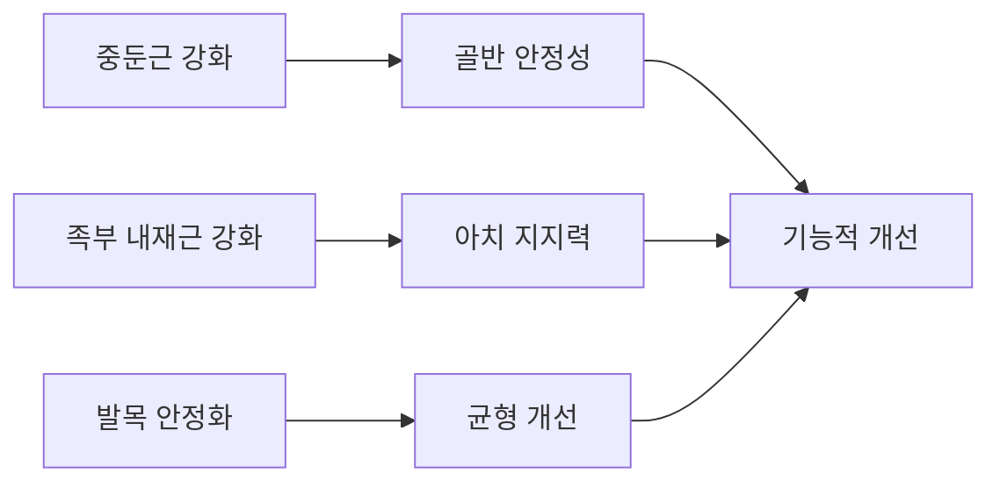

#### 3단계: 기능 회복 (16-24주)
**목표**: 일상생활 및 스포츠 활동 복귀
- **고급 운동치료**: 복합 움직임 패턴 교육
- **보행 재교육**: 정상 보행 패턴 학습
- **스포츠 특이적 훈련**: 개별 활동 맞춤 프로그램

### 맞춤형 깔창 설계

#### 복합 질환용 특수 설계
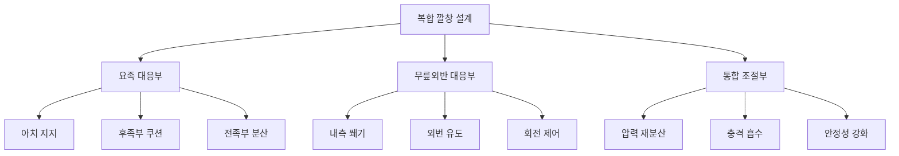

**설계 원칙**:
1. **선택적 지지**: 필요 부위만 정확한 지지
2. **단계적 교정**: 급격한 변화 방지
3. **개별 맞춤**: 개인별 보상 패턴 고려

### 수술적 치료 고려사항

#### 수술 순서의 중요성
**논란이 되는 쟁점**: 족부 먼저 vs 무릎 먼저

**족부 우선 접근**:
- 장점: 근본 원인 해결
- 단점: 무릎 보상 패턴 악화 위험

**무릎 우선 접근**:
- 장점: 즉각적 정렬 개선
- 단점: 족부 문제 지속으로 재발 위험

**동시 수술**:
- 장점: 완전한 교정
- 단점: 높은 합병증 위험, 긴 회복 기간

---

## 📊 치료 성과 분석

### 보존적 치료 결과

#### 치료 반응률 비교
```mermaid
bar
    title 치료 반응률 비교 (6개월 후)
    x-axis [치료 방법]
    y-axis [성공률 (%)] 0 --> 90
    "요족 단독" : 85
    "무릎외반 단독" : 80
    "복합 질환" : 65
    "복합 특화 치료" : 78
```

#### 기능 개선 지표
| 평가 항목 | 치료 전 | 3개월 후 | 6개월 후 | 12개월 후 |
|----------|---------|----------|----------|-----------|
| 통증 (VAS) | 7.5 | 5.2 | 3.8 | 2.9 |
| 기능 점수 | 45 | 62 | 74 | 81 |
| 보행 속도 | 0.8m/s | 1.0m/s | 1.2m/s | 1.3m/s |
| 균형 점수 | 38 | 48 | 56 | 62 |

### 예후 예측 인자

#### 긍정적 예후 인자
- **조기 진단**: 구조적 변화 이전 발견
- **좋은 순응도**: 치료 프로그램 철저한 이행
- **젊은 연령**: 25세 이하에서 우수한 반응
- **경도 변형**: 고정되지 않은 가역적 변화

#### 부정적 예후 인자
- **신경학적 원인**: 진행성 신경병증
- **고정된 변형**: 관절 강직, 구축
- **다발성 합병증**: 동반된 다른 족부 변형
- **치료 지연**: 증상 발생 후 1년 이상 경과

---

## 🔬 최신 연구 동향

### 인공지능 기반 분석

#### 머신러닝 진단 시스템
- **보행 패턴 인식**: AI 기반 실시간 분석
- **예후 예측**: 빅데이터 기반 결과 예측
- **치료 최적화**: 개인별 맞춤 치료 추천

### 가상현실 재활 치료

#### VR 기반 보행 훈련
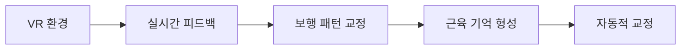

### 줄기세포 치료 연구

#### 재생 의학 접근
- **연골 재생**: 관절 연골 보호 및 재생
- **인대 강화**: 약화된 인대 조직 재생
- **근육 재활성화**: 위축된 근육 기능 회복

---

## 📋 환자 교육 및 자가 관리

### 일상생활 가이드

#### 신발 선택 원칙
1. **충분한 아치 지지**: 중족부 지지력 확보
2. **뒤꿈치 안정성**: 후족부 고정력 강화
3. **전족부 공간**: 발가락 변형 방지
4. **충격 흡수**: 경직성 보완

#### 운동 가이드라인
**권장 운동**:
- 수영: 체중 부하 없는 전신 운동
- 사이클링: 무릎 강화, 발목 부담 최소
- 요가: 유연성 및 균형 개선

**피해야 할 활동**:
- 점프 운동: 족부 충격 증가
- 달리기: 반복적 충격 누적
- 장시간 서있기: 피로 누적

### 자가 관리 체크리스트

#### 일일 관리 사항
- [ ] 아침 족부 스트레칭 (10분)
- [ ] 적절한 신발 착용
- [ ] 중간 휴식 (2시간마다)
- [ ] 저녁 아이싱 (15분)
- [ ] 발목 강화 운동 (10분)

#### 주간 관리 사항
- [ ] 전문 운동 프로그램 (주 3회)
- [ ] 깔창 상태 점검
- [ ] 통증 일지 작성
- [ ] 기능 평가 자가 검사

---

## 🎯 결론 및 권장사항

### 핵심 메시지
1. **복합성 인식**: 단순한 두 질환의 합이 아닌 새로운 질환 개체
2. **조기 중재**: 보상 패턴 고착화 이전 적극적 치료
3. **통합적 접근**: 족부, 무릎, 고관절을 포함한 전체적 관리
4. **장기적 관리**: 단기 치료가 아닌 평생 관리 관점

### 미래 연구 방향
1. **자연사 연구**: 장기 추적을 통한 진행 양상 분석
2. **치료 표준화**: 복합 질환 특화 치료 프로토콜 개발
3. **예방 전략**: 고위험군 조기 발견 및 예방법 개발
4. **개인화 치료**: 유전자, 생체표지자 기반 맞춤 치료

---

> 💡 **임상적 통찰**: 요족과 무릎 외반의 복합 발생은 단순한 우연이 아닌, 복잡한 생체역학적 적응의 결과입니다. 이러한 복합 질환은 각각을 별도로 치료하는 것보다 통합적 관점에서 접근할 때 더 나은 결과를 얻을 수 있습니다.