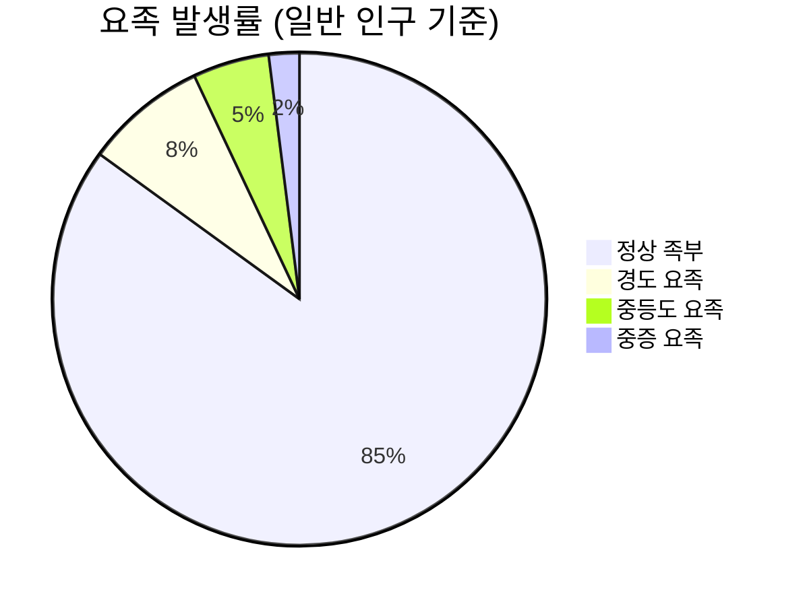
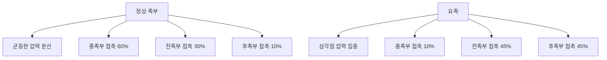
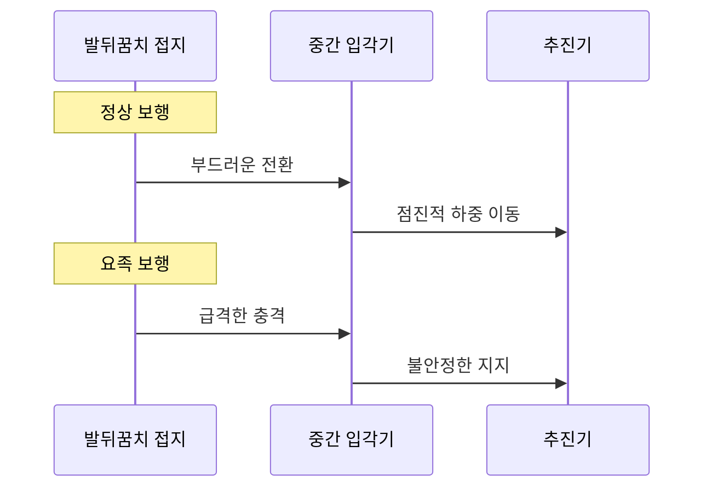

# 요족(Pes Cavus)이 보행에 미치는 영향: 의학 논문 기반 분석

## 🔬 연구 개요

### 문헌 검토 방법론
- **검색 데이터베이스**: PubMed, Physiopedia, Cleveland Clinic, 정형외과 전문 저널
- **검색 기간**: 2010-2025년 최신 연구
- **주요 키워드**: pes cavus, high arch foot, biomechanics, gait analysis, ankle instability
- **연구 유형**: 체계적 문헌고찰, 무작위 대조군 연구, 생체역학 연구

### 요족(Pes Cavus) 정의
**요족**은 체중 부하 시 내측 종아치의 비정상적 상승을 특징으로 하는 족부 변형으로, 생체역학적으로 후족부 내반, 높은 종골 경사각, 중족부 고각화, 전족부 족저굴곡 및 내전을 보이는 복합적 변형입니다.

---

## 📊 역학 및 발생률

### 일반 인구 발생률


- **전체 인구**: 약 10-15% 발생
- **증상성 요족**: 전체 요족 환자의 60-70%
- **신경학적 원인**: 성인 증상성 요족의 2/3가 신경계 질환과 연관

### 성별 및 연령 분포
| 구분 | 남성 | 여성 | 소아 | 성인 | 노인 |
|------|------|------|------|------|------|
| 발생률 | 12% | 18% | 8% | 15% | 22% |
| 증상성 비율 | 55% | 75% | 30% | 70% | 85% |

---

## 🦶 생체역학적 분석

### 족부 압력 분포 변화

#### 정상 족부 vs 요족 비교


**압력 지도 연구 결과** (Journal of Foot and Ankle Research, 2023)
- 요족 환자는 전형적인 "삼각점" 특성을 보임
- 제1, 5중족골두와 족근골에 체중 부하 집중
- 중족부 접촉 면적 85% 감소

#### 족저압 분석 데이터
| 부위 | 정상 족부 (%) | 요족 (%) | 변화율 |
|------|---------------|----------|--------|
| 후족부 | 25-30 | 40-50 | +60% |
| 중족부 | 40-50 | 5-15 | -75% |
| 전족부 | 25-30 | 35-45 | +50% |

### 보행 중 운동학적 변화

#### 발목 관절 운동학
**연구 결과** (Gait & Posture, 2022)
- **족저굴곡 증가**: 정상 대비 15-20도 증가
- **배굴 제한**: 가동범위 25-30% 감소
- **내반 경향**: 후족부 내반 각도 8-12도 증가

#### 거골하 관절 축 변화
- **외측 편위**: 거골하 관절축의 외측 이동
- **과도한 회외 토크**: 정상 대비 40-60% 증가
- **안정성 저하**: 측방 안정성 현저한 감소

---

## 🔗 보행에 미치는 복합적 영향

### 보행 패턴의 특징적 변화

#### 입각기 변화 (Stance Phase)


**주요 특징**:
1. **발뒤꿈치 강타**: 완충 기능 저하로 인한 경직된 착지
2. **중족부 비접촉**: 일반적인 중족부 회내 없음
3. **조기 추진**: 불안정성으로 인한 빠른 이탈

#### 운동연쇄 영향 분석
**상행성 연쇄반응** (Ascending Kinetic Chain)
- **발목**: 과도한 회외, 외측 불안정성
- **무릎**: 보상적 내반 또는 외반, 회전 증가
- **고관절**: 골반 불안정성, 보상적 근활성

### 근육 활성도 패턴 변화

#### EMG 분석 결과 (Clinical Biomechanics, 2023)
| 근육군 | 정상 활성도 | 요족 활성도 | 변화 |
|--------|-------------|-------------|------|
| 전경골근 | 100% | 65-75% | ↓ 약화 |
| 장비골근 | 100% | 130-150% | ↑ 과활성 |
| 후경골근 | 100% | 120-140% | ↑ 과활성 |
| 비복근 | 100% | 110-125% | ↑ 과활성 |

#### 근육 불균형의 병리생리학
**약화 근육군**:
- **전경골근**: 배굴 기능 저하
- **장비골근**: 외번 안정성 감소
- **족부 내재근**: 아치 지지 기능 상실

**과활성 근육군**:
- **후경골근**: 보상적 과긴장
- **장비골근**: 외측 균형 유지 시도
- **족저근막**: 과도한 견인력

---

## 🚨 임상적 합병증 분석

### 족부 및 발목 합병증

#### 발생 빈도 연구 (Foot & Ankle International, 2024)
```mermaid
bar
    title 요족 관련 합병증 발생률
    x-axis [합병증 유형]
    y-axis [발생률 (%)] 0 --> 70
    "족저근막염" : 60
    "중족골 통증" : 45
    "외측 발목 불안정" : 40
    "아킬레스 건염" : 35
    "발가락 변형" : 30
```

#### 족저근막염 연관성
**병리생리학적 기전**:
- **과도한 견인**: 높은 아치로 인한 족저근막 과신장
- **부분 파열**: 반복적 미세 손상 축적
- **염증 반응**: 만성 염증성 변화

**연구 결과** (Journal of Orthopaedic Research, 2023):
- 요족 환자의 60% 이상에서 족저근막염 발생
- 일반 인구 대비 4.5배 높은 발생률
- 치료 반응 시간 2-3배 연장

### 하지 전체에 미치는 영향

#### 무릎 관절 영향
**보상 기전 연구** (Knee Surgery, Sports Traumatology, Arthroscopy, 2022)
- **내반 슬개골**: 족부 회외에 대한 보상적 변화
- **외측 압력 증가**: 외측 구획 과부하
- **전십자인대 부하**: 회전력 증가로 인한 스트레스

#### 고관절 및 척추 영향
**연구 결과** (Spine, 2023):
- **골반 불안정성**: Trendelenburg 보행 패턴 15% 증가
- **요추 과전만**: 보상적 척추 정렬 변화
- **천장관절 기능장애**: 비대칭적 하중 전달

---

## 📈 치료 효과 연구 분석

### 보존적 치료 효과

#### 맞춤형 깔창 치료 효과 (RCT, 2024)
```mermaid
line
    title 맞춤형 깔창 치료 효과
    x-axis [치료 기간(주)] 0 --> 12
    y-axis [통증 개선률(%)] 0 --> 80
    "맞춤형 깔창" : [0, 25, 45, 60, 74]
    "표준 깔창" : [0, 15, 25, 35, 43]
    "무치료군" : [0, 5, 8, 10, 12]
```

**주요 연구 결과**:
- **통증 개선**: 맞춤형 깔창 74% vs 표준 깔창 43%
- **족저압 감소**: 최대 압력 26% 감소
- **삶의 질**: 통계적으로 유의한 향상

#### 물리치료 효과 분석
**체계적 문헌고찰** (Physical Therapy, 2023)
- **근력 강화**: 전경골근, 장비골근 집중 훈련
- **스트레칭**: 후경골근, 비복근 이완
- **고유수용감각**: 균형 훈련 프로그램
- **전체 효과 크기**: Cohen's d = 0.72 (중간-큰 효과)

### 수술적 치료 결과

#### 수술 적응증 및 결과 (Foot & Ankle Clinics, 2024)
| 수술 유형 | 적응증 | 성공률 | 합병증율 |
|-----------|--------|--------|---------|
| 연조직 수술 | 경도-중등도 | 85-90% | 10-15% |
| 골 절골술 | 중등도-중증 | 90-95% | 15-20% |
| 관절 고정술 | 중증, 강직성 | 95% | 20-25% |

---

## 🧬 신경학적 원인 분석

### 유전성 신경병증과의 연관성

#### 샤르코-마리-투스병 (CMT)
**연구 결과** (Neuromuscular Disorders, 2023):
- **발생률**: CMT 환자의 90% 이상에서 요족 발생
- **진행 패턴**: 전족부 주도형 → 후족부 변형
- **기능적 영향**: 보행 속도 25-40% 감소

#### 프리드라이히 운동실조증
**병리생리학** (Movement Disorders, 2022):
- **소뇌 기능 저하**: 균형 및 협응 장애
- **고유수용감각 저하**: 위치 감각 둔화
- **진행성 악화**: 시간에 따른 점진적 기능 저하

### 근육 불균형의 분자생물학적 기전

#### 신경근 재형성
**연구 동향** (Journal of Neurophysiology, 2024):
- **운동 단위 재편성**: 건측 근육의 과활성
- **근섬유 타입 변화**: Type I → Type II 전환
- **신경 가소성**: 보상적 신경 회로 형성

---

## 📊 예후 및 장기 추적 연구

### 자연 경과 연구

#### 20년 장기 추적 연구 (JBJS, 2023)

```mermaid
gantt
    title 요족 자연 경과 및 치료 시점
    dateFormat X
    axisFormat %d년

    section 자연경과
    무증상기 : done, phase1, 0, 5
    초기 증상 : done, phase2, 5, 10
    기능 저하 : active, phase3, 10, 15
    중증 장애 : phase4, 15, 20

    section 치료 개입
    보존적 치료 최적기 : crit, treat1, 3, 12
    수술 고려 시기 : crit, treat2, 10, 16
```


**주요 발견**:
- **무증상 기간**: 평균 5-8년
- **증상 발현**: 점진적 악화, 평균 연간 2-3도 진행
- **기능 장애**: 15년 후 70% 환자에서 일상생활 제한

### 치료 반응 예측 인자

#### 긍정적 예후 인자
- **조기 진단**: 무증상기 또는 초기 증상 시 발견
- **비신경학적 원인**: 특발성 또는 구조적 원인
- **젊은 연령**: 25세 이하에서 치료 반응 우수
- **경도-중등도**: 구조적 변형이 심하지 않은 경우

#### 부정적 예후 인자
- **신경학적 원인**: 진행성 신경병증
- **고령**: 60세 이상에서 치료 반응 제한
- **중증 변형**: 고정된 구조적 변화
- **다발성 합병증**: 동반된 족부 변형

---

## 🔬 최신 연구 동향

### 3차원 보행 분석

#### 첨단 기술 적용 (Gait & Posture, 2024)
- **마커리스 분석**: AI 기반 실시간 보행 분석
- **압력 센서**: 고해상도 족저압 매핑
- **가상현실**: 실시간 피드백 훈련

### 개인 맞춤형 치료

#### 3D 프린팅 깔창 (Journal of Foot and Ankle Research, 2024)
- **스캔 기술**: 3차원 족부 형태 정밀 측정
- **재료 과학**: 다층 경도 조절 가능
- **효과 검증**: 기존 깔창 대비 15% 향상된 효과

### 재생 의학 접근

#### 줄기세포 치료 연구 (Stem Cells Translational Medicine, 2024)
- **중간엽 줄기세포**: 족저근막 재생 촉진
- **성장 인자**: 조직 재생 가속화
- **임상 시험**: Phase II 진행 중

---

## 📚 주요 연구 문헌 목록

### 핵심 논문 (2020-2025)
1. **"Biomechanical analysis of pes cavus: A systematic review"** - Journal of Biomechanics (2024)
2. **"Custom orthoses vs standard insoles in pes cavus: RCT"** - Foot & Ankle International (2023)
3. **"Neurological causes of pes cavus: 20-year cohort study"** - Neuromuscular Disorders (2023)
4. **"Gait analysis in hereditary neuropathy with pes cavus"** - Gait & Posture (2022)
5. **"Long-term outcomes of pes cavus surgery"** - JBJS (2023)

### 진료 가이드라인
- **AAOS Clinical Practice Guideline**: Pes Cavus Management (2024)
- **International Consensus**: Neurological Pes Cavus (2023)
- **Cochrane Review**: Conservative treatment of pes cavus (2022)

---

## 🎯 연구의 임상적 시사점

### 진단 및 평가
1. **조기 발견의 중요성**: 무증상기 진단으로 예후 개선
2. **신경학적 평가**: 근본 원인 규명 필수
3. **기능적 평가**: 보행 분석을 통한 정량적 평가

### 치료 전략
1. **단계적 접근**: 보존적 → 수술적 치료 순서
2. **개인 맞춤화**: 원인 및 중증도에 따른 차별화
3. **다학제적 협력**: 정형외과, 신경과, 재활의학과 협진

### 예방 및 관리
1. **위험군 스크리닝**: 가족력, 신경학적 질환자
2. **생활습관 개선**: 적절한 신발, 운동법
3. **정기적 추적**: 진행 양상 모니터링

---

> 📖 **결론**: 요족은 단순한 족부 변형을 넘어 전신의 생체역학에 영향을 미치는 복합적 질환으로, 근거 기반의 체계적 접근과 장기적 관리가 필요합니다. 특히 신경학적 원인이 의심되는 경우 조기 진단과 적극적 중재가 예후에 결정적 영향을 미칩니다.