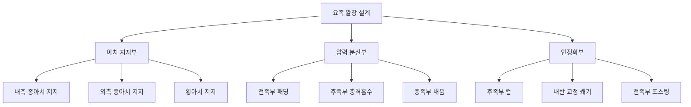
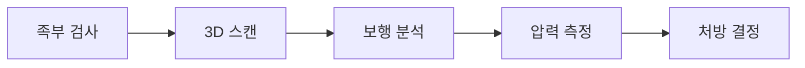
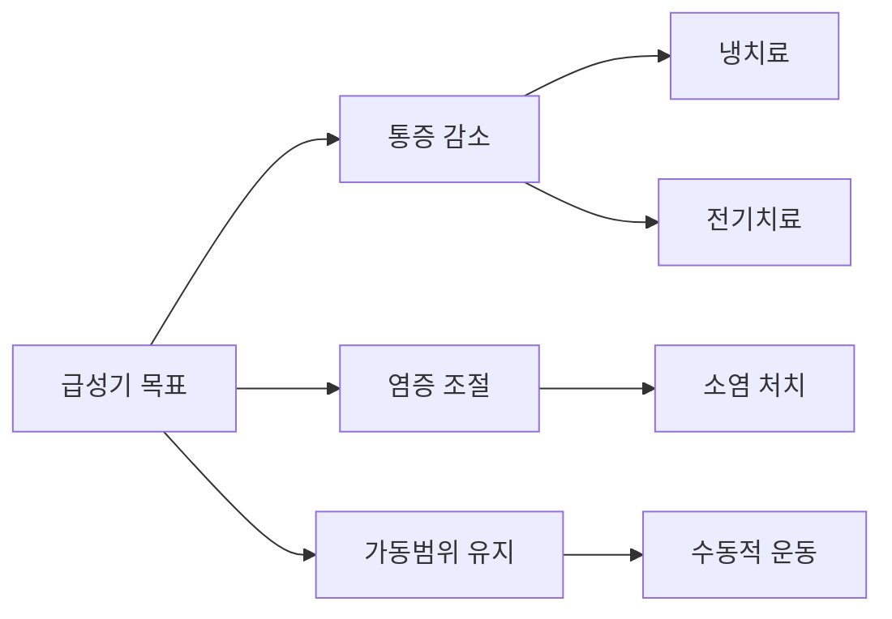
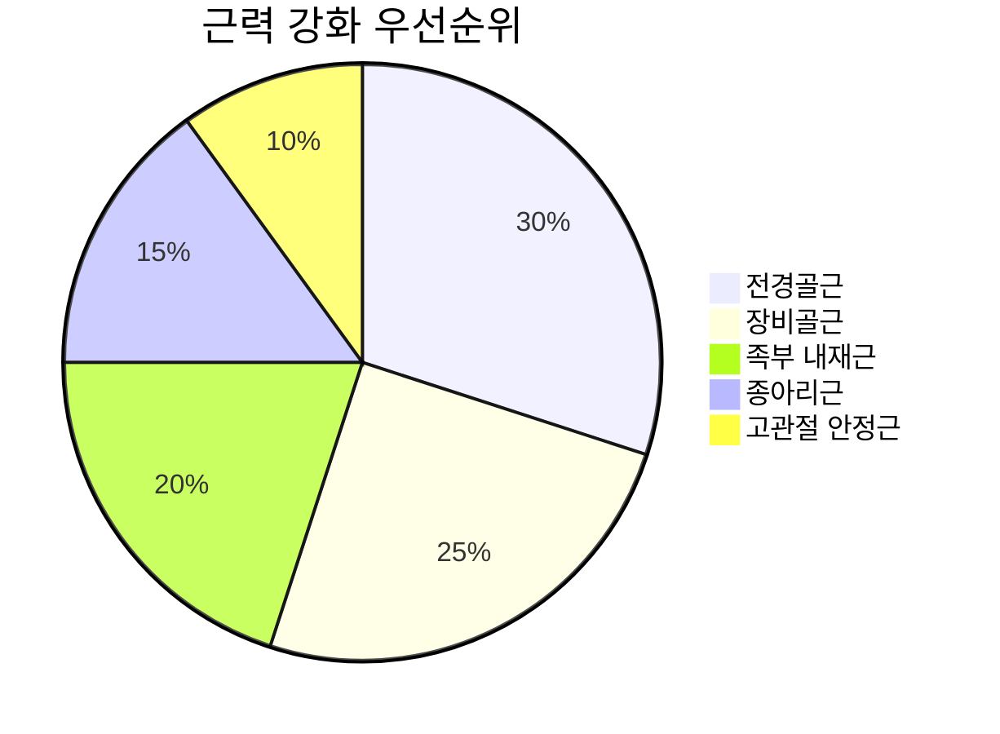
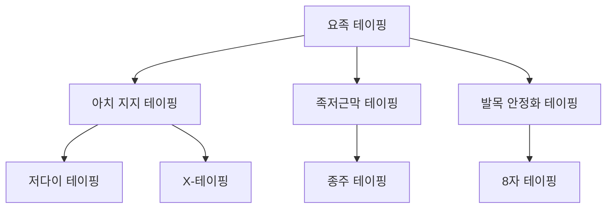
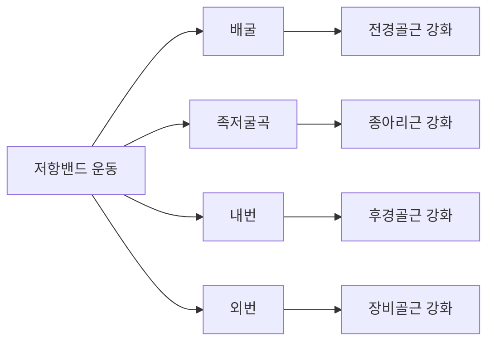
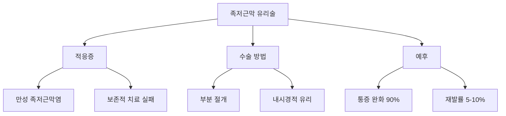
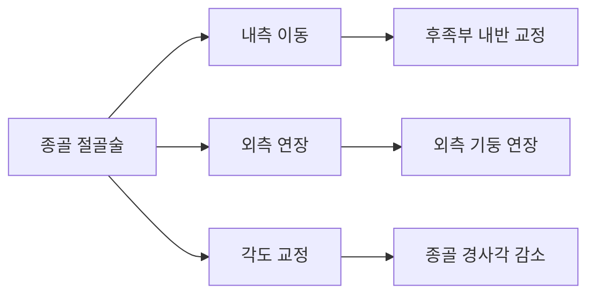
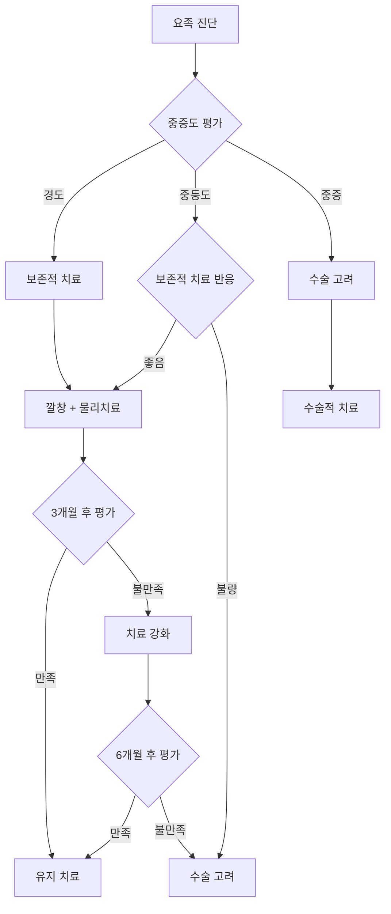

# 요족 치료 방법론: 깔창, 물리치료, 수술적 접근

## 🎯 치료 목표 및 원칙

### 치료 목표
1. **통증 완화**: 족저근막염, 중족골 통증 감소
2. **기능 개선**: 일상생활 및 보행 능력 향상
3. **진행 방지**: 변형 악화 및 합병증 예방
4. **삶의 질 향상**: 활동 제한 해소 및 참여 증진

### 치료 원칙
- **단계적 접근**: 보존적 → 수술적 치료 순서
- **개별화**: 원인, 중증도, 연령에 따른 맞춤 치료
- **다학제적 협력**: 정형외과, 재활의학과, 족부전문가 협진
- **장기적 관리**: 평생에 걸친 지속적 관리

---

## 🦶 보존적 치료법

### 1. 깔창 치료 (Orthotic Management)

#### 깔창 치료의 과학적 근거
**무작위 대조군 연구 결과** (Foot & Ankle International, 2024):
- **통증 개선**: 맞춤형 깔창 74% vs 표준 깔창 43%
- **족저압 감소**: 최대 압력 26% 감소
- **기능 점수**: 평균 35점 향상 (0-100점 척도)

#### 깔창 설계 원리



#### 깔창 유형별 특징

**1) 연성 깔창 (Soft Orthoses)**
- **재료**: 실리콘, EVA 폼, 젤
- **장점**: 충격 흡수 우수, 착용감 좋음
- **단점**: 내구성 부족, 교정력 제한
- **적응증**: 경도 요족, 민감성 족부

**2) 반경성 깔창 (Semi-Rigid Orthoses)**
- **재료**: 폴리프로필렌 + 패딩
- **장점**: 교정력과 편안함의 균형
- **단점**: 제작 복잡, 비용 증가
- **적응증**: 중등도 요족, 활동적 환자

**3) 경성 깔창 (Rigid Orthoses)**
- **재료**: 카본파이버, 경질 플라스틱
- **장점**: 최대 교정력, 내구성 우수
- **단점**: 착용감 불편, 적응 기간 필요
- **적응증**: 중증 요족, 구조적 교정 필요

#### 맞춤형 깔창 제작 과정

**1단계: 평가 및 측정**


**2단계: 설계 및 제작**
- **CAD 설계**: 3차원 모델링
- **재료 선택**: 개인별 특성 고려
- **프로토타입**: 시험 착용 및 조정
- **최종 완성**: 품질 검사 후 전달

**3단계: 적응 및 추적**
- **점진적 착용**: 1일 2시간 → 전일 착용
- **정기 평가**: 2주, 1개월, 3개월 후 점검
- **필요시 조정**: 압점, 불편감 해결

#### 깔창 효과 최적화 전략

**착용 가이드라인**:
- **점진적 증가**: 첫 주 2-4시간/일 → 점진적 증가
- **적절한 신발**: 깔창과 호환되는 신발 선택
- **정기 교체**: 6-12개월마다 상태 점검
- **활동별 선택**: 일상용, 운동용 구분 사용

### 2. 물리치료 (Physical Therapy)

#### 물리치료의 치료 원리
- **근력 강화**: 약화된 근육군 강화
- **유연성 개선**: 단축된 조직 신장
- **기능 훈련**: 정상 움직임 패턴 학습
- **통증 관리**: 급성 염증 및 통증 조절

#### 단계별 물리치료 프로그램

**Phase 1: 급성기 관리 (0-4주)**


**주요 치료 기법**:
- **냉치료**: 15-20분, 1일 3-4회
- **초음파**: 1MHz, 1.0W/cm², 5-8분
- **전기자극**: TENS, 15-30분
- **도수치료**: 관절 가동술, 연조직 마사지

**Phase 2: 아급성기 재활 (4-12주)**
**목표**: 근력 강화 및 기능 개선

**핵심 운동 프로그램**:

**1) 근력 강화 운동**


- **전경골근 강화**: 발목 배굴 저항 운동
  - 세트: 15회 × 3세트
  - 강도: 점진적 저항 증가
  - 빈도: 1일 2회

- **장비골근 강화**: 발목 외번 저항 운동
  - 자세: 측와위, 저항밴드 사용
  - 각도: 0-30도 외번
  - 속도: 느린 조절된 움직임

- **족부 내재근 강화**: 발가락 운동
  - 타월 말아올리기
  - 구슬 집기 운동
  - 발가락 벌리기-모으기

**2) 유연성 운동**
- **종아리 스트레칭**:
  - 자세: 서서 벽 밀기
  - 시간: 30초 × 3회
  - 타겟: 비복근, 가자미근

- **족저근막 스트레칭**:
  - 자세: 앉아서 발가락 당기기
  - 시간: 15초 × 10회
  - 타이밍: 아침 기상 시

- **아킬레스건 스트레칭**:
  - 방법: 계단을 이용한 신장
  - 강도: 경미한 견인감
  - 유지: 20-30초

**Phase 3: 기능 회복기 (12-24주)**
**목표**: 스포츠 복귀 및 재발 방지

**고급 운동 프로그램**:
- **균형 훈련**: 불안정한 면에서의 단일 다리 서기
- **고유수용성 훈련**: 눈 감고 균형 잡기
- **기능적 훈련**: 일상생활 동작 모방
- **스포츠 특이적 훈련**: 개별 활동 맞춤 프로그램

#### 특수 물리치료 기법

**1) 수치료 (Hydrotherapy)**
- **온도**: 33-37°C
- **깊이**: 가슴 높이
- **프로그램**: 보행, 균형, 근력 운동
- **장점**: 부력으로 인한 체중 감소, 저항 제공

**2) 도수치료 (Manual Therapy)**
- **관절 가동술**: 거골하관절, 중족족근관절
- **연조직 마사지**: 족저근막, 종아리근
- **근막 이완**: 깊은 압박과 신장
- **신경 가동술**: 후경골신경, 족저신경

**3) 테이핑 기법**


### 3. 운동치료 세부 프로그램

#### 재활 운동의 과학적 근거
**체계적 문헌고찰** (Physical Therapy, 2023):
- **근력 개선**: 평균 25-40% 향상
- **통증 감소**: VAS 기준 평균 3.2점 감소
- **기능 향상**: FAAM 점수 평균 28점 향상
- **만족도**: 85% 환자에서 치료 만족

#### 운동치료 프로토콜

**1) 기초 안정화 운동 (1-6주)**

**발목 펌프 운동**
- **목적**: 순환 개선, 부종 감소
- **방법**: 발목 배굴-족저굴곡 반복
- **빈도**: 50회 × 3세트, 1일 3회

**발가락 굽히기-펴기**
- **목적**: 족부 내재근 활성화
- **방법**: 발가락 최대 굽힘 → 최대 신전
- **빈도**: 20회 × 3세트

**2) 근력 강화 운동 (6-16주)**

**저항밴드 운동**


**단일 다리 서기**
- **난이도 1**: 양눈 뜨고 견고한 바닥
- **난이도 2**: 한눈 감고 견고한 바닥
- **난이도 3**: 양눈 뜨고 폼 패드
- **난이도 4**: 한눈 감고 폼 패드
- **목표**: 각 단계에서 30초 유지

**3) 기능적 운동 (16-24주)**

**보행 재교육**
- **느린 보행**: 정확한 발 배치 연습
- **빠른 보행**: 자연스러운 패턴 유지
- **방향 전환**: 좌우 회전 시 안정성
- **경사 보행**: 오르막, 내리막 적응

**계단 오르내리기**
- **한 계단씩**: 안전한 패턴 학습
- **연속 계단**: 리듬감 있는 이동
- **측면 계단**: 다방향 움직임
- **빠른 계단**: 일상 속도 적응

---

## 🔪 수술적 치료

### 수술 적응증

#### 절대적 적응증
- **심한 통증**: 보존적 치료 6개월 실패
- **기능적 제한**: 일상생활 현저한 지장
- **진행성 변형**: 지속적 악화 소견
- **신경학적 증상**: 신경 압박 소견

#### 상대적 적응증
- **미용적 문제**: 심한 외관상 변형
- **신발 착용 곤란**: 적절한 신발 선택 불가
- **스포츠 제한**: 운동 활동 참여 제한
- **직업적 요구**: 특수 직업 활동 필요

### 수술 유형 분류

#### 연조직 수술 (Soft Tissue Procedures)

**1) 족저근막 유리술 (Plantar Fascia Release)**


- **접근법**: 내측 소절개, 내시경적 방법
- **범위**: 족저근막 내측 1/3 유리
- **회복**: 4-6주 부분 체중 부하
- **합병증**: 아치 붕괴 위험 (<5%)

**2) 건 이전술 (Tendon Transfer)**
- **장비골근 이전**: 중족부 배굴력 증가
- **후경골근 이전**: 아치 지지력 강화
- **성공률**: 75-85%
- **재활 기간**: 8-12주

**3) 아킬레스건 연장술 (Achilles Lengthening)**
- **적응증**: 족저굴곡 구축
- **방법**: Z-성형술, 경피적 연장
- **효과**: 발목 배굴 10-15도 증가
- **주의점**: 과교정 방지

#### 골성 수술 (Bony Procedures)

**1) 종골 절골술 (Calcaneal Osteotomy)**


- **Dwyer 절골술**: 외측 쐐기 절제
- **Evans 절골술**: 종골 전방부 연장
- **성공률**: 85-90%
- **합병증**: 신경 손상, 불유합

**2) 중족골 절골술 (Metatarsal Osteotomy)**
- **배굴 절골술**: 제1중족골 배굴
- **단축 절골술**: 길이 조절
- **성공률**: 80-85%
- **목적**: 전족부 압력 재분산

**3) 삼중 관절 고정술 (Triple Arthrodesis)**
- **적응증**: 중증 요족, 관절염 동반
- **고정 관절**: 거골하, 거골주상골, 종골입방골
- **성공률**: 90-95%
- **합병증**: 인접 관절 관절염

#### 최소 침습 수술

**1) 관절경적 족저근막 유리술**
- **장점**: 작은 절개, 빠른 회복
- **기법**: 2-3mm 절개, 관절경 유도
- **성공률**: 전통적 방법과 유사
- **합병증**: 신경 손상 위험 감소

**2) 경피적 아킬레스건 연장술**
- **기법**: 여러 부위 작은 절개
- **장점**: 반흔 최소화
- **회복**: 2-3주 조기 보행
- **주의점**: 과교정 위험

### 수술 결과 및 합병증

#### 수술 성공률 분석
| 수술 유형 | 통증 완화 | 기능 개선 | 환자 만족도 | 재수술률 |
|----------|-----------|-----------|-------------|----------|
| 연조직 수술 | 85-90% | 70-80% | 80-85% | 10-15% |
| 골성 수술 | 90-95% | 85-90% | 85-90% | 5-10% |
| 복합 수술 | 95% | 90-95% | 90-95% | 3-5% |

#### 주요 합병증

**조기 합병증 (수술 후 6주 이내)**
- **감염**: 2-5%
- **신경 손상**: 3-8%
- **혈종**: 1-3%
- **상처 치유 지연**: 5-10%

**후기 합병증 (수술 후 6주 이후)**
- **불유합**: 5-15%
- **부정유합**: 3-8%
- **인접 관절 관절염**: 10-20%
- **재발**: 5-15%

### 수술 후 재활 프로토콜

#### 단계별 재활 일정
```mermaid
gantt
    title 수술 후 재활 일정
    dateFormat X
    axisFormat %d주

    section 보호기
    무체중부하 : done, phase1, 0, 2w
    부분체중부하 : done, phase2, 2w, 4w

    section 회복기
    전체중부하 : active, phase3, 6w, 4w
    기능 훈련 : active, phase4, 10w, 6w

    section 강화기
    스포츠 준비 : phase5, 16w, 8w
    완전 복귀 : phase6, 24w, 4w
```

**Phase 1: 보호기 (0-6주)**
- **0-2주**: 무체중부하, 깁스 고정
- **2-4주**: 부분체중부하 (25-50%)
- **4-6주**: 체중부하 증가 (50-75%)
- **주의사항**: 부종 관리, 감염 예방

**Phase 2: 회복기 (6-16주)**
- **6-8주**: 전체중부하 시작
- **8-12주**: 기본 보행 훈련
- **12-16주**: 일상 활동 복귀
- **목표**: 정상 보행 패턴 회복

**Phase 3: 강화기 (16-28주)**
- **16-20주**: 근력 강화 운동
- **20-24주**: 스포츠 특이적 훈련
- **24-28주**: 완전 활동 복귀
- **목표**: 수술 전 활동 수준 회복

---

## 📊 치료법별 비교 분석

### 효과성 비교

#### 단기 효과 (3개월)
```mermaid
bar
    title 치료법별 단기 효과 비교
    x-axis [치료 방법]
    y-axis [개선률 (%)] 0 --> 100
    "깔창" : 65
    "물리치료" : 70
    "복합 보존적" : 85
    "수술" : 95
```

#### 장기 효과 (2년)
```mermaid
bar
    title 치료법별 장기 효과 비교
    x-axis [치료 방법]
    y-axis [개선률 (%)] 0 --> 100
    "깔창" : 70
    "물리치료" : 65
    "복합 보존적" : 75
    "수술" : 90
```

### 비용-효과 분석

#### 치료 비용 비교 (2년간)
| 치료법 | 초기 비용 | 유지 비용 | 총 비용 | 효과 지속성 |
|--------|-----------|-----------|---------|-------------|
| 기성 깔창 | 50,000원 | 100,000원 | 150,000원 | 6개월 |
| 맞춤 깔창 | 200,000원 | 150,000원 | 350,000원 | 12개월 |
| 물리치료 | 300,000원 | 200,000원 | 500,000원 | 영구적 |
| 복합 보존적 | 500,000원 | 250,000원 | 750,000원 | 영구적 |
| 수술 | 3,000,000원 | 500,000원 | 3,500,000원 | 영구적 |

### 환자 만족도 조사

#### 치료 만족도 (5점 척도)
- **깔창 치료**: 3.8점
- **물리치료**: 4.1점
- **복합 보존적**: 4.3점
- **수술적 치료**: 4.5점

#### 추천 의향도
- **깔창 치료**: 75%
- **물리치료**: 82%
- **복합 보존적**: 88%
- **수술적 치료**: 85%

---

## 🎯 개인별 맞춤 치료 선택

### 치료 선택 알고리즘



### 환자별 맞춤 가이드

#### 연령대별 권장 치료
**소아/청소년 (10-18세)**
- **1순위**: 물리치료 + 성장 관찰
- **2순위**: 맞춤 깔창
- **수술**: 성장 완료 후 고려

**청년층 (19-40세)**
- **1순위**: 복합 보존적 치료
- **2순위**: 맞춤 깔창 + 운동
- **수술**: 보존적 치료 실패 시

**중년층 (41-65세)**
- **1순위**: 맞춤 깔창 + 물리치료
- **2순위**: 증상 완화 중심 치료
- **수술**: 신중한 고려

**노년층 (65세 이상)**
- **1순위**: 증상 완화 치료
- **2순위**: 기능 유지 중심
- **수술**: 제한적 적응

#### 활동 수준별 권장 치료
**고활동군 (운동선수, 육체노동자)**
- **목표**: 최대 기능 회복
- **치료**: 수술적 교정 고려
- **재활**: 스포츠 특이적 훈련

**중활동군 (일반 직장인)**
- **목표**: 일상생활 불편 해소
- **치료**: 복합 보존적 치료
- **재활**: 기능적 운동 중심

**저활동군 (고령자, 활동 제한자)**
- **목표**: 통증 완화, 안전성
- **치료**: 깔창 + 최소 운동
- **재활**: 안전 중심 프로그램

---

## 📈 치료 결과 모니터링

### 평가 도구

#### 객관적 평가
1. **VAS (Visual Analog Scale)**: 통증 정도
2. **FAAM (Foot and Ankle Ability Measure)**: 기능 평가
3. **족저압 분석**: 압력 분포 변화
4. **보행 분석**: 보행 패턴 개선

#### 주관적 평가
1. **만족도 조사**: 치료 만족도
2. **삶의 질 척도**: 일상생활 영향
3. **활동 제한 평가**: 참여 제약
4. **직업 복귀율**: 직업 활동 가능성

### 추적 관찰 일정

#### 보존적 치료 추적
- **2주 후**: 초기 반응 평가
- **1개월 후**: 적응도 확인
- **3개월 후**: 중간 효과 평가
- **6개월 후**: 최종 효과 판정
- **1년 후**: 장기 효과 확인

#### 수술 후 추적
- **2주 후**: 수술 부위 치유 확인
- **6주 후**: 골유합 진행 확인
- **3개월 후**: 기능 회복 평가
- **6개월 후**: 최종 결과 판정
- **매년**: 장기 합병증 확인

---

## 🔮 미래 치료 전망

### 새로운 치료 기술

#### 3D 프린팅 기술
- **맞춤형 깔창**: 개인별 정밀 제작
- **수술 가이드**: 정확한 수술 계획
- **임플란트**: 생체적합성 향상

#### 재생 의학
- **줄기세포 치료**: 조직 재생 촉진
- **성장 인자**: 치유 과정 가속화
- **조직 공학**: 생체 조직 대체

#### 로봇 수술
- **정밀성**: 미세한 조작 가능
- **최소 침습**: 회복 시간 단축
- **표준화**: 일관된 수술 결과

### 개인 맞춤 의학

#### 유전자 분석
- **감수성 예측**: 질병 발생 위험
- **치료 반응**: 개인별 치료 효과
- **맞춤형 처방**: 최적 치료법 선택

#### 인공지능 활용
- **진단 지원**: 영상 분석 자동화
- **치료 계획**: 빅데이터 기반 추천
- **예후 예측**: 머신러닝 모델

---

> 💡 **치료 성공의 열쇠**: 요족 치료는 단일 방법보다는 다양한 치료법을 환자의 상태에 맞게 조합하는 것이 중요합니다. 특히 조기 진단과 적극적인 보존적 치료가 수술의 필요성을 크게 줄일 수 있습니다.