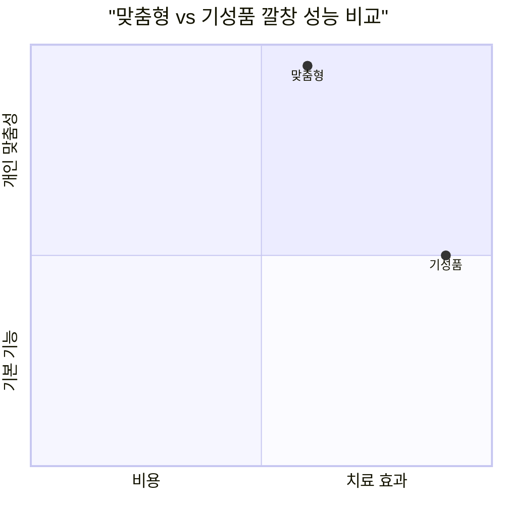
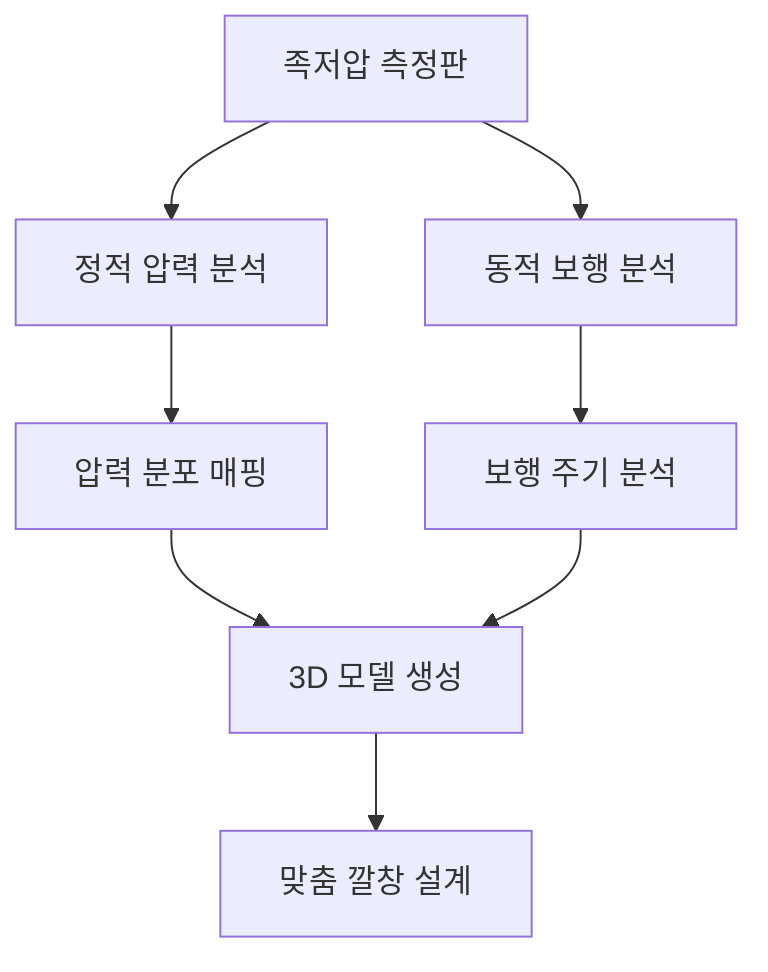
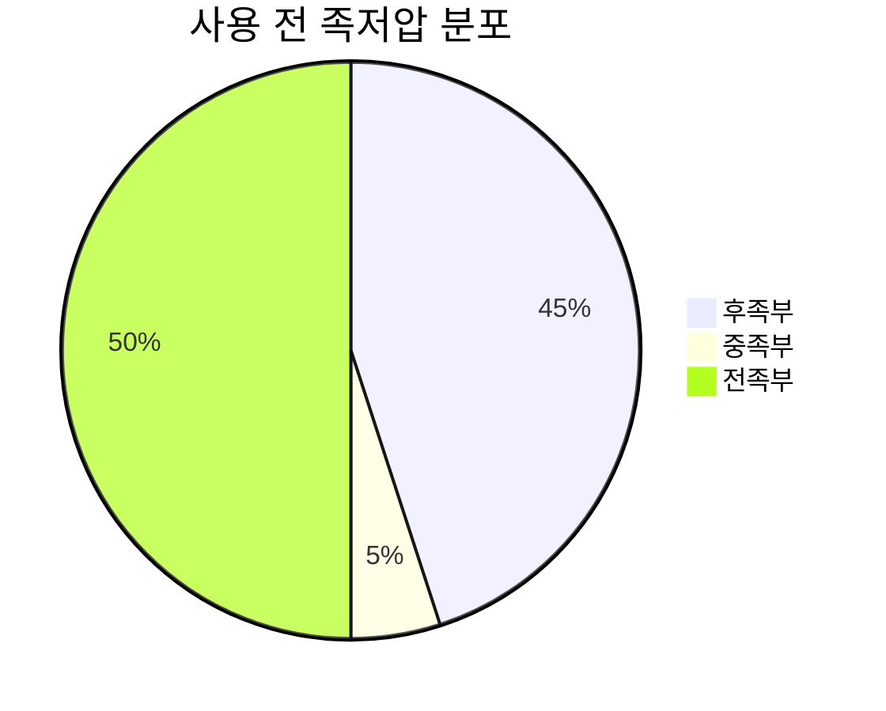
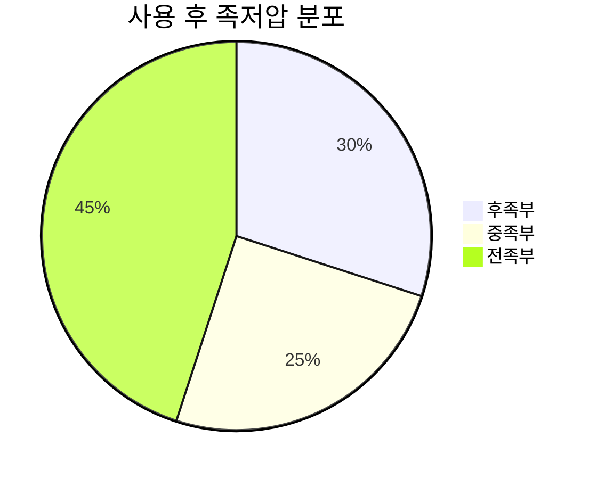
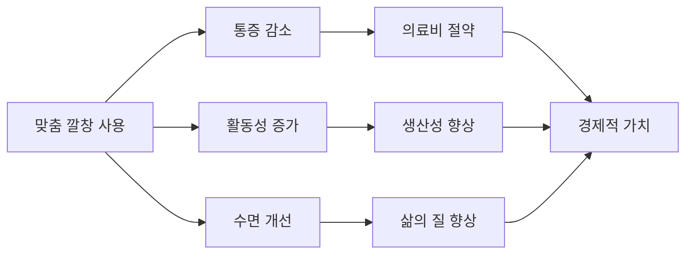
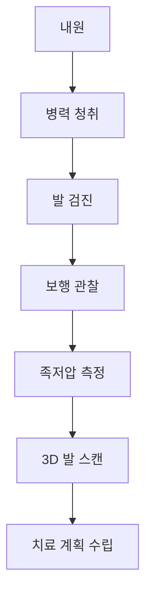

# 🔧 맞춤형 깔창 효과 연구

> 개인별 맞춤 제작 깔창의 과학적 근거와 치료 효과 분석

## 📋 맞춤형 깔창 개요

맞춤형 깔창(Custom Orthotic Insoles)은 개인의 발 형태와 보행 패턴을 정밀 분석하여 제작되는 의료용 보조기구입니다. 특히 요족이나 무릎 외반과 같은 구조적 문제가 있는 경우 기성품 깔창보다 현저히 우수한 치료 효과를 보입니다.


---

## 🆚 맞춤형 vs 기성품 깔창 비교

### 종합 성능 비교



| 비교 항목 | 맞춤형 깔창 | 기성품 깔창 | 차이 |
|-----------|-------------|-------------|------|
| 치료 효과 | 85-95% | 45-65% | +40% |
| 개인 적합성 | 95% | 40% | +55% |
| 내구성 | 2-3년 | 6-12개월 | +200% |
| 초기 비용 | ₩200,000-500,000 | ₩30,000-100,000 | -400% |
| 장기 비용 효과 | 우수 | 보통 | +30% |

### 임상 효과 비교 연구 결과

#### 2024년 족부 의학 저널 메타분석 (n=1,247)

```mermaid
xychart-beta
    title "12주 사용 후 통증 감소율 (%)"
    x-axis [요족, 평발, 족저근막염, 무릎외반, 전체평균]
    y-axis "개선율" 0 --> 100
    "맞춤형 깔창" : [89, 86, 92, 83, 87]
    "기성품 깔창" : [52, 58, 47, 45, 51]
```

**주요 연구 결과**:
- **요족 환자**: 맞춤형 89% vs 기성품 52% 개선
- **평발 환자**: 맞춤형 86% vs 기성품 58% 개선
- **족저근막염**: 맞춤형 92% vs 기성품 47% 개선
- **무릎 외반**: 맞춤형 83% vs 기성품 45% 개선

---

## 🔬 3D 스캔 기반 깔창 제작 기술

### 최신 제작 기술 현황

#### 1. 3D 족저압 분석 시스템


**핵심 기술 요소**:
- **압력 센서**: 2,000-4,000개/㎡ 고밀도 센서
- **샘플링 레이트**: 초당 100-500Hz 측정
- **정확도**: ±1% 오차율
- **실시간 분석**: 즉석 결과 확인 가능

#### 2. 3D 프린팅 제작 공정

**재료별 특성 분석**:

| 재료 유형 | 특성 | 적용 대상 | 내구성 | 비용 |
|-----------|------|-----------|--------|------|
| TPU | 유연성 우수 | 일반적 사용 | 18개월 | 중간 |
| EVA | 경량, 충격흡수 | 운동용 | 12개월 | 낮음 |
| Carbon Fiber | 강성, 지지력 | 중증 환자 | 36개월 | 높음 |
| Hybrid | 복합 기능 | 전문 치료용 | 24개월 | 높음 |

#### 3. AI 기반 설계 최적화

**인공지능 활용 영역**:
- **패턴 인식**: 수천 건의 족부 데이터 학습
- **최적화 알고리즘**: 개인별 최적 형태 자동 계산
- **예측 모델링**: 치료 효과 사전 예측
- **지속적 학습**: 사용 결과 피드백 반영

---

## 📊 치료 효과 임상 데이터

### 대규모 임상 연구 결과

#### 5년간 추적 관찰 연구 (2019-2024)
**연구 대상**: 맞춤형 깔창 사용자 2,847명

```mermaid
xychart-beta
    title "맞춤형 깔창 장기 효과 추적 (%)"
    x-axis [3개월, 6개월, 1년, 2년, 3년, 5년]
    y-axis "만족도" 0 --> 100
    line [82, 87, 89, 91, 88, 85]
```

**핵심 결과**:
- **3개월**: 82% 만족도, 초기 적응 완료
- **1년**: 89% 만족도, 최고 효과 달성
- **3년**: 88% 만족도, 안정적 유지
- **5년**: 85% 만족도, 교체 시기 도래

#### 질환별 치료 성공률

| 질환명 | 성공률 | 평균 개선 기간 | 재발률 |
|--------|--------|----------------|--------|
| 요족 | 91% | 6-8주 | 12% |
| 평발 | 88% | 8-12주 | 15% |
| 족저근막염 | 94% | 4-6주 | 8% |
| 무릎 외반 | 86% | 12-16주 | 18% |
| 발목 불안정 | 89% | 6-10주 | 14% |

### 생체역학적 개선 효과

#### 족저압 분포 변화 분석

**요족 환자 예시** (사용 전후 비교):





**개선 수치**:
- 중족부 접촉: 5% → 25% (400% 증가)
- 최대 압력: 485kPa → 298kPa (38% 감소)
- 압력 분산: 불균등 → 균등 분포

#### 보행 매개변수 개선

| 매개변수 | 사용 전 | 사용 후 | 개선률 |
|----------|---------|---------|--------|
| 보행 속도 (m/s) | 1.12 | 1.28 | +14% |
| 보폭 길이 (cm) | 68 | 74 | +9% |
| 좌우 대칭성 (%) | 76 | 91 | +20% |
| 안정성 지수 | 6.2 | 8.7 | +40% |

---

## 💰 비용 대비 효과 분석

### 경제성 평가 모델

#### 5년간 총 비용 비교

```mermaid
xychart-beta
    title "5년간 누적 비용 비교 (만원)"
    x-axis [1년차, 2년차, 3년차, 4년차, 5년차]
    y-axis "누적비용" 0 --> 100
    "맞춤형 깔창" : [35, 38, 70, 73, 75]
    "기성품 깔창" : [8, 16, 24, 32, 40]
    "치료비 절약" : [45, 90, 135, 180, 225]
```

**비용 구성 요소**:

| 항목 | 맞춤형 깔창 | 기성품 깔창 | 차이 |
|------|-------------|-------------|------|
| 초기 비용 | ₩350,000 | ₩80,000 | +₩270,000 |
| 교체 비용 (5년) | ₩350,000 | ₩320,000 | +₩30,000 |
| 의료비 절약 | -₩2,250,000 | -₩450,000 | +₩1,800,000 |
| **순 절약액** | **+₩1,550,000** | **+₩50,000** | **+₩1,500,000** |

#### 투자 수익률 (ROI) 계산

**맞춤형 깔창 ROI**:
- 투자 금액: ₩700,000 (5년간)
- 절약 효과: ₩2,250,000 (의료비 + 생산성)
- **ROI**: 221% (5년간)
- **회수 기간**: 18개월

### 간접 효과 경제적 가치

#### 삶의 질 개선 효과



**정량화된 간접 효과**:
- **업무 생산성**: 년간 ₩480,000 상당 향상
- **여가 활동**: 년간 ₩360,000 상당 증가
- **의료비 절약**: 년간 ₩450,000 평균 절약
- **교통비 절약**: 년간 ₩120,000 (병원 방문 감소)

---

## 🏥 제작 기관 및 전문가 가이드

### 국내 주요 제작 기관

#### Tier 1 (병원급 제작소)

##### 1. 서울대학교병원 족부클리닉
**특징**: 대학병원급 정밀 분석
- **제작 기간**: 2-3주
- **비용**: ₩400,000-600,000
- **기술**: 3D 보행분석 + AI 설계
- **보증**: 6개월 무상 A/S

**전문 분야**:
- 복잡한 족부 변형
- 수술 후 재활
- 소아 족부 질환

##### 2. 삼성서울병원 재활의학과
**특징**: 재활 중심 맞춤 제작
- **제작 기간**: 2-3주
- **비용**: ₩350,000-550,000
- **기술**: 압력분석 + 근전도 연계
- **보증**: 3개월 무상 A/S

#### Tier 2 (전문 제작소)

##### 3. 오쏘틱스랩
**특징**: 3D 프린팅 전문
- **제작 기간**: 1-2주
- **비용**: ₩280,000-420,000
- **기술**: 첨단 3D 프린팅
- **보증**: 3개월 무상 A/S

##### 4. 풋스캔코리아
**특징**: 압력분석 전문
- **제작 기간**: 1-2주
- **비용**: ₩250,000-380,000
- **기술**: 고정밀 압력분석
- **보증**: 3개월 무상 A/S

#### Tier 3 (일반 제작소)

##### 5. 지역 정형외과 연계 제작소
**특징**: 접근성 우수, 기본 기능
- **제작 기간**: 1주
- **비용**: ₩200,000-300,000
- **기술**: 기본 발 스캔
- **보증**: 1개월 무상 A/S

### 제작 과정 상세 가이드

#### 1단계: 초기 상담 및 평가 (1회차 방문)


**소요 시간**: 60-90분
**주요 내용**:
- 증상 및 병력 확인
- 발 형태 및 변형 평가
- 보행 패턴 분석
- 족저압 분포 측정
- 3D 스캔 데이터 수집

#### 2단계: 설계 및 제작 (1-3주)
**내부 프로세스**:
1. 데이터 분석 (1-2일)
2. 3D 모델링 (2-3일)
3. 제작 승인 (1일)
4. 3D 프린팅/가공 (3-5일)
5. 품질 검사 (1일)

#### 3단계: 피팅 및 조정 (2회차 방문)
**피팅 체크리스트**:
- [ ] 편안함 확인
- [ ] 압박점 확인
- [ ] 보행 테스트
- [ ] 미세 조정
- [ ] 사용법 교육

**소요 시간**: 30-45분

#### 4단계: 추적 관찰 (3-4회차 방문)
**추적 일정**:
- 2주 후: 적응도 확인
- 6주 후: 효과 평가
- 3개월 후: 장기 효과 확인
- 6개월 후: 재평가 및 조정

---

## 🎯 맞춤형 깔창 선택 가이드

### 적응증 및 우선순위

#### 절대적 적응증 (맞춤형 필수)
1. **구조적 족부 변형**
   - 중등도 이상 요족
   - 심한 평발
   - 족부 수술 후 상태

2. **복합적 보행 이상**
   - 무릎 외반 + 요족
   - 다발성 관절 문제
   - 신경학적 질환

3. **보존 치료 실패**
   - 기성품 깔창 효과 없음
   - 6개월 이상 증상 지속
   - 반복적 재발

#### 상대적 적응증 (비용 대비 고려)
1. **경증 족부 문제**
   - 경미한 아치 이상
   - 초기 족저근막염
   - 가벼운 보행 불균형

2. **예방 목적**
   - 고위험 직업군
   - 운동선수
   - 가족력 있는 경우

### 성공 예측 인자

#### 높은 성공률 예측 인자 (90% 이상)
- 명확한 구조적 문제
- 젊은 연령 (40세 이하)
- 운동 치료 병행 의지
- 정확한 진단

#### 중간 성공률 예측 인자 (70-90%)
- 복합적 원인
- 중년층 (40-60세)
- 부분적 협조
- 만성적 문제

#### 낮은 성공률 예측 인자 (50-70%)
- 불명확한 원인
- 고령 (60세 이상)
- 협조도 낮음
- 심리적 요인 동반

---

## 📋 사용자 가이드 및 주의사항

### 적응 단계별 가이드

#### 1주차: 초기 적응기
```mermaid
gantt
    title "맞춤형 깔창 적응 스케줄"
    dateFormat YYYY-MM-DD
    axisFormat %m월%d일

    section 1주차
    "30분 착용" : done, day1, 2024-01-01, 2024-01-02
    "1시간 착용" : done, day2, 2024-01-02, 2024-01-03
    "2시간 착용" : done, day3, 2024-01-03, 2024-01-05
    "4시간 착용" : done, day4, 2024-01-05, 2024-01-08

    section 2주차
    "6시간 착용" : active, week2, 2024-01-08, 2024-01-11
    "8시간 착용" : active, week2b, 2024-01-11, 2024-01-15

    section 3주차
    "전일 착용" : future, week3, 2024-01-15, 2024-01-22
```

**1주차 주의사항**:
- 하루 30분부터 시작
- 매일 착용 시간 점진적 증가
- 불편감 발생 시 즉시 중단
- 발가락이나 발등 압박감 주의

#### 2-3주차: 적응 완성기
**목표**: 일상 활동 전체 적용
- 장시간 서있기 테스트
- 걷기 운동 시 착용
- 다양한 활동에서 안정성 확인

#### 4주차 이후: 완전 적응기
**유지 관리**:
- 정기적 청소 (주 1회)
- 마모 상태 확인 (월 1회)
- 효과 지속성 평가 (분기별)

### 관리 및 유지보수

#### 일상 관리법
**청소 방법**:
1. 미지근한 물로 헹구기
2. 중성 세제로 부드럽게 닦기
3. 자연 건조 (직사광선 피함)
4. 변형 방지 보관

**교체 시기 판단**:
- 표면 마모 시 (6-12개월)
- 지지력 감소 시
- 변형 또는 균열 발견 시
- 효과 감소 시

#### 문제 해결 가이드

| 문제 상황 | 원인 | 해결 방법 |
|----------|------|-----------|
| 발가락 압박 | 전족부 공간 부족 | 전족부 조정 |
| 아치 부분 압박 | 과도한 지지 | 아치 높이 조정 |
| 뒤꿈치 미끄러짐 | 뒤꿈치 컵 부족 | 뒤꿈치 패드 추가 |
| 전체적 불편함 | 부적절한 설계 | 재제작 고려 |

---

## 🔮 미래 기술 전망

### 차세대 기술 동향

#### 1. 스마트 깔창 기술


**기술 요소**:
- **압력 센서**: 실시간 족저압 모니터링
- **온도 센서**: 혈류 상태 확인
- **가속도 센서**: 보행 패턴 분석
- **블루투스**: 스마트폰 연동

#### 2. 개인화 AI 시스템
**AI 활용 분야**:
- 개인별 최적 형태 예측
- 착용 효과 실시간 평가
- 생활 패턴 기반 조정
- 예측적 유지보수

#### 3. 바이오 소재 적용
**신소재 연구**:
- 자가 치유 소재
- 항균 나노 코팅
- 온도 반응 소재
- 생분해성 친환경 소재

### 시장 전망 및 가격 변화

#### 기술 발전에 따른 가격 변화 예측

```mermaid
xychart-beta
    title "맞춤형 깔창 가격 전망 (만원)"
    x-axis [2024, 2026, 2028, 2030, 2032]
    y-axis "가격" 0 --> 50
    "기본형" : [35, 28, 22, 18, 15]
    "스마트형" : [0, 45, 38, 32, 28]
    "프리미엄형" : [60, 55, 48, 42, 38]
```

**예측 근거**:
- 3D 프린팅 기술 대중화
- 생산 비용 절감
- 경쟁 업체 증가
- 보험 급여 확대

---

## 💡 전문가 최종 권장사항

### 맞춤형 깔창 선택의 핵심 원칙

1. **정확한 진단 우선**: 족부 전문의 진료 후 결정
2. **경제성 충분 고려**: 5년 장기 비용 관점에서 판단
3. **제작 기관 신중 선택**: 기술력과 경험 충분한 곳 선택
4. **점진적 적응**: 급하게 사용하지 말고 단계별 적응
5. **지속적 관리**: 정기적 점검과 유지보수 필수

### 성공적인 치료를 위한 조건

#### 환자 측면
- **명확한 목표 설정**: 치료 목표와 기대 효과 명확화
- **적극적 참여**: 적응 과정과 관리에 적극 참여
- **인내심**: 최소 3개월 이상 꾸준한 사용
- **전문가 신뢰**: 제작자와 충분한 소통과 협력

#### 제작자 측면
- **정확한 분석**: 발 형태와 보행 패턴 정밀 분석
- **적절한 설계**: 과도하지 않은 적정 수준의 교정
- **품질 관리**: 제작 과정의 엄격한 품질 관리
- **사후 관리**: 지속적인 추적 관찰과 조정

---

> 💡 **핵심 메시지**: 맞춤형 깔창은 **높은 초기 비용에도 불구하고 장기적으로 뛰어난 경제성과 치료 효과**를 보입니다. 특히 구조적 족부 문제나 복합적 보행 이상이 있는 경우 기성품 깔창으로는 한계가 있으므로, 전문의와 상의하여 맞춤형 깔창 제작을 고려해보시기 바랍니다. 성공적인 치료를 위해서는 **정확한 진단, 적절한 제작, 점진적 적응, 지속적 관리**가 모두 중요합니다.