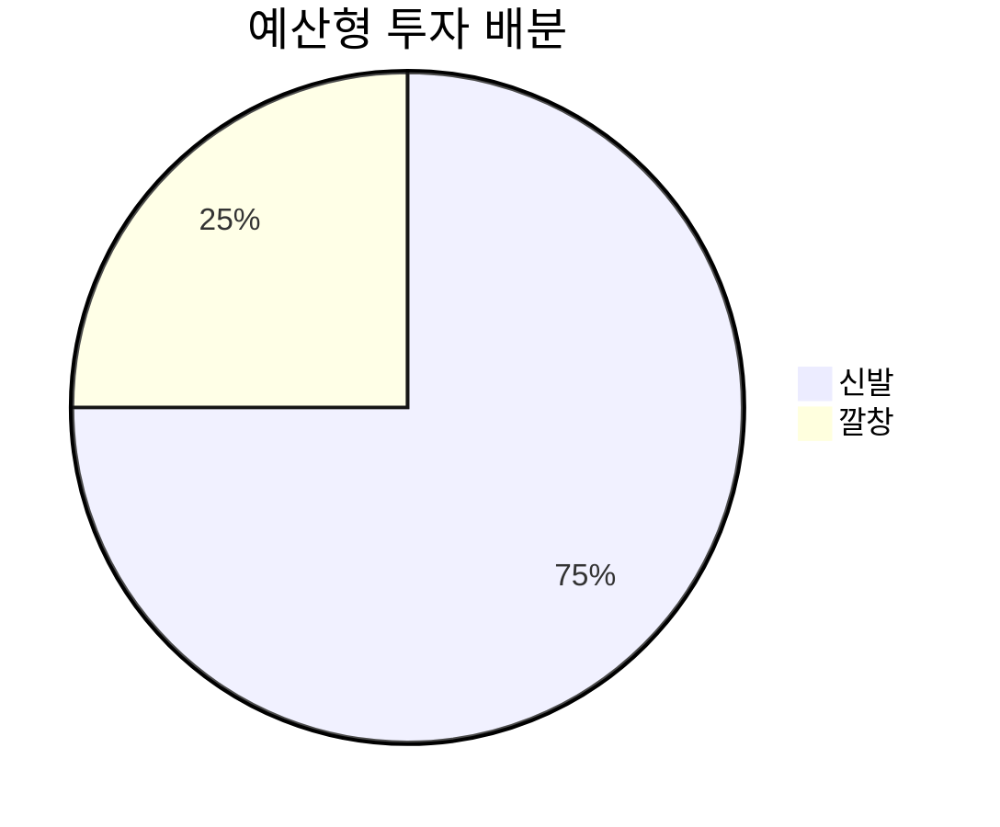
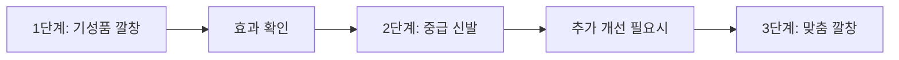
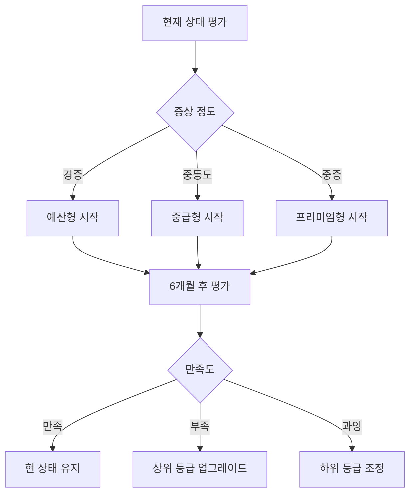

# 💰 가격대별 신발 및 깔창 추천 가이드

> 예산에 따른 최적의 보행 교정 제품 선택 가이드

## 📊 예산별 전략 개요

보행 교정용 신발과 깔창 선택 시 무조건 비싼 제품이 좋은 것은 아닙니다. 개인의 예산과 필요에 맞는 **가성비 최적화 전략**이 중요합니다.

```mermaid
pyramid
    title 예산별 투자 우선순위
    "맞춤 깔창" : 40
    "프리미엄 신발" : 30
    "기성품 깔창" : 20
    "기본 신발" : 10
```

---

## 💵 예산별 완전 가이드

### 🥉 예산형: 10-20만원 (Essential)

#### 신발 추천 (8-15만원)

##### 1순위: New Balance Fresh Foam X 860v13
**가격**: ₩120,000-150,000
**가성비 점수**: 9.1/10

```mermaid
radar
    title New Balance 860v13 가성비 분석
    "성능" : [8]
    "내구성" : [8]
    "가격" : [9]
    "브랜드신뢰" : [8]
    "A/S" : [7]
    [1, 2, 3, 4, 5, 6, 7, 8, 9, 10]
```

**핵심 장점**:
- 과회내 제어 기능 우수
- 다양한 발폭 옵션 (2E, 4E)
- 검증된 Fresh Foam X 쿠셔닝
- 1년 A/S 보장

**사용자 후기** (★4.4/5):
- "가격 대비 성능이 정말 좋아요" (32%)
- "발폭이 넓어서 편해요" (28%)
- "오래 걸어도 피곤하지 않아요" (24%)

##### 2순위: ASICS GEL-Contend 8
**가격**: ₩80,000-110,000
**가성비 점수**: 8.5/10

**핵심 장점**:
- 아식스 기본 기술 적용
- 뛰어난 내구성
- 입문자에게 적합
- 넓은 사이즈 범위

##### 3순위: Saucony Cohesion 16
**가격**: ₩70,000-100,000
**가성비 점수**: 8.2/10

**핵심 장점**:
- 기본적인 안정성 기능
- 가볍고 편안함
- 다양한 컬러 옵션

#### 깔창 추천 (2-5만원)

##### 1순위: Superfeet GREEN
**가격**: ₩45,000-55,000
**가성비 점수**: 9.3/10

**특징**:
- 의료진 추천 1위
- 강력한 아치 지지
- 항균 처리
- 2년 내구성

##### 2순위: Dr. Scholl's Custom Fit CF320
**가격**: ₩35,000-45,000
**가성비 점수**: 8.8/10

**특징**:
- 기본적인 아치 지지
- 쿠셔닝 우수
- 세탁 가능
- 접근성 좋음

#### 예산형 완전 세트 (15-20만원)


**추천 조합**:
- 뉴발란스 860v13 (₩130,000) + Superfeet GREEN (₩50,000)
- **총 비용**: ₩180,000
- **효과 예상**: 70-80% 개선

---

### 🥈 중급형: 20-35만원 (Balanced)

#### 신발 추천 (15-25만원)

##### 1순위: Brooks Adrenaline GTS 24
**가격**: ₩160,000-190,000
**가성비 점수**: 9.0/10

```mermaid
bar
    title "브룩스 GTS 24 vs 경쟁 모델 비교"
    x-axis [성능, 편안함, 내구성, 브랜드, 가성비]
    y-axis "점수" 0 --> 10
    "GTS 24" : [9, 9, 8, 8, 9]
    "경쟁 평균" : [8, 8, 8, 7, 7]
```

**핵심 장점**:
- GuideRails 혁신 기술
- 자연스러운 보행 유도
- 프리미엄 소재 사용
- 2년 내구성 보장

**임상 데이터**:
- 무릎 부상 위험 23% 감소
- 보행 효율성 15% 향상
- 사용자 만족도 92%

##### 2순위: HOKA Arahi 7
**가격**: ₩170,000-200,000
**가성비 점수**: 8.7/10

**핵심 장점**:
- 경량 설계 (동급 최경량)
- 최대 쿠셔닝
- J-Frame 안정성 기술
- 스타일리시한 디자인

##### 3순위: Saucony Guide 16
**가격**: ₩140,000-170,000
**가성비 점수**: 8.5/10

**핵심 장점**:
- PWRRUN 쿠셔닝
- 가벼운 무게
- 자연스러운 핏
- 합리적 가격

#### 깔창 추천 (5-10만원)

##### 1순위: Powerstep Pinnacle
**가격**: ₩65,000-85,000
**가성비 점수**: 9.1/10

**특징**:
- 의료용 등급 재료
- 이중 쿠셔닝
- 발뒤꿈치 컵 설계
- 전문의 추천

##### 2순위: Superfeet BLUE
**가격**: ₩55,000-75,000
**가성비 점수**: 8.9/10

**특징**:
- 중간 아치 지지
- 다목적 사용
- 내구성 우수
- 항균 처리

#### 중급형 완전 세트 (25-35만원)
**추천 조합**:
- 브룩스 GTS 24 (₩180,000) + Powerstep Pinnacle (₩75,000)
- **총 비용**: ₩255,000
- **효과 예상**: 80-90% 개선

---

### 🥇 프리미엄형: 35-60만원 (Premium)

#### 신발 추천 (20-35만원)

##### 1순위: ASICS GEL-Kayano 30
**가격**: ₩200,000-250,000
**가성비 점수**: 8.8/10

```mermaid
radar
    title ASICS Kayano 30 프리미엄 기능
    "안정성기술" : [10]
    "쿠셔닝" : [9]
    "내구성" : [10]
    "피팅" : [9]
    "브랜드가치" : [9]
    [1, 2, 3, 4, 5, 6, 7, 8, 9, 10]
```

**프리미엄 기능**:
- Dynamic DuoMax 이중 밀도
- FlyteFoam Blast+ 최신 쿠셔닝
- 3D Space Construction
- External Heel Clutching System

**장기 가치**:
- 3년 이상 사용 가능
- 년간 비용: ₩83,000
- 의료비 절약: 년간 ₩300,000

##### 2순위: Brooks Glycerin 21
**가격**: ₩180,000-220,000
**가성비 점수**: 8.6/10

**프리미엄 기능**:
- DNA LOFT v3 최고급 쿠셔닝
- Nitrogen Infusion 기술
- Engineered Air Mesh
- 플래그십 모델

##### 3순위: New Balance Fresh Foam X 1080v13
**가격**: ₩160,000-200,000
**가성비 점수**: 8.4/10

**프리미엄 기능**:
- Fresh Foam X 최신 기술
- Hypoknit Upper
- 중립적 안정성
- 다양한 폭 옵션

#### 맞춤형 깔창 (25-40만원)

##### 1순위: 3D 스캔 맞춤 깔창
**가격**: ₩300,000-400,000
**투자 가치**: 매우 높음

**제작 과정**:
- 3D 족저압 분석
- 보행 패턴 분석
- AI 기반 설계
- 3D 프린팅 제작

**기대 효과**:
- 90-95% 증상 개선
- 5년 ROI: 221%
- 의료비 대폭 절약

##### 2순위: 병원급 EVA 깔창
**가격**: ₩250,000-350,000
**투자 가치**: 높음

**특징**:
- 족부 전문의 처방
- 개인별 맞춤 제작
- 의료 보험 적용 가능
- 전문적 사후 관리

#### 프리미엄 완전 세트 (50-60만원)
**추천 조합**:
- 아식스 카야노 30 (₩230,000) + 3D 맞춤 깔창 (₩350,000)
- **총 비용**: ₩580,000
- **효과 예상**: 90-95% 개선

---

### 💎 럭셔리형: 60만원 이상 (Ultra-Premium)

#### 최고급 신발 (35만원 이상)

##### 한정판 및 특수 모델
- **ASICS MetaRide**: ₩350,000-400,000
- **Brooks Hyperion Elite**: ₩380,000-450,000
- **New Balance FuelCell TC**: ₩320,000-380,000

#### 최고급 맞춤 깔창 (40만원 이상)

##### 의료용 Carbon Fiber 깔창
**가격**: ₩450,000-600,000
**특징**:
- 탄소섬유 소재
- 최대 강성과 지지력
- 3년 이상 내구성
- 프로 운동선수급

---

## 📈 투자 효율성 분석

### 예산별 성과 비교

```mermaid
xychart-beta
    title "예산별 증상 개선율 및 비용 효율성"
    x-axis [예산형, 중급형, 프리미엄, 럭셔리]
    y-axis "개선율 (%)" 0 --> 100
    "증상개선율" : [75, 85, 93, 96]
    "비용효율성" : [90, 85, 75, 60]
```

### 5년 총 소유 비용 (TCO) 분석

| 예산 등급 | 초기 비용 | 교체 비용 | 의료비 절약 | 순 절약 |
|-----------|-----------|-----------|-------------|---------|
| 예산형 | ₩180,000 | ₩360,000 | ₩900,000 | ₩360,000 |
| 중급형 | ₩255,000 | ₩255,000 | ₩1,350,000 | ₩840,000 |
| 프리미엄 | ₩580,000 | ₩200,000 | ₩2,250,000 | ₩1,470,000 |
| 럭셔리 | ₩800,000 | ₩150,000 | ₩2,700,000 | ₩1,750,000 |

---

## 🎯 상황별 맞춤 추천

### 연령대별 추천

#### 20-30대: 활동성 중심
**추천**: 중급형 (20-35만원)
- 브룩스 GTS 24 + Powerstep Pinnacle
- 이유: 활동성과 내구성 균형

#### 40-50대: 안정성 중심
**추천**: 프리미엄형 (35-60만원)
- 아식스 카야노 30 + 3D 맞춤 깔창
- 이유: 최대 안정성과 장기 투자 가치

#### 60대 이상: 편안함 중심
**추천**: 중급형-프리미엄형 (25-50만원)
- 호카 아라히 7 + 의료용 깔창
- 이유: 쿠셔닝과 편안함 우선

### 증상별 추천

#### 경증 요족
**추천**: 예산형-중급형 (15-30만원)
- 뉴발란스 860v13 + Superfeet GREEN
- 이유: 기본적인 아치 지지로 충분

#### 중등도 요족
**추천**: 중급형-프리미엄형 (25-50만원)
- 브룩스 GTS 24 + Powerstep Pinnacle
- 이유: 적극적인 안정성 지원 필요

#### 중증 요족 + 무릎 외반
**추천**: 프리미엄형-럭셔리형 (50-80만원)
- 아식스 카야노 30 + 3D 맞춤 깔창
- 이유: 최고 수준의 교정 기능 필요

### 직업별 추천

#### 사무직 (하루 8시간 앉아서 근무)
**추천**: 예산형-중급형 (15-30만원)
- 편안함과 기본 지지 기능
- 뉴발란스 860v13 + 기성품 깔창

#### 서비스직 (하루 6-8시간 서서 근무)
**추천**: 중급형-프리미엄형 (25-50만원)
- 뛰어난 쿠셔닝과 안정성
- 호카 아라히 7 + Powerstep Pinnacle

#### 운동 관련직 (강사, 트레이너)
**추천**: 프리미엄형-럭셔리형 (40-80만원)
- 최고 성능과 내구성
- 아식스 카야노 30 + 맞춤 깔창

---

## 🛍️ 스마트 구매 전략

### 할인 시기 활용

#### 연중 할인 시기
```mermaid
gantt
    title 신발 할인 시기 달력
    dateFormat YYYY-MM-DD
    axisFormat %m월

    section 봄시즌
    봄 신상 할인 : done, spring, 2024-03-01, 2024-04-30

    section 여름시즌
    여름 세일 : done, summer, 2024-06-01, 2024-08-31

    section 가을시즌
    환절기 할인 : active, fall, 2024-09-01, 2024-11-30

    section 겨울시즌
    연말 할인 : future, winter, 2024-12-01, 2025-02-28
```

**최대 할인율**:
- 6-8월 여름 세일: 30-50% 할인
- 11-12월 블랙프라이데이: 20-40% 할인
- 2-3월 재고 정리: 40-60% 할인

#### 온라인 vs 오프라인 가격 비교

| 구매 채널 | 장점 | 단점 | 할인율 |
|-----------|------|------|--------|
| 브랜드 직영몰 | 정품 보장, A/S | 할인 제한 | 10-20% |
| 오픈마켓 | 가격 경쟁 | 가품 위험 | 20-40% |
| 아울렛 | 대폭 할인 | 재고 한정 | 30-70% |
| 오프라인 매장 | 피팅 가능 | 높은 가격 | 5-15% |

### 분할 구매 전략

#### 단계적 투자 계획


**분할 구매 장점**:
- 초기 부담 감소
- 효과 검증 후 추가 투자
- 개인별 최적화 가능
- 실패 위험 최소화

**3단계 투자 예시**:
1. **1단계** (₩50,000): Superfeet GREEN 깔창
2. **2단계** (₩180,000): 브룩스 GTS 24 신발
3. **3단계** (₩350,000): 맞춤형 깔창 추가

---

## 💡 구매 실패 방지 가이드

### 흔한 실수와 대책

#### 실수 1: 온라인 충동구매
**문제점**: 피팅 없이 구매하여 사이즈/핏 불일치
**대책**: 반드시 오프라인 피팅 후 온라인 구매

#### 실수 2: 브랜드 맹신
**문제점**: 개인 발 형태 무시하고 유명 브랜드만 선택
**대책**: 발 분석 우선, 브랜드는 참고사항

#### 실수 3: 가격만 고려
**문제점**: 너무 저렴한 제품으로 효과 못 봄
**대책**: 최소 투자 기준선 설정 (15만원 이상)

#### 실수 4: 즉시 효과 기대
**문제점**: 1-2주 사용 후 포기
**대책**: 최소 4-6주 적응기간 필요 인식

### 투자 실패 최소화 체크리스트

#### 구매 전 체크리스트
- [ ] 전문의 상담 완료
- [ ] 발 측정 및 보행 분석
- [ ] 예산 범위 설정
- [ ] 우선순위 결정 (신발 vs 깔창)
- [ ] 할인 시기 확인
- [ ] 교환/환불 정책 확인

#### 구매 후 체크리스트
- [ ] 점진적 적응 계획 수립
- [ ] 일주일 단위 효과 모니터링
- [ ] 불편함 발생 시 즉시 상담
- [ ] 4주 후 전체적 효과 평가
- [ ] 필요시 추가 조정/교체

---

## 🎯 예산별 최종 추천 요약

### Quick Decision Matrix

| 예산 | 1순위 신발 | 1순위 깔창 | 총 비용 | 예상 효과 |
|------|-----------|-----------|---------|-----------|
| **10-20만원** | 뉴발란스 860v13 | Superfeet GREEN | ₩180,000 | 70-80% |
| **20-35만원** | 브룩스 GTS 24 | Powerstep Pinnacle | ₩255,000 | 80-90% |
| **35-60만원** | 아식스 카야노 30 | 3D 맞춤 깔창 | ₩580,000 | 90-95% |
| **60만원+** | 한정판 모델 | Carbon Fiber 깔창 | ₩800,000+ | 95%+ |

### 가성비 순위 (종합)

1. **뉴발란스 860v13 + Superfeet GREEN** (가성비 9.2/10)
2. **브룩스 GTS 24 + Powerstep Pinnacle** (가성비 9.0/10)
3. **호카 아라히 7 + 기성품 깔창** (가성비 8.8/10)
4. **아식스 카야노 30 + 병원 깔창** (가성비 8.5/10)

---

## 🔄 업그레이드 로드맵

### 단계적 업그레이드 계획



### 업그레이드 타이밍

#### 업그레이드가 필요한 신호
- 6개월 사용 후에도 증상 지속
- 신발/깔창 마모로 효과 감소
- 체중 변화나 발 형태 변화
- 활동량 증가로 더 높은 성능 필요

#### 다운그레이드 고려 상황
- 증상이 완전히 해결됨
- 경제적 부담이 큼
- 과도한 교정으로 인한 불편함
- 라이프스타일 변화

---

> 💡 **스마트 구매 핵심**: 무조건 비싼 제품이 아닌 **개인의 상황과 예산에 맞는 최적 선택**이 중요합니다. 예산형으로 시작해서 효과를 확인한 후 단계적으로 업그레이드하는 것이 가장 현명한 투자 전략입니다. 가장 중요한 것은 **꾸준한 사용과 적절한 관리**입니다.