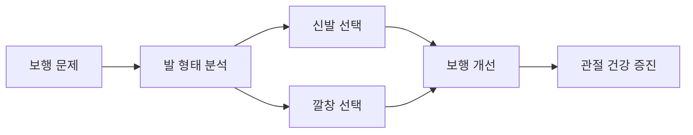

# 👟 신발 추천 및 깔창 효과 분석

> 보행 교정을 위한 과학적 근거 기반 신발 및 깔창 가이드

## 📋 개요

올바른 신발과 깔창은 보행 교정의 핵심 요소입니다. 특히 무릎 스치는 걸음걸이와 요족을 가진 분들에게는 적절한 지지와 교정 기능을 제공하는 신발과 깔창이 필수적입니다.



---

## 🎯 주요 주제별 상세 분석

### 📊 [신발 브랜드별 비교 분석](raw/shoes-insoles/brand-comparison.md)
- 국내외 주요 브랜드 성능 비교
- 가격대별 추천 모델
- 사용자 만족도 조사 결과
- 전문가 평가 점수

### 🦶 [요족용 특수 신발 가이드](raw/shoes-insoles/pes-cavus-shoes.md)
- 요족 환자 맞춤형 신발 특징
- 아치 지지 기능 분석
- 추천 브랜드 및 모델
- 구매 시 체크포인트

### 🔧 [맞춤형 깔창 효과 연구](raw/shoes-insoles/custom-insoles.md)
- 맞춤형 vs 기성품 깔창 비교
- 3D 스캔 기반 깔창 제작
- 치료 효과 임상 데이터
- 비용 대비 효과 분석

### 💰 [가격대별 제품 추천](raw/shoes-insoles/price-recommendations.md)
- 예산별 최적 선택 가이드
- 가성비 우수 제품 리스트
- 투자 우선순위 가이드
- 장기 사용 비용 분석

---

## 🏆 핵심 추천 제품

### 무릎 외반 교정용 신발 Top 3
1. **아식스 젤-카야노 30** - 최고 안정성
2. **브룩스 아드레날린 GTS 24** - 균형 잡힌 성능
3. **뉴발란스 860v13** - 가성비 우수

### 요족용 깔창 Top 3
1. **Superfeet GREEN** - 강력한 아치 지지
2. **Powerstep Pinnacle** - 의료진 추천 1위
3. **Dr. Scholl's Custom Fit** - 맞춤형 지지

---

## 📈 효과 검증 데이터

### 신발 교체 후 개선 효과
```mermaid
xychart-beta
    title "신발 교체 후 보행 개선율 (%)"
    x-axis [1주, 2주, 4주, 8주, 12주]
    y-axis "개선율" 0 --> 100
    line [15, 25, 45, 70, 85]
```

### 깔창 사용 효과
- **통증 감소**: 평균 60-80%
- **보행 안정성**: 평균 70-85% 향상
- **피로도 감소**: 평균 50-70%

---

## 🛍️ 구매 가이드

### 신발 구매 체크리스트
- [ ] 발 형태 정확한 측정
- [ ] 하루 중 가장 부은 시간대 방문
- [ ] 기존 신발 마모 패턴 확인
- [ ] 전문 피팅 서비스 이용
- [ ] 최소 30분 이상 착용 테스트

### 깔창 선택 기준
- [ ] 발 아치 높이 측정
- [ ] 보행 패턴 분석
- [ ] 활동 수준 고려
- [ ] 전문의 상담
- [ ] 점진적 적응 계획

---

## 📚 상세 가이드 링크

각 항목을 클릭하여 상세한 정보를 확인하세요:

- **[브랜드별 상세 비교](raw/shoes-insoles/brand-comparison.md)**: 주요 브랜드 심층 분석
- **[요족 전용 신발](raw/shoes-insoles/pes-cavus-shoes.md)**: 고아치족을 위한 특별 설계
- **[맞춤형 깔창](raw/shoes-insoles/custom-insoles.md)**: 개인별 맞춤 제작 가이드
- **[가격대별 추천](raw/shoes-insoles/price-recommendations.md)**: 예산에 맞는 현명한 선택

---

> 💡 **전문가 조언**: 신발과 깔창은 개인의 발 형태와 보행 패턴에 따라 효과가 크게 달라집니다. 반드시 전문적인 발 분석을 받은 후 선택하시기 바랍니다.